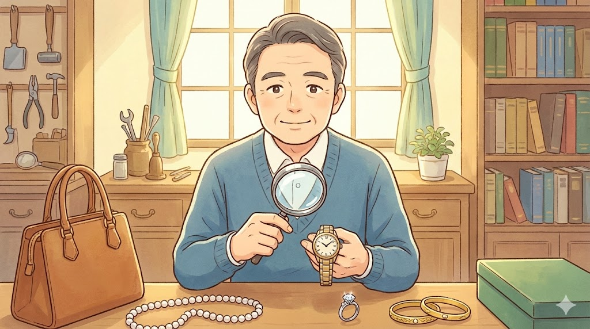
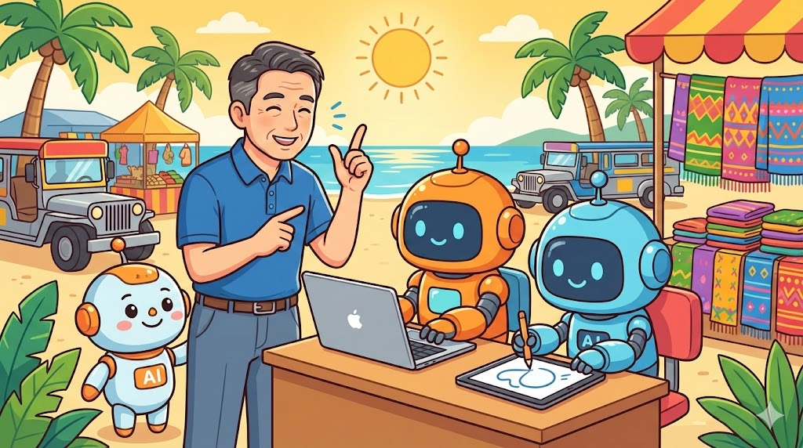

## 今回の課題・話題

「58歳、質屋の番頭として35年。ブランド品や貴金属の真贋判定には自信があるけれど、パソコンにはほとんど触ったことがない」

 *58歳・IT初心者の元質屋番頭が、AIを活用して副収入を得る方法を模索*

今回ご紹介するのは、こんな経歴を持つ架空の人物・**村田誠一さん**です。

村田さんが抱える悩みは、多くのおとな世代に共通するものでした。

**長年の経験で培った「本物を見抜く目」がある**——でも、その技術を**どうやって副収入に変えればいいかわからない**。ネットやAIは「若い人のもの」という先入観がある。自分の強みが「時代遅れ」になるのではという不安。

村田さんのような「目利き」の経験は、**AI時代にむしろ価値が高まります**。

AIは、過去の大量データから「よくある形」を覚えるのは得意です。しかし、「**この傷の入り方は本物特有だ**」「**この縫製の微妙な違和感は偽物のサイン**」といった、**現場で数万点を見てきた人間だけが持つ「違和感センサー」**は持っていません。

---

## 一般的な解決法

質屋や古物商の経験を活かした副業として、一般的には以下のような方法が紹介されています。

**1. フリマアプリでの転売**
メルカリやヤフオクで中古品を仕入れて販売する方法。しかし、仕入れ資金が必要で、在庫リスクもあります。

**2. 鑑定士資格を活かした出張買取**
買取業者と契約して出張鑑定を行う方法。体力的な負担が大きく、移動時間も取られます。

**3. YouTubeでの鑑定動画配信**
再生回数を稼ぐまでに時間がかかり、顔出しや編集技術も求められます。

これらの方法にもメリットはありますが、**「体力を使わず、知恵で稼ぐ」**という観点では課題が残ります。

---

## おとなが人生経験を生かして解決する方法

村田さんのような「目利き」経験者が、**体力を使わずに知恵で稼ぐ**ための方法。それは、**AIを「優秀だけど経験のない新人」として使い、自分は「監督者」として判断を下す**というスタイルです。

 *AIは「優秀だけど現場を知らない新人」——35年の経験を持つあなたが監督者として判断を下す*

### 具体的な収益化の方向性

**① オンライン真贋アドバイスサービス**

ココナラやストアカなどのスキルシェアサービス（自分の得意なことを売れるサイト）で、「**購入前に写真でプロの視点からアドバイスします**」というサービスを提供します。

※トラブル防止のため、「鑑定」ではなく**「アドバイス」「セカンドオピニオン」**として出品するのがポイントです。

価格帯は1件500〜2,000円、作業時間は1件15〜30分。月に20〜30件で3〜5万円の収益が見込めます。

ここまでで、「目利き経験×AI」の可能性は見えてきたと思います。では、実際にどうやってサービスを立ち上げ、最初の1件を獲得するのか？

<!-- paywall -->

ここから先は、有料会員限定のコンテンツです。以下の内容を具体的に解説します。

**この記事で解説する内容：**
AIを使った真贋チェックの「5ステップ手順書」、村田さんが実際に使っている「真贋チェックリスト」テンプレート（そのままコピーして使えます）、最初の依頼を獲得するための「プロフィール文の書き方」、「判断に迷ったとき」の対応マニュアル、トラブルを防ぐ「免責事項」入り返信テンプレート。

---

**② 「目利きの視点」を言語化したコンテンツ販売**

35年間、頭の中にだけあった「**見極めのポイント**」を、AIの力を借りて文章化します。

例えば「素人でもわかるブランドバッグの真贋ポイント10選」（※ブランド名は一例です）、「質屋が教える、金・プラチナの見分け方入門」など。

**AIの役割**：村田さんが口頭で説明した内容を、わかりやすい文章に整えてもらう

**村田さんの役割**：内容が正しいかチェックし、「ここはもっと強調すべき」と指示を出す

この「**AIは下書き係、人間は編集長**」という分担が、おとな世代に最も適したAI活用法です。

---

**③ フリマアプリ出品者向けの「商品説明文作成代行」**

メルカリなどで高額商品を売りたい人は、「**本物であることの説明**」に苦労しています。

村田さんは、写真を見て本物と判断したら、**AIに「この商品の魅力と真正性を伝える説明文を作って」と指示**。出てきた文章を、プロの目でチェック・修正して納品します。

価格帯は1件1,000〜3,000円、作業時間は1件20〜40分です。

---

### なぜ「目利き経験」はAIに代替されないのか

AIは「データにあるパターン」を学習しますが、**偽物業者もAIを使って「パターン通りの偽物」を作る時代**です。

**「パターンに当てはまるかどうか」だけでは判断できない**局面が増えています。

そんな時に価値を持つのが、「**35年間、何万点もの本物と偽物を見てきた人間の「違和感センサー」**」なのです。

---

## 収益シミュレーション（1ヶ月の想定）

村田さんが取り組んだ場合の1ヶ月間をシミュレーションしてみます。

 *1日1〜1.5時間の作業で月約4万円——「判断を下す時間」で稼ぐスタイル*

| 収益源 | 件数 | 単価 | 小計 |
|--------|------|------|------|
| オンライン真贋アドバイス | 15件 | 1,500円 | 22,500円 |
| 商品説明文作成代行 | 8件 | 2,000円 | 16,000円 |
| **合計** | | | **38,500円** |

**作業時間の内訳**：1日あたり約1〜1.5時間、月合計約30〜45時間。

**ポイントは、「体を動かす時間」ではなく「判断を下す時間」で稼いでいる**ということです。

村田さん自身の感想（架空）：

> 「最初は『AIなんて』と思っていたけど、使ってみたら**優秀だけど現場を知らない新人と同じ**だった。私が『ここを見ろ』と教えてやれば、ちゃんと仕事をしてくれる。**35年の経験が、こんな形で役に立つとは思わなかった**」

---

## よくある質問と回答

**Q1. パソコンが苦手でも大丈夫ですか？**

**スマートフォンだけでも始められます**。ココナラのアプリで相談を受け、LINEやメールで写真を受け取り、AIアプリに話しかけて文章を作ってもらう。この流れなら、キーボードをほとんど使いません。

**Q2. 判断を間違えてしまったらどうなりますか？**

サービス説明に「**個人の経験に基づくアドバイスであり、メーカー公式の真贋判定を保証するものではありません。最終判断はご自身でお願いします**」と明記しておくことが重要です。また、「写真では判断しきれない場合は正直にお伝えする」というスタンスが、かえって信頼につながります。

**Q3. すでに引退しているのですが、それでも始められますか？**

**むしろ引退後の方が向いています**。現役時代は会社のルールに縛られていた知識を、自分の名前で自由に発信できるからです。

**Q4. 質屋以外の経験でも応用できますか？**

**「本物を見抜く」経験があれば応用可能**です。例えば、骨董品店の経験なら陶器・絵画のアドバイス、宝石店の経験ならジュエリーの品質についての相談、古着屋の経験ならヴィンテージ衣類の年代についてのアドバイスができます。

---

## まとめ

**35年間で培った「目利き力」は、AI時代に消えるどころか、むしろ価値が高まります。**

AIは「一般的なパターン」を学ぶのは得意ですが、**現場で数万点を見てきた人間だけが持つ「違和感センサー」**は持っていません。

村田さんが実際にやってみて、特に大事だったのは次の3点です。

**AIは「優秀な新人」として使う**——下書き・整理・文章化を任せる。**自分は「監督者」として判断を下す**——最終チェックと「ここを見ろ」という指示。**「体を動かす時間」ではなく「判断を下す時間」で稼ぐ**。

村田さんの例では、**1日1〜1.5時間、月に約4万円**という、無理のないペースでの収益化が可能でした。

**「パソコンが苦手」は、もはや言い訳にならない時代**です。AIに話しかけるだけで文章が作れるようになりました。

「何をAIにやらせるか」を判断できる経験——それは、すでにあなたの中にあります。

---

※補足：AIの進化が進むと、「写真を見て判断する」レベルの簡易チェックはAI単独でも可能になるかもしれません。しかし、「触った感触」「経年変化の微妙な違い」「贋作師の"癖"を見抜く」といった、**五感と経験に基づく判断**は、人間に残り続ける領域です。AIが進化しても、**最後に「責任を持って判断する人間」の価値は上がり続けます**。
