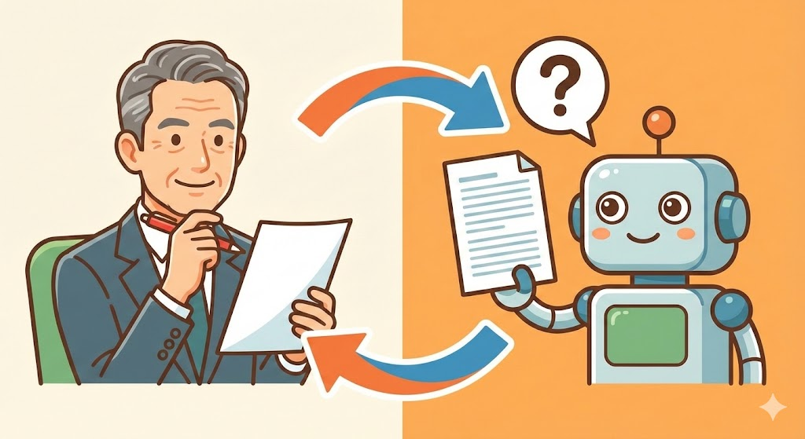

※本記事は複数の事例をもとにした架空のケースです。

## 今回の課題・話題

「葬儀の仕事なんて、AIとは無縁でしょう？」

そう思われる方は多いかもしれません。しかし実は、**葬儀業界で培った経験こそ、AI時代に最も希少な価値を持つ可能性があります**。

今回の例として想定するのは、**佐藤さん（59歳・仮名）**のような方です。高卒で地元の葬儀社に入社し、施行担当として30年。パソコンは事務処理程度、スマホはLINEと電話中心。ChatGPTという言葉は聞いたことがあるものの、自分には関係ないと思っていた——そんな方を想定しています。

 *30年の経験を持つベテラン施行担当のイメージ*

葬儀業界で働いてきた方が抱えがちな不安は、おもに3つあります。

- 「葬儀の経験なんて、他の仕事に活かせるわけがない」
- 「AIやITは若い人のもの。今さら覚えられない」
- 「特別な資格もないし、副業なんて無理」

しかし結論から言うと、**葬儀の施行担当は、AI時代に最も強い職種の一つです**。なぜなら、AIは「正解のある作業」は得意でも、**「正解のない場面で瞬時に判断する」ことが極めて苦手**だからです。

## 一般的な解決法

一般的に、「AIで稼ぐ」と聞くと、次のような方法が紹介されています。

- ChatGPTでブログ記事を量産する
- AIで画像を作ってSNSで販売する
- プログラミングコードをAIに書かせる

どれも「AIに何かを作らせる」ことが前提です。しかし、この方法には大きな問題があります。

**AIが作ったものは、誰でも同じように作れてしまう**という点です。

「ダイエットの記事を書いて」とAIに頼めば、世界中の誰でも同じような記事が出てきます。しかも、AIは進化が速いので、今日覚えたテクニックが数ヶ月〜1年で古くなってしまうことも珍しくありません。

「覚えることが多すぎて追いつけない」と感じる50代後半〜60代の方には、この**「作る側」で勝負するやり方は向いていない**と言えます。

## おとなが人生経験を生かして解決する方法

佐藤さんのような方が30年かけて身につけた能力は、実はAI時代に**極めて希少な能力**です。

それは「**正解のない場面で、その場で判断する力**」です。

葬儀の仕事をしてきた方なら、こんな経験があるはずです。

- 遺族自身も言語化できていない要望を、表情や言葉の端々から読み取る
- 「今は説明すべきか、あえて黙るべきか」を瞬時に判断する
- 形式を守るべき場面と、多少崩してでも寄り添うべき場面を見極める
- 宗派・地域慣習・家族関係の違いに合わせて対応を変える

この「**言葉にならない空気を読み取って対応を変える力**」は、30年分の経験からしか生まれません。

AIは文章を作ったり、マニュアル通りの回答を出したりするのは得意です。しかし、**「この遺族には今、何を言うべきか」「どんなトーンで伝えるべきか」**といった判断は、人間にしかできません。

佐藤さんのような方の新しい役割は、**「AIが作った文章や対応案の内容をチェックする役」**です。

 *AIの監督者としての新しい役割*

AIは優秀だけれど経験のない新人のようなもの。**「ここは違う」「この言い方では遺族を傷つける」**と指摘できる監督者が必要なのです。

最初は「自分の経験に値段がつくとは思えなかった」という方がほとんどです。しかし、AIが作った文章を見て「なんとなく違和感がある」と感じたその瞬間、あなたの経験は確実に価値を発揮しています。

ここから先は、**週5時間・月20時間程度**で月3万円〜を目指す具体的な作業内容と、**案件の探し方・始め方**を解説します。「自分にもできそう」と思える内容になっていますので、ぜひご覧ください。

<!-- paywall -->

## 具体的な作業結果

葬儀業界の経験を活かした副業として、以下のような分野が考えられます。2026年時点では案件数はまだ多くありませんが、AIコンテンツの品質管理ニーズは今後増加が見込まれる分野です。

**1. 終活・葬儀関連Q&Aデータの監修**

クラウドソーシングサイト（ネット上で仕事を受発注できるサービス）やコンテンツ制作会社では、「終活」「葬儀準備」「法事のマナー」などに関するQ&A（よくある質問集）の需要が増えています。AIが下書きを作成し、**現場経験者が「この回答で本当に遺族の役に立つか」をチェックする**という案件が想定されます。

**2. 遺族向け文面・案内文のチェックと改善**

葬儀後のお礼状、法要の案内文、香典返しの挨拶文など、**「正しいけれど冷たい」文章を「正しくて、かつ心が伝わる」文章に直す**作業です。AIが作った文章を、現場感覚で調整する役割が求められます。

**3. 葬儀社向け接客トーク例・対応パターンの整理**

葬儀社の新人研修用に、**「こういう場面ではこう対応する」というパターン集**を作成する案件も考えられます。30年の経験で蓄積した「言葉にしにくい現場の知恵」を言語化し、AIや新人が使いやすい形にまとめる仕事です。

想定される1週間の作業スケジュール例は以下のとおりです。

| 曜日 | 作業内容 | 所要時間 |
|------|---------|---------|
| 月曜 | 案件の確認・受注 | 30分 |
| 火曜 | Q&A監修（10問程度） | 1.5時間 |
| 水曜 | 休み | - |
| 木曜 | 文面チェック・修正（5本程度） | 2時間 |
| 金曜 | 納品・修正対応 | 1時間 |
| 土日 | 休み | - |

**週5時間、月20時間程度**の作業で、**月3万円〜5万円**の収入を目指すことが可能と考えられます。

 *無理のないペースで副収入を目指す*

最初は単価が低いかもしれませんが、AIに慣れ、提供内容が整理されてくれば、**単価アップや案件の安定化**も期待できます。実績を積んだ方であれば、月10万円程度まで伸ばすことも現実的な範囲でしょう。

## よくある質問と回答

**Q. パソコンが苦手でも大丈夫ですか？**

大丈夫です。必要な作業は、**Googleドキュメント（無料で使えるワープロソフト）やスプレッドシート（Google版のエクセル）にコメントを入れる**程度です。LINEが使える方であれば、1〜2時間の練習で覚えられるでしょう。ただし、誠実な対応や納期を守る姿勢は、どんな仕事でも必須です。

**Q. 葬儀の資格がなくても副業できますか？**

資格がなくても問題ありません。**30年の現場経験そのものが、誰にも真似できない資格**です。「葬祭ディレクター」（厚生労働省認定の技能審査資格）などの資格があればアピール材料になりますが、必須ではありません。

**Q. 最初はどこで案件を探せばいいですか？**

クラウドワークスやランサーズといった副業マッチングサイトで「終活」「葬儀」「マナー監修」などのキーワードで検索すると、関連案件が見つかる可能性があります。最初は単価が低くても、実績を積むことで徐々に条件の良い案件を受注できるようになるでしょう。

**Q. 自分の経験に本当に価値があるか不安です**

日常では当たり前になっている判断や気配りは、外から見ると**非常に希少で再現性の低いスキル**です。「その場でどう振る舞うか」を積み重ねてきた経験自体が、すでに**価値のある知識資産**になっています。

## まとめ

葬儀業界で培った**「正解のない場面で判断する力」**は、AI時代に最も希少な能力の一つです。

AIは文章を作ったり、マニュアル通りの回答を出したりすることは得意ですが、**遺族の感情に寄り添い、場の空気を読んで対応を変えること**はできません。

佐藤さんのような経験を持つおとな世代の役割は、**「AIという優秀だけれど経験のない新人」を監督すること**です。

特別な資格や派手な実績がなくても、**30年かけて積み重ねた「その場でどう振る舞うか」という経験**は、すでに立派な知識資産です。

まずは月3万円を目標に、**AIと人生経験を組み合わせた新しい働き方**を始めてみてはいかがでしょうか。

※この記事は2026年時点のAI技術を前提にしています。AIは急速に進化しており、5〜10年後には状況が変わる可能性もあります。ただし、「人の感情に寄り添う経験」の価値は、技術がどれだけ進んでも完全にはなくならないと私は考えています。
