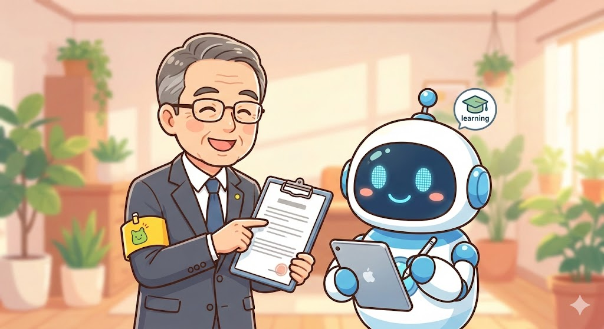

今回は、**マンション管理員として長年働いてきた方**が、その経験をどのようにAIと組み合わせて副収入につなげられるかを考えます。

※副業を始める前に、就業規則や契約書のご確認をおすすめします。

例として、次のような方を想定してみましょう。

> 田中さん（仮名）：60歳、高卒、マンション管理員歴22年。住民トラブルの仲裁や理事会対応には自信があるが、スマホは電話とLINEだけ。パソコンは報告書をなんとか打てる程度。

 *マンション管理員歴22年の田中さん（仮名）のイメージ*

マンション管理員という仕事は、**マンションという小さな社会を支える「縁の下の力持ち」**です。表に出ることは少なくても、現場の「空気」を読む力が求められる専門職といえます。

「ちゃんとやっているのに、なぜか管理員だけが怒られる」「ルールを守らない一部の人のせいで、全体に注意文を出さなければならないつらさ」「理事会と住民、管理会社の板挟みになる立場」——こうした理不尽さを感じながらも、日々現場を回してきた方は少なくないでしょう。

そして、この仕事で最も神経を使うのが**「言葉選び」**です。

掲示板の貼り紙ひとつとっても、「きつく書くとクレームが来る」「柔らかく書くと守ってもらえない」という板挟みがあります。騒音、ゴミ出し、駐輪問題など、**表現ひとつで住民の反応が大きく変わる**ことを、長年の経験で身をもって知っているはずです。

 *「きつく書くとクレーム、柔らかく書くと守ってもらえない」という板挟み*

この「言葉選びのセンス」こそ、実はAI時代に大きな価値を持つスキルなのです。

## 一般的な解決法

マンション管理員が副業や副収入を考える場合、一般的には次のような選択肢が挙げられます。

**1. 別の現場で働く（ダブルワーク）**

休日や空き時間に、清掃や警備など別の現場仕事を掛け持ちする方法です。ただし、体力的な負担が大きく、本業に支障をきたすリスクがあります。

**2. 資格を取得してキャリアアップを目指す**

マンション管理士や管理業務主任者などの資格取得を目指す方法です。ただし、勉強時間の確保が難しく、合格しても副収入に直結するとは限りません。

**3. クラウドソーシングでライティング案件を受ける**

ランサーズやクラウドワークス（インターネット上で仕事を受発注できるサービス）などで記事作成の仕事を受ける方法です。しかし、文章作成に慣れていない場合はハードルが高く、単価も低い傾向にあります。

これらの方法は、**「経験を直接活かす」というよりも、新しいスキルや体力を必要とするもの**が多いのが実情です。

## おとなが人生経験を生かして解決する方法

ここで提案したいのが、**「20年以上の現場経験」と「AI」を組み合わせて、デジタル商品を作る**という方法です。

マンション管理員の仕事で培った**「言葉選びのセンス」**は、少なくとも現時点では、AIだけでは再現できません。AIは一般的な文章を作ることは得意ですが、**「この表現だと住民からクレームが来る」「この言い回しなら角が立たない」**という現場の肌感覚は持っていないのです。

AIは文章生成が得意になっても、**あなたのマンションの住民の性格や過去のトラブル履歴までは知りません**。この「現場の文脈」を知っているのは、あなただけです。

つまり、あなたの経験は**「AIという、知識はあるが現場を知らない新人」を指導する力**として活かせます。

 *AIという「知識はあるが現場を知らない新人」を指導するイメージ*

具体的な商品としては、以下のようなものが考えられます。

**1. 掲示文・案内文テンプレート集**

騒音注意、ゴミ出しルール、駐輪場マナー、共用部の使い方など、**現場で実際に使える文例**をまとめたものです。「きつすぎず、でも守ってもらえる」絶妙な表現は、経験者にしか書けません。

**2. トラブル対応の初動マニュアル**

住民同士のトラブル、設備故障時の連絡、理事会への報告の仕方など、**「最初にどう動くか」**をまとめたものです。新人管理員や、異業種から転職してきた人にとって、非常に価値のある情報となります。

**3. 理事会・管理会社向け報告文のテンプレート**

「何を、どこまで、どう書くか」に悩む報告書作成を助ける文例集です。

※本テンプレートはあくまで文例です。法的なトラブル解決を保証するものではありません。個別の事案は専門家にご相談ください。

---

**ここまでのまとめ：**

- あなたの「言葉選びのセンス」は、AIには真似できない価値がある
- 掲示文テンプレートなどのデジタル商品で、月1〜3万円の副収入が見込める
- 体力ではなく、知恵で稼ぐ方法がある

**でも、「具体的にどうやればいいの？」と思いますよね。**

<!-- paywall -->

ここからは、パソコンが苦手な方でも取り組める**5つのステップ**と、**1週間のスケジュール例**を具体的に解説します。

## AIを使ったテンプレート作成の5ステップ

田中さんのような経験を持つ方が、AIを活用してテンプレート集を作る場合、以下のような流れが想定できます。

**ステップ1：自分の経験を「箇条書き」で書き出す**

まず、これまでに対応してきたトラブルや、作成した掲示文を思い出し、メモに書き出します。

例：

- 上階の足音がうるさいというクレーム → どう対応した？
- ゴミの分別が守られない → どんな掲示を出した？
- 駐輪場に放置自転車 → 撤去までの手順は？

この「経験の棚卸し」が、商品の素材になります。

**ステップ2：AIに「下書き」を作らせる**

ChatGPT（チャットジーピーティー：文章で会話するように指示を出せるAI）などに、「騒音トラブルについて住民に注意を促す掲示文を書いて」と指示すると、一般的な文章が出てきます。LINEで孫とやり取りするような感覚で、話しかけるように指示を出せます。

ただし、**そのままでは使えないことがほとんど**です。表現がきつすぎたり、逆に曖昧すぎたりします。

**ステップ3：あなたの経験で「監督」する**

AIが作った下書きを見て、「この表現だとクレームが来そう」「ここはもう少し具体的に」と修正を指示します。

例えば、「『騒音はご遠慮ください』ではなく、『小さなお子様がいらっしゃるご家庭も多いかと存じます。夜10時以降は、足音や物音にご配慮いただけますと幸いです』のような表現に変えて」と伝えます。

**この「監督」こそが、あなたにしかできない仕事です。**

**ステップ4：テンプレート集としてまとめる**

修正を重ねた文例を、カテゴリ別（騒音、ゴミ、駐輪、設備故障など）にまとめ、WordやPDFで商品化します。

**ステップ5：販売サイトで出品する**

note（ノート）やココナラなど、個人がデジタル商品を販売できるサイトで出品します。メルカリで物を売るような感覚で、自分の知識や経験を商品として販売できる仕組みです。

**想定される収益の目安**

- テンプレート集1点：1,000円〜1,500円程度
- 月に10〜20件売れた場合：**月1〜3万円程度**の収益（例：1,500円×20件＝3万円）
- 商品数を増やしたり、セット販売を行うことで：**月5万円程度**まで伸ばせる可能性

※実際の収益には個人差があります。

この方法の良いところは、**一度作った商品は繰り返し売れる「ストック型収入」（一度作れば、何度も売れる仕組みの収入）になる**という点です。体力を使わず、経験を「資産」に変えることができます。

**1週間のスケジュール例**

田中さんのような働き方を想定した場合、以下のようなペースで進めることが考えられます。

| 曜日 | 作業内容 | 時間目安 |
|------|----------|----------|
| 月 | 経験の棚卸し（メモ書き） | 30分 |
| 火 | AIに下書きを作らせる | 30分 |
| 水 | 下書きを修正・監督 | 30分 |
| 木 | 別のテーマで同じ作業 | 30分 |
| 金 | 全体を見直し・整理 | 30分 |
| 土 | 商品としてまとめる | 1時間 |
| 日 | 休み or 販売準備 | — |

1日30分〜1時間、無理のないペースで進めれば、**1〜2ヶ月で最初の商品を完成させることが可能**でしょう。

## よくある質問と回答

**Q1. パソコンが苦手でも大丈夫ですか？**

大丈夫です。報告書を打てる程度のスキルがあれば、十分に取り組めるでしょう。AIへの指示は「話しかける」感覚で行えますし、商品のまとめ作業もWordで文章を打つ程度で対応できます。

**Q2. 同じような商品を出している人がいたら、売れないのでは？**

一般的なテンプレートは他にもありますが、**「現場を知っている人が作った」という信頼性**は大きな差別化ポイントになります。20年以上の経験に基づいた「角が立たない表現」「実際に効果があった文面」は、経験のない人には書けません。

**Q3. 本業に支障は出ませんか？**

1日30分程度の作業であれば、本業への影響は少ないと考えられます。また、作業はスマホでもある程度可能なので、通勤時間や休憩時間を活用することもできるでしょう。

**Q4. どのくらいで収益が出始めますか？**

商品の完成度や販売サイトの選び方によりますが、**最初の商品を出してから1〜3ヶ月で最初の購入者が現れる**ケースが多いようです。焦らず、まずは1つの商品を丁寧に作ることをおすすめします。

**Q5. 管理会社との契約上、副業は問題ないですか？**

これは契約内容によります。副業を始める前に、**就業規則や契約書を確認し、必要であれば管理会社に相談する**ことをおすすめします。テンプレート販売であれば、特定のマンション名や個人情報を出さない限り、問題になりにくいケースが多いでしょう。

## まとめ

マンション管理員として培った**「言葉選びのセンス」と「トラブル対応の経験」**は、AI時代においても簡単には代替できない貴重なスキルです。

感情が先に立っている住民に対して、いきなり正論を言わず、まず話を聞き、共感を示した上で規約や過去事例を"後出し"で説明する——この**対人スキルと言語化能力**は、少なくとも現時点では、AIには真似できません。

AIを「知識はあるが現場を知らない新人」として使いこなすことで、あなたの経験を**「繰り返し売れるデジタル商品」**に変えることができます。

将来的には、テンプレート販売だけでなく、**「あなたのマンションに合わせた掲示文を添削します」**といったコンサルティング型のサービスに発展させることも可能です。AIがどれだけ進化しても、**「その現場を知っている人」の価値**はなくなりません。

まずは、これまでの経験を箇条書きで書き出すことから始めてみてはいかがでしょうか。**体力ではなく、知恵で稼ぐ**——それがおとなのAI活用です。
