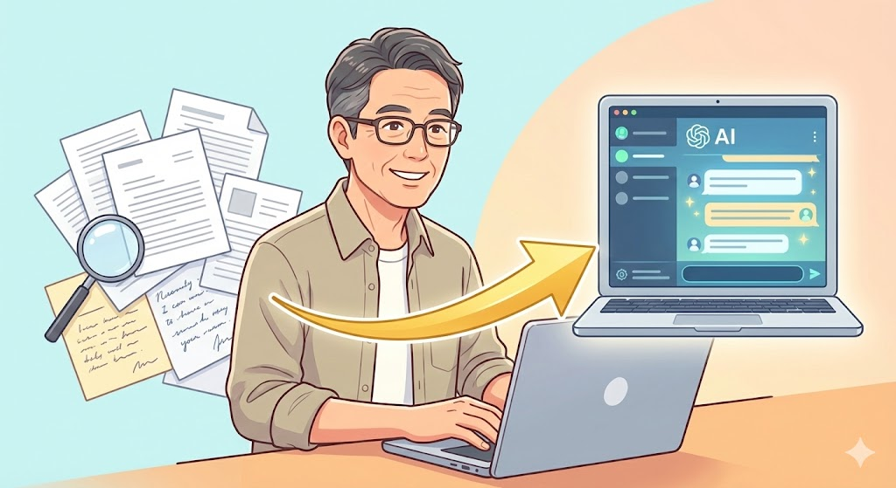
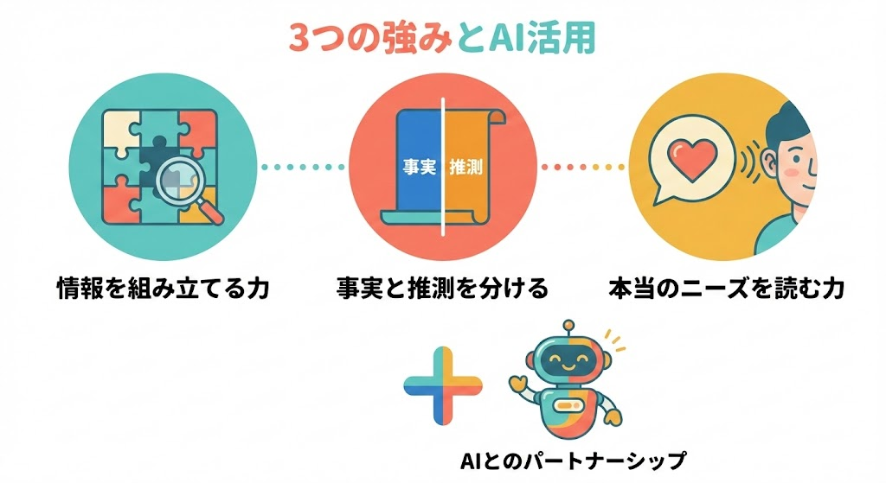
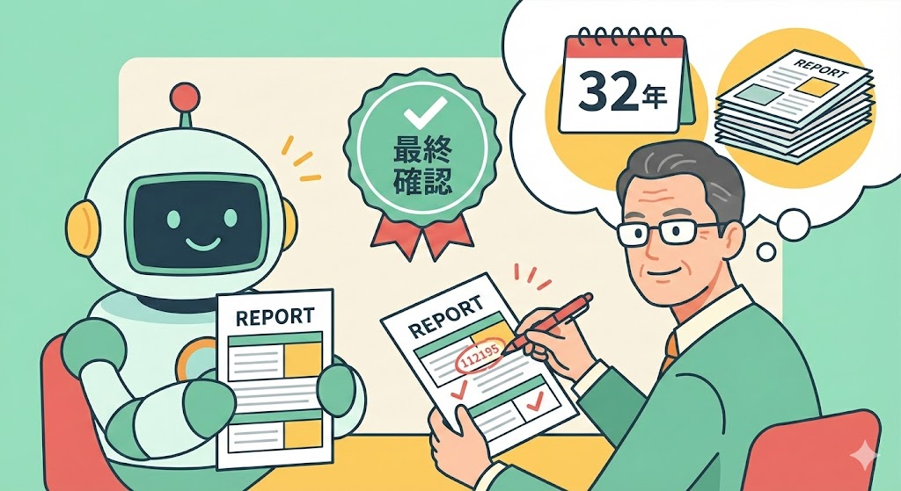

**今回のペルソナ（例）：**
鳥飼さん（仮名）。57歳、高卒。探偵事務所で調査員として32年勤務。尾行や張り込みは体力的にきつくなってきたが、**調査報告書の作成と情報の裏取りには絶対の自信がある**。パソコンはWordで報告書を書く程度で、ITには詳しくない。

---

## 今回の課題・話題

インターネットには情報が溢れています。しかし、**その情報が正しいかどうかを判断できる人は、実はほとんどいません**。

検索すれば何でも出てくる時代だからこそ、「一次情報（公式発表や本人の発言などの元情報）と二次情報（誰かがまとめた又聞きの情報）の区別」「意図的に作られた情報の見抜き方」「書かれていない事実の存在に気づく力」が求められる場面が増えています。企業のリサーチ、取引先の信用調査、ネット上の口コミや評判の検証など、**「調べてまとめる」仕事のニーズは年々高まっている**のが現状です。

ところが、こうした仕事は「ネット検索が得意な若い人」に向いていると思われがちです。鳥飼さんのような調査員経験者にとっては、「自分のスキルがAI時代に通用するのか」「体力勝負の仕事しかできないのではないか」という不安があるかもしれません。

しかし、結論から言えば、**32年間で培った「情報の裏取り力」と「報告書作成力」は、AIと組み合わせることで副収入に変えられる可能性が十分にあります**。

 *32年の調査経験とAIを組み合わせることで、新しい副業の可能性が広がります*

---

## 一般的な解決法

「調べてまとめる」仕事で副収入を得ようとする場合、一般的には以下のような方法が考えられます。

**クラウドソーシング（ネット上で仕事の発注・受注ができるサービス）でリサーチ案件を受注する方法。** ランサーズやクラウドワークスなどのプラットフォームで、企業や個人が依頼する調査・リサーチ案件に応募するやり方です。「競合調査」「市場調査」「口コミ収集」などの案件が常時掲載されています。

**Webライターとして情報をまとめる方法。** 調べた内容を記事として納品する仕事です。1文字あたり1〜3円程度が相場で、調査力がある人には向いていると言えるでしょう。

**SNSやブログで情報発信をする方法。** 自分の専門知識を活かして情報発信し、広告収入やコンサルティングにつなげるやり方です。

ただし、これらの方法には共通した課題があります。**ネット検索だけで完結する調査は、単価が安く、AIに代替されやすい**という点です。ChatGPT（チャットジーピーティー）やClaude（クロード）などのAIツールは、ネット上の一般的な情報を収集・整理する作業が得意です。つまり、「ただ調べてまとめるだけ」の仕事は、今後ますます競争が激しくなると考えられます。

---

## おとなが人生経験を生かして解決する方法

鳥飼さんのような調査員経験者が持っている能力は、一般的なリサーチ力とは**質が根本的に異なります**。

### 「断片的な情報から全体像を組み立てる力」

ネット検索で出てくる情報は、ほとんどの場合「断片」です。一般的なリサーチャーは、その断片をそのまま並べて報告書にしがちです。しかし、調査員経験者は違います。**「出てくる情報」だけでなく、「出てこない情報」や「不自然に欠けている情報」に気づける**のです。

たとえば、関係者の発言が食い違っているケース。ネット上の情報だけでは判断できない場面で、「どこが不自然か」「何が欠けているか」を見抜くには、**現場感覚と経験に基づく直感が不可欠**です。この能力は、現時点のAIでは簡単に再現できません。

### 「事実と解釈を分離する技術」

調査報告書で最も重要なのは、**どこまでが確定情報で、どこからが推測かを明確にすること**です。これは長年の報告書作成で身につく技術であり、経験がない人の文章は「情報量は多くても判断材料として使いにくい」ものになりがちです。

AIは大量のテキストを生成できますが、「この情報の確度はどの程度か」「この推測にはどんな前提条件があるか」を適切に判別して書き分けることは、現時点では苦手な領域です。**ここに、経験者が「AIの出力を最終確認する」価値が生まれます**。

### 「依頼者の本当のニーズを読み取る力」

表向きは「確認してほしい」「念のため調べてほしい」という依頼でも、実際には**「安心したい」「決断の背中を押してほしい」**というケースは少なくありません。言葉よりも、質問の仕方や繰り返し出てくる話題から、本当の関心事を読み取る力。これは32年の対人経験があればこそ備わる能力でしょう。

この3つの力を**AIの情報収集スピードや文章生成能力と組み合わせる**ことで、「ただ調べてまとめるだけ」の仕事とは一線を画した、**付加価値の高いリサーチ＆レポート作成サービス**を提供できる可能性があります。

 *調査員経験者が持つ3つの強みは、AIでは代替しにくい領域です*

なお、AIの能力は急速に進化しているため、AIにできること・できないことの境界線は変わり続けます。だからこそ、**AIの進化を継続的にウォッチしながら、自分の役割を柔軟にアップデートしていく姿勢**が大切です。「今の自分の強み」に固執するのではなく、「AIの進化に合わせて自分の立ち位置を調整できる力」こそが、長く価値を持ち続けるスキルだと言えるでしょう。

また、この記事で扱うリサーチ副業は、あくまで**インターネット上で公開されている情報の収集・分析**が対象です。個人の行動調査や尾行・張り込みといった探偵業務とは異なりますので、その点はご安心ください。

<!-- paywall -->

ここまでは「なぜ調査経験者がAI時代に有利なのか」をお伝えしました。ここからは、**AIを使った具体的な調査の手順、案件ごとの単価目安、1週間のスケジュール例、さらにはノウハウを商品化する方法**まで、より実践的な内容をお伝えします。

---

## 具体的な作業結果

鳥飼さんのような経験を活かす場合、以下のようなステップで副業を始めることが想定できます。

### ステップ1：自分の「調査プロセス」を言語化する

まず取り組むべきは、**普段どんな手順で情報を集め、どう整理しているかを書き出すこと**です。たとえば以下のような項目を整理すると良いでしょう。

- **情報収集の順番：** 何から調べ始めるか、どの段階でどんなソースにあたるか
- **裏取りの基準：** どんなときに「この情報は怪しい」と判断するか
- **報告書の構成：** 事実→分析→推測をどう配置しているか
- **依頼者とのやりとり：** ヒアリングで必ず聞く質問は何か

この「暗黙知の言語化」が、AIを使いこなすための土台になります。**AIへの指示文（プロンプト）を書くとは、つまり「自分のやり方を言葉にする」こと**だからです。

### ステップ2：AIを「調査アシスタント」として使う

言語化した調査プロセスをもとに、AIに以下のような作業を任せることが考えられます。

- **情報の一次収集：** 「この企業について、公開されている情報を時系列でまとめて」とAIに依頼し、収集のスピードを上げる
- **矛盾点の洗い出し補助：** 複数の情報源から集めたデータをAIに渡し、「食い違っている点をリストアップして」と指示する
- **報告書の下書き作成：** 調査メモをAIに渡し、「事実と推測を分けて、報告書形式にまとめて」と依頼する

**ただし、AIが出した結果をそのまま使うのではなく、経験者の目で最終確認する**ことが重要です。AIは表面的な矛盾には気づけても、「業界の常識や経験から考えると、この数字はおかしい」といった判断は、現時点では難しい場合が多いです。ここが鳥飼さんの出番です。

 *AIが出した結果を、経験者の目で「最終確認」することが重要です*

### ステップ3：小さな案件から始める

最初から大きな仕事を狙うのではなく、以下のような**「調べてまとめる」小さな依頼**から始めるのが現実的です。（※以下の単価はあくまで目安であり、案件の内容・地域・業界などにより変動します。）

- **企業の基本情報リサーチ（1件3,000〜5,000円程度）：** 取引先の基本情報、評判、関連ニュースをまとめるレポート
- **口コミ・評判の分析レポート（1件5,000〜10,000円程度）：** 特定の商品やサービスについて、ネット上の口コミを収集・分析し、傾向をまとめる
- **競合調査の簡易レポート（1件8,000〜15,000円程度）：** 依頼者の競合企業について、公開情報をもとに比較レポートを作成する

慣れてきて案件の種類を組み合わせながら、**平均単価5,000〜8,000円程度の案件を月4〜5件こなせれば、月2〜4万円の副収入を得ることも十分に可能でしょう。** 調査経験者ならではの「情報の確度を明記したレポート」は、一般的なリサーチャーのレポートとは差別化できるため、リピート依頼につながりやすいと考えられます。

### ステップ4：「信用調査テンプレート」を商品化する

経験が蓄積されてきたら、**自分の調査ノウハウをテンプレート化して販売する**ことも選択肢のひとつです。

- **「取引先チェックシート」：** 新規取引先と取引を始める前に確認すべきポイントをまとめたもの
- **「情報の信頼性チェックリスト」：** ネット上の情報が信用できるかどうかを判断する基準をまとめたもの
- **「簡易調査報告書テンプレート」：** 事実・分析・推測を分けて記載できるフォーマット

これらはココナラ（スキルや知識を売買できるサービス）やBASE（ネットショップを簡単に作れるサービス）などのプラットフォームで、1テンプレート1,000〜3,000円程度で販売することが想定できます。

※なお、テンプレートはあくまで**公開情報の整理を目的としたもの**に限定してください。特定の個人や企業を誹謗中傷したり、プライバシーを侵害するような使い方を想定したものは作成・販売しないよう十分にご注意ください。

### 想定される1週間のスケジュール例

鳥飼さんのような方が週10〜15時間程度で取り組む場合、以下のようなスケジュールが考えられます。

- **月曜日（2時間）：** 新規案件の確認・依頼者へのヒアリング
- **火〜水曜日（各3時間）：** AIを活用した情報収集と裏取り作業
- **木曜日（3時間）：** 報告書の下書き作成（AI活用）と経験に基づく最終確認・修正
- **金曜日（2時間）：** 報告書の最終確認・納品・次の案件の準備

---

## よくある質問と回答

**Q. 探偵の仕事をしていたわけではなく、「調べることが好き」という程度でも始められますか？**

始められる可能性は十分にあります。この副業の核心は「尾行や張り込み」ではなく、**「情報を集めて、整理して、わかりやすく伝える」**という能力です。たとえば、事務職で社内の情報を集約して報告書にまとめていた経験や、営業職で取引先の情報を調べてから商談に臨んでいた経験も、十分に活かせるでしょう。まずは自分がどんな手順で情報を集めているかを言語化するところから始めてみてはいかがでしょうか。

**Q. AIがあれば、人間がリサーチする必要はなくなるのではないですか？**

AIは「公開されている情報を素早く集める」ことは得意ですが、**「集めた情報の信頼性を判断する」「書かれていない事実の存在に気づく」「依頼者が本当に知りたいことを読み取る」**ことは、現時点では苦手な領域です。情報が溢れる時代だからこそ、**「何が正しくて、何が怪しいか」を見分けられる人の価値はむしろ高まっている**と言えるでしょう。AIは優秀なアシスタントですが、調査の方向性を決め、結果を最終確認するのは人間の役割です。ただし、AIの能力は日々進化しています。「今AIにできないこと」が将来もずっとできないとは限りません。だからこそ、**AIの進化に合わせて自分の役割を柔軟にアップデートしていく姿勢**が大切です。

**Q. パソコンはWordで報告書を書く程度ですが、AIツールは使えますか？**

**同程度のパソコンスキルの方でも、AIツールの基本操作は問題なく対応できるでしょう。** ChatGPT（チャットジーピーティー）やClaude（クロード）などのAIツールは、画面上の入力欄に日本語で指示を書くだけで使えます。特別なプログラミング知識は必要ありません。「この会社について調べて」「この情報を報告書形式にまとめて」と、普段部下や同僚に頼むような言葉で指示を出せば良いのです。

**Q. 収入が安定するまでにどのくらいかかりますか？**

個人差はありますが、**最初の1〜2ヶ月は練習期間**として、AIツールの操作に慣れながらサンプルレポートを作成し、3ヶ月目以降に少しずつ案件を受注していく流れが現実的でしょう。月2〜4万円程度の安定した副収入を目指す場合、**半年程度の継続が目安**になると想定できます。焦らず、まずは「自分の調査プロセスの言語化」から始めることをおすすめします。

**Q. 法律的に問題になることはありませんか？**

公開情報をもとにしたリサーチとレポート作成は、**多くの場合、一般的な業務委託の範囲内と考えられ**、特別な資格や届出は不要です。ただし、特定の個人の行動を調べるような調査（尾行・張り込みなど）は探偵業法に基づく届出が必要であり、副業のリサーチとは明確に異なります。副業として行うリサーチは、**企業情報や市場情報など、公開されている情報の収集・分析に限定する**のが安全です。**個人のプライバシーに関わる調査や、特定の個人・企業への誹謗中傷につながるような依頼は、絶対に引き受けないでください。** 不安がある場合は、行政書士など専門家に相談することをおすすめします。

---

## まとめ

探偵事務所の調査員として32年間培ってきた**「情報の裏取り力」「事実と解釈を分ける報告書作成力」「依頼者の本当のニーズを読み取る力」**は、AI時代にこそ価値が高まる能力です。

AIは情報収集のスピードでは多くの場合、人間を上回りますが、**「この情報は怪しい」「ここに書かれていないことが重要だ」**と気づけるのは、現場経験を積んだ人間ならではの強みです。鳥飼さんのような経験者は、**AIという優秀だが文脈を理解しきれないアシスタントに的確な指示を出せる「調査監督者」**としてのポジションを確立できる可能性があります。

最初の一歩は、大きな仕事を探すことではありません。**「自分が普段どんな手順で情報を集め、どう整理しているか」を言語化すること**。それがAI時代の副業の土台になります。体力ではなく、**32年分の「判断力」と「目利き力」**を武器にしてみてはいかがでしょうか。
