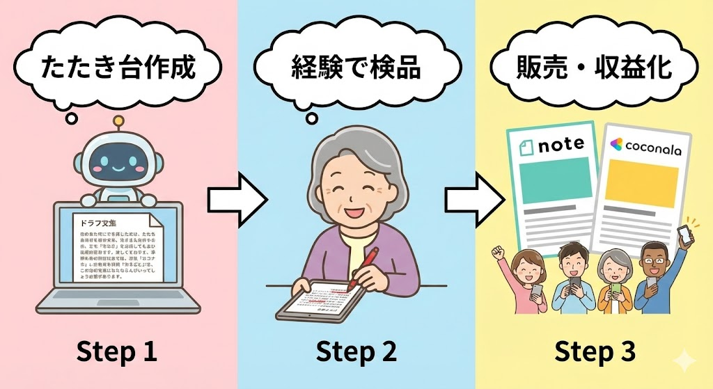
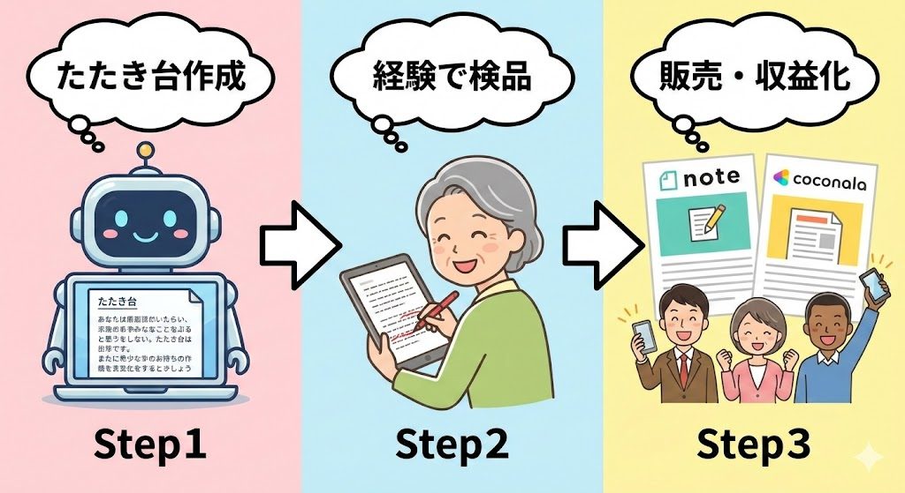

## 今回の課題・話題

たとえば、こんな方を想像してみてください。

**藤原洋子さん（仮名）、60歳。着付け師歴33年。成人式・結婚式・七五三と、あらゆる場面で着物を着せてきたベテラン。**体力的に現場の数は減ってきたものの、「この帯結びは写真映えするけれど、長時間は苦しい」「場面によっては、この色を着ると親族席で浮いてしまう」といった"教科書には載らない判断"が、33年間で身体に染みついています。

一方で、スマホはLINEと電話が中心。パソコンは年賀状ソフトを使ったことがある程度。**「私の技術は着付けの現場でしか使えない」**と思い込んでいます。

実はこの「思い込み」こそが、今回の最大の課題です。

着付けの世界には、AIがどれだけ進化しても簡単には再現できない知識が大量にあります。季節・格・立場・宗派・地域差・年配親族の目線・写真映えと実用性のバランス——**これらを総合的に判断できるのは、長年の現場経験を持つ方だけ**です。

実際にAIに「結婚式での母親の着物と帯の組み合わせ」を聞いてみると、理屈としては正しい回答が返ってきます。しかし、「この地域では少し派手に見られる」「写真では綺麗だが帯が重くて2時間で苦しくなる」といった**現場の判断は、AIにはまだできません。**

つまり、着付け師として33年間で培った暗黙知は、**AI時代にこそ希少価値が高まる資産**なのです。問題は、その資産を「どうやってお金に変えるか」を知らないだけ。この記事では、IT初心者の方でもわかるように、その具体的な方法を解説します。

 *33年の経験で培った「教科書には載らない判断力」——これがAI時代の最大の資産です*

---

## 一般的な解決法

「着付けの知識を活かして副収入を得たい」と考えたとき、一般的には以下のような方法が思い浮かぶでしょう。

**着付け教室を開く。** 自宅やカルチャーセンターで生徒を集め、対面で教える方法です。確かに王道ですが、集客に時間がかかり、場所の確保やスケジュール調整も必要です。体力的な負担も少なくありません。

**出張着付けを続ける。** 成人式や結婚式シーズンに依頼を受ける方法ですが、繁忙期と閑散期の差が激しく、安定した収入にはなりにくいのが現実です。さらに、早朝からの作業や重い荷物の運搬など、年齢とともに厳しくなる面もあります。

**YouTubeやSNSで着付け動画を発信する。** 若い世代の着付け師が多く参入しており、映像のクオリティや編集技術で勝負するには、かなりのIT知識と機材が求められます。

これらはいずれも「自分の体と時間を直接使う」モデルです。もちろん価値のある方法ですが、**体力やITスキルに依存する部分が大きく、長く続けるには工夫が必要**です。

---

## おとなが人生経験を生かして解決する方法

ここからが本題です。着付け師歴33年の経験を、**AIを「翻訳機」として使うことで、現場に立たなくても収入に変える**方法を考えてみましょう。

### なぜ「経験 × AI」なのか

まず大前提として、**AIは着物の知識を「データ」として持っていますが、「現場の判断力」は持っていません。**

たとえば、AIに「留袖に合う帯締めの色は？」と聞けば、一般論としてはそれらしい答えが返ってきます。しかし、「この式場は照明が暗いから、もう少し明るめの色でないと写真で映えない」「この方は背が低いのでお太鼓の位置を少し上げた方がバランスが良い」といった判断は、AIにはできません。

つまり、**あなたの33年の経験は「AIが出した回答を検品し、修正できる力」**そのものなのです。

 *AIが出した「データ上の正解」を、33年の経験で「現場の正解」に変える——これが最大の強みです*

### AIがさらに進化しても、なぜこの力が必要なのか

今後、AIはさらに賢くなり、人間の代わりに考えて動くAI（AIエージェントと呼ばれます）が普及すると言われています。難しく考える必要はありません。要するに、**「AIの使い方を覚える」だけのスキルは、すぐに古くなる**ということです。

しかし、**「AIが出した答えが現場で通用するかどうかを判断できる力」**は、AIがどれだけ進化しても必要です。なぜなら、和装の世界には明文化されていないルール、地域ごとの慣習、「なんとなくこれは違う」という美意識が無数に存在し、**それらを正しく判断できるのは経験者だけ**だからです。

ココナラやクラウドワークスなどのサービス上で**「この人に聞けば間違いない」という信頼と実績**を積み上げておくことは、AI時代においてますます重要になります。AIがどれだけ進化しても、**最終判断を求める依頼は人間に来る**からです。

### 具体的に何を「商品」にできるのか

着付け師歴33年の藤原さんのような方であれば、以下のような商品が考えられます。

**① 和装TPO相談サービス（ココナラ・Zoom活用）**

「結婚式に招かれたが何を着ていけばいいかわからない」「七五三で母親は何を着るべきか」といった相談に、オンラインで答えるサービスです。ChatGPTを使って回答の下書きを作り、**あなたの経験で「現場で通用する内容」に仕上げる**という流れです。

**② 和装マナー・TPOガイドの販売（note）**

「結婚式の着物選び 完全ガイド」「七五三の母親の着物——失敗しない5つのポイント」といったコンテンツを、noteで有料記事として販売する方法です。AIに構成案や文章の下書きを作らせ、**あなたの33年の判断基準で「現場で通用する確かな内容」に磨き上げます。**

**③ 着付け師・呉服店向けのトラブル事例集（クラウドワークス・note）**

「帯が崩れやすい体型への対処法」「クレームにつながりやすい失敗パターン」など、**現場を知る人だけが書ける実務資料**です。若手の着付け師や呉服店スタッフにとっては、教科書にはない貴重な情報源になります。

**④ オンライン着付け相談（Zoom・Google Meet）**

30分〜60分の相談枠を設け、写真や画面共有を使いながら「この着物にこの帯で大丈夫か」「この場面で何を着るべきか」をアドバイスするサービスです。

---

<!-- paywall -->

「具体的な商品はイメージできたけれど、パソコンが苦手な私にできるの？」「毎日忙しいのに、いつ作業すればいいの？」

そう思われた方のために、ここから先では**「週3日・合計4時間の具体的なスケジュール例」「収入シミュレーション表」「ChatGPTへの具体的な指示の出し方」**を、包み隠さず公開します。33年の経験を「宝の持ち腐れ」にしないための手順書としてお使いください。

---

## 具体的な作業結果

藤原さんのような着付け師歴33年の方が、上記の方法を実践する場合、以下のような作業の流れが想定できます。

### 想定スケジュール（1週間の例）

**月曜日：ネタ出しとAI下書き（約1時間）**
その週に書くテーマを1つ決め、ChatGPTに「結婚式に母親が着る着物の選び方について、初心者向けに説明してください」と入力します。AIが出した下書きを読み、**「ここは現場では違う」「この部分は地域差がある」**とメモしておきます。

**水曜日：経験を加えて原稿を仕上げる（約1〜2時間）**
AIの下書きに、自分の経験を加筆・修正します。たとえば、「教科書ではこう書いてあるが、実際の現場では○○に注意した方がよい」「この帯結びは見栄えはするが、長時間は厳しいので△△がおすすめ」といった**現場の知恵**を書き足します。ChatGPTに「この文章をもう少しわかりやすくしてください」と頼めば、表現の調整もAIが手伝ってくれます。

**金曜日：noteやココナラに公開・出品（約30分〜1時間）**
仕上げた原稿をnoteに投稿したり、ココナラのサービスページを更新したりします。最初は1本500〜1,000円程度の記事販売からスタートし、反応を見ながら価格や内容を調整するのがおすすめです。

**土日：オンライン相談の対応（必要に応じて）**
予約が入っていれば、ZoomやGoogle Meetで30分〜60分の相談を行います。1回3,000〜5,000円程度の設定であれば、月に数件の対応で十分な副収入が見込めます。

### 想定される収入イメージ

| 商品 | 単価（目安） | 月間件数（目安） | 月間収入（目安） |
|------|-------------|-----------------|-----------------|
| note記事販売 | 500〜1,500円 | 10〜20件 | 5,000〜30,000円 |
| ココナラTPO相談 | 2,000〜5,000円 | 3〜5件 | 6,000〜25,000円 |
| オンライン着付け相談 | 3,000〜5,000円 | 2〜4件 | 6,000〜20,000円 |
| トラブル事例集（note） | 1,000〜3,000円 | 3〜5件 | 3,000〜15,000円 |

最初からすべてを同時に始める必要はありません。**まずはnoteの記事販売を1〜2本出すところから始めて、月1〜3万円を目指す**のが現実的な第一歩です。手応えを感じたらココナラやオンライン相談を追加し、複数の収入源を組み合わせることで**月3〜5万円**を目指します。慣れてきてお客様からの信頼が貯まれば、単価を上げたりセット販売を導入したりすることで、**月10万円以上を狙うことも可能**です。

なお、ココナラでは販売額の約22%が手数料として差し引かれ、noteでも決済手数料等がかかります。上記の金額は売上ベースですので、**手取りは約8割程度**になる点はあらかじめ把握しておきましょう。

### AIの使い方——「代替」ではなく「翻訳機」

ここで重要なのは、**AIはあなたの代わりに着付けをするわけではない**ということです。AIの役割は、あなたの頭の中にある33年分の知識を、文章として「翻訳」する手伝いをすることです。

たとえば、こんな使い方が想定できます。

- 「七五三の母親の着物選びについて、よくある失敗例を5つ挙げてください」→ AIが一般的な失敗例を出す → **あなたが「実際に多いのはこれとこれ」と選別・追記する**
- 「この文章を、着物を着たことがない人にもわかるように書き直してください」→ AIが平易な表現に変換 → **専門用語が必要な部分だけあなたが戻す**
- 「ココナラのサービス説明文を書いてください」→ AIが雛形を作る → **あなたの強み（33年の実績、対応した式の種類）を具体的に入れる**

このように、**AIに「たたき台」を作らせ、あなたが「検品」と「味付け」をする**——これが、おとな世代のAI活用の基本形です。この流れに慣れると「AIなしでは考えられない」と言う方がほとんどです。

 *AIに「たたき台」を作らせ、あなたが「検品」と「味付け」をする——おとな世代のAI活用はこの3ステップです*

---

## よくある質問と回答

**Q. 着物の知識をオンラインで売るなんて、需要はあるのでしょうか？**

あります。近年は着物を着る機会が減ったからこそ、**「いざ着るときに何を選べばいいかわからない」**という方が増えています。ネット上には一般的な情報はあふれていますが、「この場面で、この立場で、この体型の人が着るなら」という具体的な判断ができる情報源は極めて少ないのが現状です。そこに33年の経験が活きます。

**Q. ITが苦手でも、本当にできるでしょうか？**

最初に覚えることは、実はそれほど多くありません。ChatGPTへの文章入力、noteへの記事投稿、ココナラへのサービス出品——この3つができれば始められます。いずれもスマホからでも操作可能です。IT初心者の方でも、最初の1本を公開するまでに1〜2週間かけて慣れていけば、十分に対応できます。

**Q. 着付けの資格や免状がなくても大丈夫ですか？**

相談サービスやコンテンツ販売では、**資格よりも「実務経験」が信頼の源**になります。「着付け師歴33年、成人式・結婚式・七五三の現場経験多数」という実績そのものが、お客様にとっての安心材料です。プロフィールにこうした経歴を明記することで、資格がなくても信頼を得ることは十分に可能です。もちろん資格をお持ちであれば、それも大きな強みとして活用できます。

**Q. 同じようなサービスを提供している人がいたら、勝てないのでは？**

若い着付け師が発信する情報と、33年のベテランが発信する情報では、**強みの方向性が異なります。**たとえば「この帯結びは3時間が限界」「この色は照明によって全く違って見える」「年配の親族はこういう着こなしを好まない」といった経験則は、短期間では身につきません。むしろ、AIが一般的な情報を大量に生成する時代だからこそ、**「現場を知る人の言葉」の価値は上がる**と考えられます。

**Q. 顔出しや本名を出す必要がありますか？**

必須ではありません。ココナラやnoteでは、ニックネームやイニシャルで活動している方も多くいます。大切なのは「着付け師歴33年」「対応した式の種類や件数」といった**経験の具体性**です。顔写真の代わりに、着付けに関連するイメージ画像を使うことも可能です。まずは無理のない範囲で始めてみましょう。

**Q. 最初はどの商品から始めるのがおすすめですか？**

まずは**noteでの記事販売**がおすすめです。理由は、初期費用がかからず、自分のペースで書けるからです。「結婚式に招かれたときの着物の選び方」など、需要が明確なテーマを1本書いてみて、反応を確かめるとよいでしょう。そこで手応えを感じたら、ココナラでの相談サービスやオンライン相談に広げていく流れが無理のないステップです。

---

## まとめ

着付け師として33年間で培った**「格・TPO・体型補正・地域差・親族の目線」を総合的に判断する力**は、AIがどれだけ進化しても簡単には再現できない希少な資産です。

**経験は、整理して言葉にした瞬間に「商品」になります。**完璧な体系や資格がなくても構いません。現場で積み重ねてきた判断や失敗回避の勘所こそ、今の時代に最も求められている価値です。

AIは、あなたの経験を「代替」するものではなく、**あなたの知識を「翻訳」して届けるための道具**です。ChatGPTにたたき台を作らせ、あなたの目で検品し、あなたの言葉で仕上げる。この流れを週に数時間ずつ続けていけば、**月3〜5万円の副収入は十分に現実的な目標**です。

**大切なのは、「自分の経験には価値がない」という思い込みを手放すこと。**学歴やIT経験に関係なく、33年かけて身につけた「和装の暗黙知」は、AI時代にこそ輝く武器になります。
