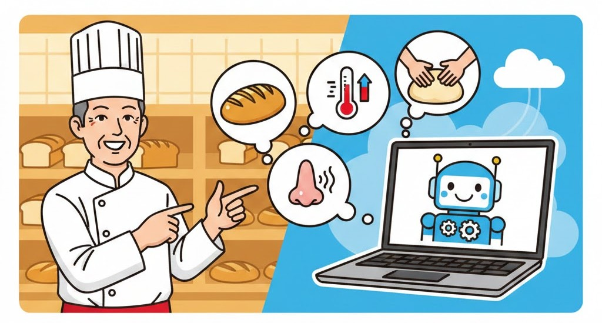

---
title: "製パン職人歴35年｜「生地の声が聞こえる」経験をAIと組み合わせて月2〜4万円の副収入を目指す方法"
slug: "bread-baker-35years-ai-side-income"
excerpt: "58歳、製パン職人歴35年。発酵の見極めや焼き加減の勘は、AIには真似できない判断力です。現場で培った「五感の技術」をAIで言語化し、月2〜4万円の副収入を目指す具体的な方法をIT初心者向けに解説します。"
category: "副業・収入"
pubDate: 2026-02-10

## 今回の課題・話題

製パン職人として長年働いてきた方が、体力の衰えや現場の変化を感じながらも、**「自分にはパンを焼くことしかできない」**と思い込んでいるケースは少なくありません。

今回のペルソナ例として想定するのは、こんな方です。

> 藤田さん（仮名）、58歳。高卒で地元のパン屋に就職し、製パン職人として35年。生地の発酵具合は手触りと匂いで判断でき、窯の温度変化も体感でわかる。しかしパソコンはレシピ検索くらいしか使ったことがなく、スマホもLINEと電話が中心。最近は腰痛がひどくなり、早朝からの仕込み作業が辛くなってきた。

この藤田さんのような経験を持つ方にとって、課題は明確です。**体力勝負の現場はいつまでも続けられない。しかし35年間で培った「パンの技術」は、現場を離れた瞬間にお金にならなくなるのではないか** ── という不安です。

 *35年の現場経験は、体力が衰えても価値を失いません*

さらに製パン業界には、もうひとつ切実な問題があります。効率化の波が押し寄せ、**職人技を発揮できる場面が減っている**ことです。セントラルキッチン方式（工場で一括して生地を作り、各店舗に配送する仕組み）の普及により、冷凍生地を解凍して焼くだけの店舗が増え、「一から仕込みができる職人」の居場所が狭くなっています。

しかし、この状況はAI時代において逆にチャンスになり得ます。なぜなら、**現在のAI技術が最も苦手とするのが「五感に基づく判断」**だからです。

## 一般的な解決法

製パン職人が現場以外で収入を得ようとする場合、一般的には以下のような方法が考えられます。

**パン教室の開業**がまず挙がりますが、集客、場所の確保、材料費の立替、SNSでの宣伝など、本業とは別のスキルが多数必要になります。ITに不慣れな方にとっては、教室の運営そのものよりも集客の壁が高くなりがちです。

**レシピ本の出版やYouTubeでの発信**も選択肢としてはありますが、競合が非常に多く、プロのカメラマンや編集者を使った見栄えの良いコンテンツと戦うことになります。職人としての腕は確かでも、「見せ方」の部分で若い世代に負けてしまうケースが多いのが現実です。

**コンサルティング**はハードルが高く、「自分のような職人が人に教える立場になれるのか」という心理的な壁が立ちはだかります。

いずれの方法も、**「ITスキル」「マーケティング力」「自己プロデュース力」のどれかが前提条件**になっているのが問題です。

## おとなが人生経験を生かして解決する方法

ここで重要なのは、発想の転換です。

製パン職人の35年の経験とは、単に「パンが焼ける」ということではありません。それは**「五感で品質を判断できる能力」の集大成**です。

具体的に言えば、以下のような判断を日常的に行っているはずです。

- 生地を触った瞬間に「今日は湿度が高いから水を減らすべき」とわかる
- 発酵中の生地の匂いで「あと10分」か「もう5分オーバー」かを判断できる
- 焼き上がりの色と音で、中心温度を測らなくても焼成状態がわかる
- 季節や天候による小麦粉の水分含有量の変化を、配合を見なくても調整できる

**これらはすべて、現在のAI技術では再現できない判断です。** AIは温度や湿度のデータからパターンを見つけることは得意ですが、「手触りの微妙な違い」や「匂いの変化」からリアルタイムで判断を下すことはできません。

そしてこの能力は、**AIがさらに進化した時代になっても、当面は価値が残る側の能力**です。

なぜなら、AIが進化すればするほど、**「AIが出した結果が正しいかどうかを判断できる人間」**の価値が上がるからです。他の業界でも同じことが起きています。たとえば経理の世界では、帳簿上は問題なくても、入出金のタイミングや数字の粒度を見て「この案件は後でトラブルになる」と直感的にわかるのは、長年の経験を持つ人間だけです。

製パン職人の場合も同様で、AIが「この配合で理論上は最適です」と出した結果に対して、**「いや、この季節のこの小麦粉だと、もう少し水を控えないとベタつく」**と指摘できるのは、現場を知る職人だけです。

つまり、**AIを「道具」として使いながら、自分の経験を「検品者」「監督者」として活かすポジション**が、おとな世代にとって最も自然で持続可能な立ち位置になります。

 *AIを道具に、あなたの経験を「検品者」として活かすポジション*

この立ち位置を確保するために必要なのは、プログラミングでも最新AIツールの習熟でもありません。**「自分が無意識にやっている判断を、言葉にする力」**です。そしてその言語化作業こそ、AIが最も得意とするサポート領域なのです。

なお、これは「AIを使えば誰でも職人になれる」という話ではありません。**中身となる経験を持っている人が、その経験を言葉にするための補助としてAIを使う**という順番が重要です。AIエージェント（AIが自律的にタスクをこなす仕組み）やAGI（人間と同等の判断ができる汎用AI）が普及しても、プラットフォーム上で収入を得るためには、**「AIに的確な指示を出せる側の人間」であり続けること**が必須になります。35年の現場経験は、まさにその「的確な指示」の源泉です。

## 具体的な作業結果

藤田さんのような製パン職人歴35年の経験を活かす場合、以下のようなステップで副収入を目指すことが考えられます。もちろん、これはモデルケースであり、誰でも必ずこの通りに稼げるという話ではありません。しかし、正しい手順を踏めば十分に現実的な目標です。

### ステップ1：「職人の勘」を言語化する

最初にやるべきことは、**自分が日常的に行っている判断を、AIとの対話を通じて言葉に変換する作業**です。

たとえば、AIチャット（ChatGPTやClaudeなど）に対して、こんなふうに話しかけます。

「私は製パン職人を35年やっています。食パンの生地をこねているとき、手に吸い付くような感触から、少しサラッとした感触に変わる瞬間があります。この変化が起きたら、こね上がりのサインです。これを、パン作り初心者にもわかるように説明してください。」

すると、AIはその感覚的な表現を**初心者にも伝わる平易な言葉**に変換してくれます。職人にとっては「当たり前すぎて説明するまでもないこと」が、実は**他の人にとっては非常に価値のある情報**だということに気づく瞬間です。

### ステップ2：小さなデジタル商品を作る

言語化できた内容を、**PDFやチェックリストの形にまとめて販売する**のが最初の収益化ステップとして現実的です。

藤田さんのような経験があれば、以下のようなデジタル商品が想定できます。

- **「製パン失敗事例集」** ── 35年間で見てきた失敗パターンと、その原因・対処法をまとめたもの。「パン作り 失敗」で検索する人は非常に多く、需要が安定しているジャンルです。
- **「季節別・生地調整チェックリスト」** ── 春夏秋冬で変わる水分量・発酵時間・室温管理のポイントを、チェックリスト形式でまとめたもの。家庭でパンを焼く人にとって、プロの「季節感覚」は非常に求められている情報です。
- **「パン屋開業前に知っておくべき現場のリアル」** ── 開業希望者向けに、レシピ本には載っていない「現場の落とし穴」をまとめたもの。原材料の選び方、業務用オーブンの癖、仕込みの時間配分など。

これらの商品は、1点500〜1,500円程度で販売することが想定できます。月に20〜40点売れれば、**月2〜4万円の副収入**が見込める計算です。

### ステップ3：販売の仕組みを最小限で構築する

販売先としては、**note（ノート）**や**ココナラ**が、IT初心者にとって最もハードルが低い選択肢です。

ここまでで、あなたの経験がどのように商品になるかのイメージはつかめたのではないでしょうか。ここから先は**「明日から手を動かせる具体的な手順」**に入ります。

- IT音痴でも迷わない、noteとココナラの選び方と出品の流れ
- 「なんて命令すればいいかわからない」を解決する、**AIへの指示の出し方**
- 最初の1円を稼ぐために、最初のひと月にやるべきことリスト

35年の職人技を、これ以上「タダ」で眠らせておくのはもったいないことです。あなたの技術を「資産」に変える具体的な方法を、一緒に見ていきましょう。

<!-- paywall -->

### ステップ3の続き：販売プラットフォームの選び方

**noteの場合**は、記事を書く感覚でそのままデジタルコンテンツを販売できます。特別な設定はほとんど不要で、文章を書いて価格を設定するだけで公開できるため、藤田さんのようなIT初心者にも取り組みやすいでしょう。

**ココナラの場合**は、「製パンに関するお悩み相談」や「パン屋開業のアドバイス」といった形でサービスとして出品する方法もあります。テキストでのやり取りなので、対面の必要がなく、自分のペースで対応できるのが利点です。

いずれの場合も、**商品説明文やタイトルの作成にAIを活用**できます。「この内容を、パン作り初心者の主婦に響くように書き直して」とAIに依頼すれば、自分では思いつかなかった訴求ポイントが見つかることがあります。

### ステップ4：週のルーティンに落とし込む

藤田さんのような方が無理なく続けるための1週間のスケジュール例としては、以下のような形が想定できます。

- **月曜日（30分）：** AIとの対話で「今週の言語化テーマ」を1つ決める。例：「クロワッサンの層が均一にならない原因と対策」
- **火〜水曜日（各20分）：** AIに話しかけながら、テーマの内容を文章化していく。音声入力を使えば、タイピングが苦手でも問題ない
- **木曜日（30分）：** AIに「この文章をもっとわかりやすく」「初心者が疑問に思いそうな点を追加して」と依頼して推敲する
- **金曜日（20分）：** 完成した内容をnoteやココナラに投稿する

慣れてくれば**週の合計作業時間は約2時間**です。最初のうちは音声入力やプラットフォームの操作に戸惑うこともあるので、**最初の1〜2週間は週末の半日を使うくらいの気持ち**で始めるとよいでしょう。早朝からの仕込み作業に比べれば、体力的な負担はほぼありません。

### 収益シミュレーション

| 商品 | 単価 | 月間販売数（目安） | 月間収益（目安） |
|------|------|------|------|
| 製パン失敗事例集PDF | 980円 | 10〜20部 | 9,800〜19,600円 |
| 季節別チェックリスト | 500円 | 10〜15部 | 5,000〜7,500円 |
| ココナラ相談サービス | 2,000円 | 3〜5件 | 6,000〜10,000円 |

※上記は各プラットフォームの手数料（10〜22%程度）を差し引く前の金額です。手数料控除後の手取りは、合計で**およそ月1.6万〜3万円程度**が目安になります。商品の種類を増やしたり、販売実績がついてレビューが集まることで販売数が伸びれば、**月4万円以上も十分に視野に入ります**。

ただし、これは商品の質と認知度が安定してきた段階の数字であり、**最初の1〜2ヶ月は収益ゼロでも焦らないことが重要**です。

## よくある質問と回答

**Q：パンの作り方なんてネットにいくらでもあるのに、自分の知識に価値があるのでしょうか？**

あります。ネット上のレシピは「材料と手順」が中心です。しかし、**「なぜこの工程で失敗するのか」「季節によって何をどう変えるのか」**という現場の判断基準は、ほとんど出回っていません。35年の経験から生まれる「失敗を防ぐ知恵」は、レシピ情報とはまったく別の価値を持っています。

**Q：AIに自分の技術を教えたら、それがコピーされて自分の価値がなくなりませんか？**

その心配は不要でしょう。AIに教えるのは「判断の枠組み」であって、**35年間の五感の蓄積そのものはコピーできません**。むしろ、AIを使って自分の経験を言語化・商品化できる人が先行者利益を得る時代です。言語化しなければ、その経験は自分の引退とともに消えてしまいます。

**Q：パソコンが苦手で、noteやココナラの操作ができるか不安です。**

同様の不安を持つ方でも、スマホだけで始めることが可能です。noteもココナラもスマホアプリがあり、文章の入力は**音声入力**を使えばタイピング不要です。AIへの質問も音声で行えるため、「キーボードが打てない」ことは障壁になりません。最初の1記事を公開するまでのハードルは、想像よりもずっと低いはずです。

**Q：製パン以外の食品製造（製菓、給食調理など）の経験でも同じ方法は使えますか？**

使える可能性は高いでしょう。**「五感で品質を判断する」「季節や環境で調整する」「失敗パターンを経験で知っている」**という要素は、食品製造全般に共通します。製菓職人なら「温度1度の違いでチョコレートのテンパリングの仕上がりが変わる理由」、給食調理員なら「300人分の味噌汁の味を安定させるコツ」など、それぞれの現場にしかない知恵があるはずです。

## まとめ

製パン職人として35年間培ってきた**「五感による判断力」は、AI時代に消えるどころか、むしろ希少価値が高まる能力**です。

AIは膨大なデータから理論上の最適解を出すことは得意ですが、「今日のこの小麦粉、この湿度、この窯」で何が起きるかを瞬時に判断することはできません。その判断ができるのは、**現場で何万回もの試行錯誤を重ねてきた職人だけ**です。

大切なのは、その経験を**「自分にしかできない特殊技能」として閉じ込めておかないこと**です。AIを対話相手として使い、「当たり前にやっていたこと」を言葉に変えていく。その言葉が、パン作りに悩む誰かにとっての解決策になり、あなたの副収入につながります。

**「自分の技術は言葉にできない」と思っていたことが、AIとの対話で言葉になる。** その瞬間が、職人経験をAI時代の資産に変える第一歩になるでしょう。

 *職人の技術が言葉になる瞬間が、AI時代の資産づくりの始まりです*
