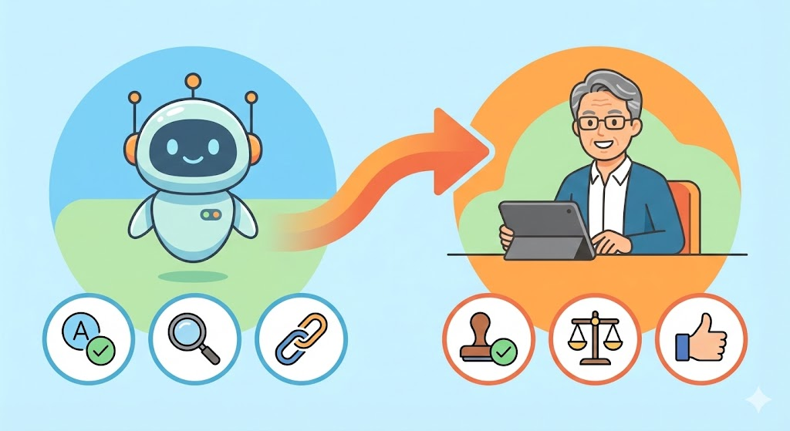

## 今回の課題・話題

AIが文章を自動で書いてくれる時代になりました。企業のブログ記事、商品説明文、メールマガジン、YouTube台本——あらゆる文章がAIで量産されるようになっています。

*30年の経験が生んだ「違和感センサー」はAI時代にこそ価値がある*

ところが、ここで大きな問題が起きています。**AIが書いた文章は、一見もっともらしいのに「どこか信用できない」ケースが非常に多い**のです。

たとえば、文法的には正しいのにその業界では絶対に使わない言い回しが入っている。数値や固有名詞が前後で微妙にズレている。論理は通っているのに、読み手の感情を逆なでする構成になっている。こうした「AIっぽい違和感」に、読者は敏感に気づきます。

今回の記事では、**印刷会社で校正・校閲を30年続けてきた方**をペルソナとして想定します。たとえば、59歳、印刷会社の校正部門一筋30年、赤ペンと校正記号が体に染みついているが、パソコンはメールとWordくらいしか使えない——そんな方です。

この「文章のプロ」が持つ**「違和感センサー」**は、AIエージェント時代・AGI時代にこそ最も求められる能力になります。その理由と、具体的に月5〜8万円の副収入を目指す方法を解説します。

## 一般的な解決法

校正・校閲の経験を副業に活かそうとすると、多くの方がまず思いつくのはクラウドソーシングサイトでの「校正案件」への応募でしょう。

一般的には、以下のような方法が紹介されています。

クラウドワークスやランサーズで「校正」「校閲」「文章チェック」などのキーワードで案件を探し、1文字0.3〜1円程度の単価で受注するパターンです。誤字脱字チェック、表記ゆれの統一、事実確認といった従来型の校正作業が中心になります。

しかし、この方法には限界があります。**単純な誤字脱字チェックはAIツールが急速に精度を上げている**ため、単価が下がり続けています。Wordのスペルチェックや無料の文章校正ツールでもある程度カバーできてしまうため、「誤字脱字を直すだけ」の校正は、残念ながら価格競争に巻き込まれやすいのが現状です。

また、従来の校正案件は「原稿を渡されてチェックして返す」という受け身の作業が多く、自分の経験や判断力を十分に活かしきれないもどかしさもあるでしょう。

## おとなが人生経験を生かして解決する方法

ここからが本題です。校正・校閲を30年続けてきた方が持つ本当の強みは、誤字脱字を見つける「目」ではありません。**「この文章は公開して問題ないか」を総合的に判断できる「違和感センサー」**です。

この能力は、AIエージェント時代・AGI時代においても代替が極めて困難です。その理由を説明します。

### AIが進化しても「検品力」が不要にならない理由

AIは文章を「生成」する能力では驚異的な進化を遂げています。しかし、**自分が書いた文章の問題点を自分で見つける「自己検品」は、AIの構造的な弱点**です。

たとえば、AIは「8割正しくて2割致命的に間違っている」文章を平然と出力します。前提条件を取り違えたまま論理的に正しい結論を導いたり、古い情報を最新の事実のように断定的に書いたり、定義が曖昧なまま専門用語を使い続けたりします。

校正・校閲のベテランであれば、こうした「もっともらしいが危険な文章」を読んだ瞬間に**「何かおかしい」と感じる**はずです。数値が不自然に整いすぎている、因果関係が逆転している、結論が安全側に逃げすぎている——この直感は、過去に何万本もの文章を読み、何千回も赤ペンを入れてきた経験の蓄積から生まれるものです。

正直なところ、最初は「自分のこの感覚が、本当にお金になるのだろうか」と不安に思うかもしれません。しかし、**チェックリストでは再現できないこの感覚こそが、AI時代に最も価値のある能力**なのです。

### 「AIの監督者」というポジション

AGI（人間と同じように何でもできる人工知能）が実現しても、**AIが生成したコンテンツを「これは世に出して大丈夫か」と最終判断する人間**は必ず必要です。これは、工場で製品を大量生産しても最終検品を人間がやるのと同じ構造です。

*校正・校閲の経験者はAI時代の品質管理責任者になれる*

将来的にはAIによる検品精度も上がっていくでしょう。しかし、**最終的な公開判断を人間が担う構造は、法的・倫理的な責任の所在という観点からも、少なくとも今後10〜20年は変わらない**と考えられます。

校正・校閲30年の経験者は、まさに**「AI時代の品質管理責任者」**としての適性が非常に高いといえます。AIという「知識は豊富だが現場経験のない新人ライター」が書いた文章に対して、「ここは業界的にNGだ」「この表現は読み手を不安にさせる」「この数字の根拠を確認しろ」と指示を出せる——このスキルは、AIが進化しても陳腐化しません。

**つまり、「AIを学ぶ」のではなく、「AIの出力を検品する側に立つ」ことで、プラットフォームから安定した収入を得るスキルが身につく**のです。

ここまでお読みいただいた方は、ご自身の校正・校閲スキルがAI時代にこそ活きることをご理解いただけたと思います。

<!-- paywall -->

**ここから先は、ITスキルに自信がない方でも今日から始められる「具体的な手順」と「案件の探し方」です。** 30年の経験を眠らせたままにせず、AI時代に必要とされる人材として新しい収入の柱を作るためのロードマップを解説していきます。

## 具体的な作業結果

校正・校閲歴30年の山口さん（59歳・仮名）のような経験を持つ方が副業を始める場合、以下のようなステップと収益化の流れが想定できます。なお、以下はあくまで想定ケースであり、すべての方が同じ結果を得られることを保証するものではありません。

### ステップ1：「AI生成文章の品質チェック」という需要を知る

まず理解していただきたいのは、**従来の校正とは異なる新しい市場が急速に拡大している**ということです。

企業がAIで大量に文章を生成するようになった結果、「AI出力の事実確認（ファクトチェック）・品質チェック」という仕事が生まれています。クラウドソーシングサイトで「AI 校正」「AI チェック」「AIライティング 品質管理」などで検索すると、従来の校正案件とは異なる案件が見つかるでしょう。

この分野では、単なる誤字脱字チェックではなく、**「事実誤認がないか」「業界の慣習に反していないか」「読み手に誤解を与えないか」**を判断できる人材が求められます。まさに、校正・校閲のベテランが最も力を発揮できる領域です。

### ステップ2：得意分野を「検品ジャンル」として定義する

30年のキャリアの中で、どんなジャンルの原稿を多く扱ってきたかを棚卸しすると良いでしょう。たとえば以下のような整理が考えられます。

**得意ジャンルの棚卸し例：**
山口さんのような方であれば、出版物（書籍・雑誌）の校正で培った「構成の論理チェック」、広告・販促物で鍛えた「景品表示法・薬機法に抵触しないかの感覚」、技術文書で身についた「専門用語の正確性チェック」といった強みがあるかもしれません。

これらを「自分が検品できるジャンル」として明確にしておくことで、**単価の高い案件に絞って応募できる**ようになります。

### ステップ3：AIを「下読みアシスタント」として使う

ここがポイントです。AIを使って自分の作業を効率化します。校正・校閲の経験者がAIを活用する場合、以下のような使い方が効果的でしょう。

*AIに単純作業を任せ自分は判断に集中する*

**AIに任せる工程：** 誤字脱字の一次チェック、表記ゆれの洗い出し、アクセスしても表示されなくなったURL（リンク切れ）がないかの確認

**自分がやる工程：** 事実関係の最終確認、業界特有の表現チェック、「この文章を公開して大丈夫か」の総合判断、クライアントへの修正提案と理由の説明

このように**AIに単純作業を任せ、自分は「判断」に集中する**ことで、1件あたりの作業時間を大幅に短縮できます。従来3時間かかっていた校正作業が1.5〜2時間で終わるようになれば、受注できる件数が増え、収入も上がります。

### ステップ4：収益化のルートを複数持つ

校正・校閲の経験×AIで収益化する方法は、一つに限りません。以下のような複数のルートが想定できます。最初は月2〜3万円から始まるケースも多いですが、実績を積むことで徐々に単価を上げていくことが可能でしょう。

**ルート①：クラウドソーシングでの受注（月2〜4万円）**
AI生成文章のチェック案件を中心に、週に2〜3件程度を受注するイメージです。1件あたり3,000〜5,000円の案件を選べば、月2〜4万円程度の売上が期待できます。慣れてきたら件数を増やしたり、より単価の高い案件に応募したりすることで、さらに上を目指せるでしょう。

**ルート②：「AI文章チェックリスト」のテンプレート販売（月1〜2万円）**
自分が校正時に使っているチェック項目を、業界別・用途別にまとめたテンプレートとして販売する方法です。「AI生成の検索上位を狙った記事（SEO記事）を公開前にチェックする30項目」「AI生成の商品説明文チェックシート」など、実務で役立つ内容であれば、1部500〜1,500円程度で継続的に売れる可能性があります。

**ルート③：企業向け「AI文章品質ガイドライン」の作成支援（月2〜5万円）**
AIで文章を量産し始めた企業に対して、「御社のブランドイメージに合わないAI表現リスト」「公開前に必ずチェックすべき項目一覧」を作成する仕事です。これは単発ではなく、毎月決まった金額で継続する契約になりやすい分野です。

### 1週間のスケジュール例

山口さんのような方が無理なく続ける場合、以下のようなスケジュールが想定できます。

**月・水・金（各2時間）：** クラウドソーシング案件の校正作業（AIで一次チェック→自分で最終判断→納品）

**火（1.5時間）：** チェックリストテンプレートの更新・新規作成（先週の案件で気づいたポイントをメモにまとめる等）

**木（1.5時間）：** 新規案件の探索、クライアントとのやり取り、AIツールの使い方の確認

**土日：** 休み（または気が向いたときに1時間程度）

週あたりの作業時間は約9時間、月に換算すると約36時間です。この作業量で、**月5〜8万円程度の収入を目指す**ことは十分に現実的でしょう。ただし、すべての方がこの金額に到達するわけではなく、得意分野や案件との相性によって結果は変わります。

## よくある質問と回答

**Q. パソコンはWordとメールくらいしか使えませんが、大丈夫でしょうか？**

大丈夫です。校正・校閲の仕事で最も重要なのは「文章を読んで判断する力」であり、高度なIT操作は必要ありません。クラウドソーシングサイトへの登録と、AIチャットツール（ブラウザで使えるもの）の基本操作を覚えれば、十分に始められるでしょう。最初は無料で使えるAIツールから試してみることをおすすめします。

**Q. 「AI生成文章のチェック」は、普通の校正と何が違うのですか？**

従来の校正は「人間が書いた文章のミスを直す」作業でした。AI生成文章のチェックは、それに加えて**「AIが自信満々に書いた不正確な情報を見抜く」**という工程が加わります。AIは「8割正しくて2割間違っている」文章を、あたかもすべて正しいかのように出力します。この2割を見抜けるかどうかが、単価の差になります。校正・校閲のベテランであれば、この「違和感に気づく力」はすでにお持ちのはずです。

**Q. 校正の仕事自体がAIに奪われるのではないですか？**

単純な誤字脱字チェックは、確かにAIに置き換わりつつあります。しかし、**「この文章を公開して問題ないか」という総合判断は、AIには極めて難しい**のが現状です。景品表示法に抵触しないか、業界の慣習に反していないか、読み手の感情を害さないか——こうした判断には、長年の実務経験に基づく「文脈の理解」が必要です。むしろ、AIが文章を大量生産するようになったことで、**検品できる人材の需要は増えている**といえるでしょう。

**Q. どのくらいの期間で収入が安定しますか？**

個人差はありますが、最初の1〜2ヶ月はクラウドソーシングでの実績作り（低単価でも受注して評価を積む期間）に充てることをおすすめします。3ヶ月目以降は、実績と評価をもとに単価の高い案件を選べるようになるでしょう。半年程度で月5万円前後が安定する方が多いと想定されます。焦らず、自分のペースで実績を積み上げていくことが大切です。

**Q. 専門分野がない場合でも始められますか？**

始められます。30年間校正・校閲をしてきた方であれば、意識していなくても「自分が得意なジャンル」は必ずあります。たとえば、出版社の校正部門であれば「書籍の構成チェック」、広告代理店であれば「キャッチコピーの表現チェック」、企業の社内報であれば「ビジネス文書の品質管理」——これらはすべて、AI時代に需要のある専門性です。長年やってきた仕事が、そのまま活きる分野です。まずは自分のキャリアを振り返り、最も多く扱ってきたジャンルから始めてみると良いでしょう。

## まとめ

校正・校閲を30年続けてきた方が持つ**「違和感センサー」は、AI時代に最も価値が高まる能力のひとつ**です。

AIが文章を大量に生成する時代だからこそ、「この文章は世に出して大丈夫か」を判断できる人間が必要とされています。これは、AIエージェントが普及しても、AGIが実現しても変わらない構造的な需要です。

大切なのは、**AIと競争するのではなく、AIの「監督者」としてのポジションを取る**ことです。AIに単純な一次チェックを任せ、自分は判断と検品に集中する。この役割分担ができれば、体力勝負ではなく経験と判断力で勝負する働き方が可能になります。

「赤ペンを持つ手」から「AIを監督する目」へ。30年かけて磨いてきた品質への感覚は、これからの時代にこそ本当の価値を発揮するでしょう。