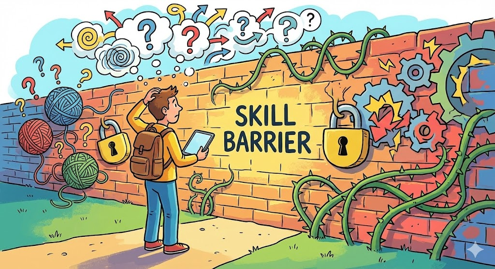
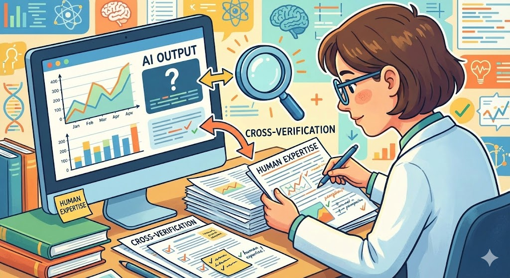

## 「先行技術を見つけ出す力」は副業になるのに、なぜ多くの調査員はその一歩を踏み出せないのか

59歳、特許調査員歴26年。技術文献の山から類似特許を的確に洗い出し、発明の新規性を左右する先行技術を見つけてきた方が、今まさに直面している課題があります。

*26年の調査経験は副業になるのに、多くの人が最初の一歩を踏み出せない壁*

「この調査スキル、個人で活かせるはずなのに、具体的にどうすればいいかわからない」という壁です。

特許事務所の中では当たり前のように行っている先行技術調査ですが、実は個人発明家や特許出願を検討する中小企業にとって、この「調査」こそが最も手が届きにくいサービスです。特許事務所に正式に依頼すれば1件あたり数万円から十数万円。自分で調べようにも、技術分類の読み方すらわからないという方が大半です。

ここに、26年の調査経験を持つプロがAIの高速文献検索と組み合わせた「簡易先行技術調査レポート」を提供するという、明確なビジネスチャンスがあります。

しかし現実には、多くの特許調査のベテランがこの一歩を踏み出せていません。理由は主に3つです。

1つ目は、副業としてのサービス設計の仕方がわからないこと。事務所の業務として行う調査と、個人で請け負う簡易調査ではスコープが全く異なります。

2つ目は、AIツールの導入に抵抗があること。26年間培ってきた手法に自信があるからこそ、AIに頼ることが自分のスキルを否定するように感じてしまう方もいます。

3つ目は、顧客をどう見つければよいかわからないこと。事務所勤務では営業は別の担当者がやってくれましたが、個人では自分で顧客を獲得する必要があります。

この記事では、こうした課題を一つずつ解きほぐしながら、特許調査のプロがAIと組み合わせて月3万円から5万円の副収入を実現するための具体的な設計図をお伝えします。

## 独学でAIツールを試してみたが調査の質が上がらないという典型的なつまずき

特許調査の副業を考えたとき、多くの方がまず試みるのが「AIツールを使って調査を効率化しよう」という直接的なアプローチです。

*経験者の検索戦略設計力がAIの調査精度を劇的に引き上げる*

ChatGPTに「○○技術に関する先行特許を教えてください」と聞いてみる。Perplexityで特許番号を検索してみる。あるいはGoogle Patentsで片っ端から検索してみる。

しかし、このアプローチだけでは壁にぶつかります。

AIが返してくる特許情報は、正確性の保証がないのです。ChatGPTは存在しない特許番号を生成することがありますし、技術分類コード(IPC/CPC)の解釈も表面的なものにとどまります。26年の経験を持つ方であればすぐに気づくはずですが、AIが出力する「先行技術リスト」をそのまま顧客に渡したら、信用を一瞬で失います。

もう1つの典型的な試みが、クラウドソーシングサイトで特許調査案件を探すというものです。ランサーズやクラウドワークスで「特許調査」と検索しても、案件はごくわずか。あったとしても単価が極端に低く、26年のキャリアに見合わない報酬で疲弊するだけです。

さらに、自分のサービスをどう差別化すればいいかわからないという問題もあります。特許事務所の正式な調査と何が違うのか。弁理士資格がなくてもサービスとして成立するのか。こうした不安が行動を止めてしまいます。

結局、多くの方は「やっぱり難しそうだ」と感じて、副業の構想を棚上げにしてしまいます。

ここで重要なのは、AIツールの使い方そのものを変える必要があるということです。AIに調査を丸投げするのではなく、26年の経験で培った「検索戦略の立て方」「技術文献の読み解き方」「類似性判断の目利き力」をAIの処理速度で増幅する、という発想の転換が求められます。

## 26年間で磨いた「検索戦略設計力」がAIの精度を劇的に引き上げる理由

ここからが本題です。特許調査員としての26年間の経験とAIツールを組み合わせたとき、なぜ他の人には真似できない価値が生まれるのかを具体的に説明します。

*AIの高速検索とベテランのノイズ除去力を組み合わせた調査ワークフロー*

### 経験者だけが持つ「検索戦略設計力」とは

特許調査の素人がAIに「この発明の先行技術を探して」と頼むのと、26年のベテランが同じAIを使うのとでは、結果に天と地ほどの差が出ます。

その差の核心は検索戦略の設計力にあります。

具体的には以下のような能力です。

技術概念の分解力: 1つの発明を複数の技術要素に分解し、それぞれに対して最適な検索キーワードと技術分類コードを設定できる。たとえば「折りたたみ式ソーラーパネル付きモバイルバッテリー」という発明があったとき、素人は「折りたたみソーラーパネル バッテリー」で検索して終わりますが、ベテランは「太陽電池モジュールの可動構造」「携帯用電源装置の筐体設計」「ヒンジ機構を有する電子機器」など、複数の切り口から網羅的に検索戦略を組み立てます。

ノイズ除去力: 膨大な検索結果から関連性の低い文献を瞬時にふるい落とす判断力。これは26年間で数万件の特許文献を読んできたからこそ身につく目利きの力です。

類似性の濃淡判断: 完全一致だけでなく、「技術的思想として近い」「構成要素の一部が重複する」「課題解決のアプローチが類似する」といった多層的な類似性判断ができること。

### AIの役割を正しく位置づける

35年のIT経験を持つ当サイト運営者は、Claude Proで全体の論理構成と情報の関連性を確認し、次にChatGPT Plusで個別データの正確性を検証するという順序で文献分析を行っています。この手法は特許調査にもそのまま応用できます。

特許調査におけるAIツールの正しい位置づけは以下の通りです。

ChatGPT Plus(月額約3,000円): 技術用語の整理、検索キーワードの拡張候補生成、特許文書の要約作成に活用します。たとえば、調査対象の発明概要を入力して「この技術に関連するIPC分類コードの候補を10個挙げてください」と指示すれば、自分の知識と照合しながら検索範囲を広げられます。

Claude(無料枠またはPro): 長文の特許明細書の読解と比較分析に優れています。2件の特許文献の全文を入力し、「技術的特徴の共通点と相違点を表形式で整理してください」と依頼すれば、比較表の叩き台が数分で完成します。ここにベテランの目で修正と補足を加えれば、高品質な分析が短時間で仕上がります。

Perplexity(無料枠またはPro): 最新の技術動向や関連論文の検索に使います。引用元が明示されるため、AIの出力に含まれる情報の信頼性を確認しやすいのが特長です。

重要なのは、AIが出力した結果を必ず自分の経験でクロス検証するというプロセスです。当サイト運営者も「AIの数値計算結果と参照元データの整合性チェックが最重要」と強調しています。特許調査においてもこの原則は同じです。AIが提示した類似特許リストを鵜呑みにせず、IPC分類の妥当性、引用関係の正確性、技術的関連性の深さを自分の目で確認する。この一手間が、素人には絶対に提供できない信頼性を生みます。

### 低予算で始めるためのツール構成

高額なツールに投資する必要はありません。特に副業の立ち上げ期は無料枠の組み合わせで十分に開始可能です。

情報収集フェーズ: ChatGPT、Gemini、Claudeの無料枠を日替わりで使い分けます。各サービスの日次制限を考慮し、月曜はChatGPT、火曜はClaude、水曜はGeminiといったローテーションを組むことで、コストゼロで継続的にAI分析を活用できます。

検索・記録フェーズ: Google Patents(完全無料)で検索し、結果をGoogle Sheetsに記録します。検索式、ヒット件数、関連度の高い文献番号を体系的に蓄積していくことで、案件を重ねるほどデータベースが充実し、調査効率が上がっていきます。

レポート作成フェーズ: Google Docsでテンプレート化したレポートを作成し、Canva無料版で技術マップや比較図表を作成します。Notion AIの無料枠も、調査結果の構造化に役立ちます。

この構成であれば、初期費用はゼロ、月額費用もインターネット代のみで始められます。案件が安定してきた段階でChatGPT Plus(月約3,000円)やPerplexity Pro(月約3,000円)を追加しても、月額ツール費用は6,000円から8,000円程度に収まります。

<!-- paywall -->

## 「簡易先行技術調査レポート」で月3〜5万円を実現するサービス設計と収益シミュレーション

### サービスの具体的な設計

提供するサービスは「簡易先行技術調査レポート」です。特許事務所が提供する本格的な先行技術調査(1件10万円以上)とは明確に差別化します。

サービス内容: 発明のアイデアや技術概要をヒアリングし、関連する先行特許を5件から10件抽出。それぞれについて技術的な類似点と相違点を整理した簡易レポートを提供します。

重要な注意点: このサービスは特許出願の可否判断を行うものではありません。弁理士の独占業務である特許性の判断には踏み込まず、あくまで「技術文献の調査と整理」に特化します。レポートにもその旨を明記することで、法的な問題を回避できます。

ターゲット顧客: 個人発明家、特許出願を検討している中小企業、クラウドファンディングで製品化を計画しているスタートアップなどです。これらの方々は「まず自分のアイデアに近い既存技術があるかどうかを、手軽に知りたい」というニーズを持っています。

### 価格設定と収益シミュレーション

当サイト運営者はITVA業務での高単価案件受注経験から、時間と専門性で価格を算出し、初期サンプル提出で品質基準を確認する方法を推奨しています。

この考え方を簡易先行技術調査に当てはめると、以下のような設計になります。

ビフォー(AI導入前の手動調査): 1件あたりの調査時間は4時間から6時間。月に対応できる案件数は限られ、副業としては非現実的でした。

アフター(AI活用後): 1件あたりの調査時間は1.5時間から2時間に短縮。AIがキーワード拡張、文献スクリーニング、要約作成の一次処理を担い、ベテランの目で最終判断と分析コメントを加えるフローにより、従来の60〜70%の時間削減が見込めます。

価格設定の目安:
- 簡易調査レポート(先行特許5件抽出+比較表): 1件 8,000円から12,000円
- 詳細調査レポート(先行特許10件抽出+分析コメント付き): 1件 15,000円から20,000円

月3万円の達成パターン: 簡易レポート(1万円)を月3件 = 3万円。週末に1件ずつ対応すれば十分に実現可能です。

月5万円の達成パターン: 簡易レポート(1万円)を月3件 + 詳細レポート(1.5万円)を月2件 = 5万円。定期的に依頼してくれるリピート顧客が1社でも見つかれば安定します。

### 顧客獲得の導線

顧客をどう見つけるかは、多くの方が悩むポイントです。以下の3つの導線を段階的に構築していきます。

第1段階: ココナラへの出品: スキルマーケットのココナラに「簡易先行技術調査レポート」を出品します。最初の3件は相場より低い5,000円程度で受注し、実績と高評価を積み上げます。レビューが5件以上得られたら、通常価格に戻します。

第2段階: 発明家コミュニティへの接点づくり: 発明学会や各地域の発明協会が主催するイベント、個人発明家が集まるオンラインコミュニティに参加し、「元特許事務所の調査員が簡易レポートを作成します」という形で認知を広げます。

第3段階: 弁理士との連携: 個人事務所の弁理士や小規模特許事務所に対して、「繁忙期の調査補助」や「簡易スクリーニングの外注先」としてアプローチします。特許出願前の簡易調査を外部に出したいと考えている事務所は少なくありません。

### 作業フローの全体像

実際の1案件の流れを時系列で整理します。

ステップ1(15分): 顧客から発明概要をヒアリング。技術内容、想定される用途、先行技術として心当たりのあるものを確認します。

ステップ2(20分): AIツールを使って検索戦略を設計。ChatGPTにヒアリング内容を入力し、関連するIPC分類コード候補とキーワード拡張リストを生成。26年の経験で取捨選択と追加を行います。

ステップ3(30分): Google PatentsとJ-PlatPatで実際の検索を実行。AIが生成したキーワードと分類コードを組み合わせた複数の検索式を投入し、結果をGoogle Sheetsに記録します。

ステップ4(20分): 関連度の高い文献を5件から10件に絞り込み、Claudeで各文献の要約と比較分析の叩き台を作成。ベテランの目で修正と補足を加えます。

ステップ5(15分): Google Docsのテンプレートにレポートを仕上げ、Canva無料版で比較図表を作成。顧客に納品します。

合計所要時間: 約1時間40分。これで1万円前後の報酬であれば、時給換算で約6,000円。26年のキャリアに見合う水準です。

## FAQ

**Q1. 弁理士資格がなくても先行技術調査サービスを提供できますか?**

提供できます。弁理士法で弁理士の独占業務とされているのは、特許出願の代理や特許性に関する鑑定業務などです。先行技術の文献検索と情報整理は、弁理士資格がなくても行えます。ただし、レポートに「特許性がある/ない」という判断を記載してはいけません。あくまで「関連する先行技術文献の調査と整理」にサービス範囲を限定し、レポートにも免責事項を明記してください。

**Q2. AIが提示する特許情報に誤りがあった場合、どう対処すればよいですか?**

これこそ26年の経験が活きる場面です。AIの出力は必ず一次情報で裏取りしてください。具体的には、AIが提示した特許番号をJ-PlatPatやGoogle Patentsで直接確認し、公報原文と照合します。当サイト運営者も「複数データソースでのクロス検証」を実務の基本としています。AIは文献の発見スピードを上げる道具であり、最終的な正確性の保証は人間の判断で行うという原則を徹底してください。

**Q3. パソコンのスペックが低くても始められますか?**

始められます。Google Patents、J-PlatPat、ChatGPT、Claudeはすべてブラウザ上で動作するため、特別な高性能パソコンは不要です。Google SheetsやGoogle Docsもクラウドサービスなので、インターネットに接続できるパソコンがあれば十分です。将来的にOllama(ローカルLLM)を導入する場合はメモリ8GB以上が望ましいですが、初期段階ではクラウドサービスの無料枠だけで問題ありません。

**Q4. 最初の顧客を獲得するまでにどのくらいの期間がかかりますか?**

ココナラへの出品から最初の受注までは、一般的に2週間から1カ月程度を見込んでください。最初はサンプルレポート(架空の発明テーマで作成した調査レポート例)をサービスページに掲載し、品質の高さを視覚的にアピールすることが重要です。最初の3件を低価格で受注して高評価レビューを獲得できれば、その後は問い合わせが自然に増えていく傾向があります。

**Q5. 本業の特許事務所との利益相反は大丈夫ですか?**

勤務先の就業規則と秘密保持契約を必ず確認してください。副業で扱う案件は、勤務先の顧客や案件とは完全に分離する必要があります。個人発明家や勤務先が取引していない業種の中小企業をターゲットにすることで、利益相反のリスクを最小化できます。不安がある場合は、勤務先に副業の許可を事前に申請することを強く推奨します。

## 26年の調査力は「AI時代の武器」になる。まずはサンプルレポート1件を作ることから始めよう

この記事のポイントを整理します。

26年間で培った検索戦略設計力、ノイズ除去力、類似性判断力は、AIでは代替できない高度なスキルです。このスキルとAIの高速処理能力を掛け合わせることで、従来4時間以上かかっていた調査を約1時間40分に短縮しながら、品質の高い簡易先行技術調査レポートを提供できます。

月3万円から5万円の副収入は、週末に1件から2件のレポートを納品するペースで十分に達成可能な数字です。ツール費用も無料枠の組み合わせから始めれば初期投資はゼロ。案件が安定してから有料プランに移行すれば、リスクを最小限に抑えられます。

今日からできる最初の一歩は、架空の発明テーマを1つ設定して、この記事で紹介した5ステップのフローに沿ってサンプルレポートを1件作ってみることです。AIツールとの連携の感覚をつかみ、自分なりの作業テンプレートを固めてから、ココナラに出品する。この順序で進めれば、26年の経験がAI時代の確かな収入源に変わります。