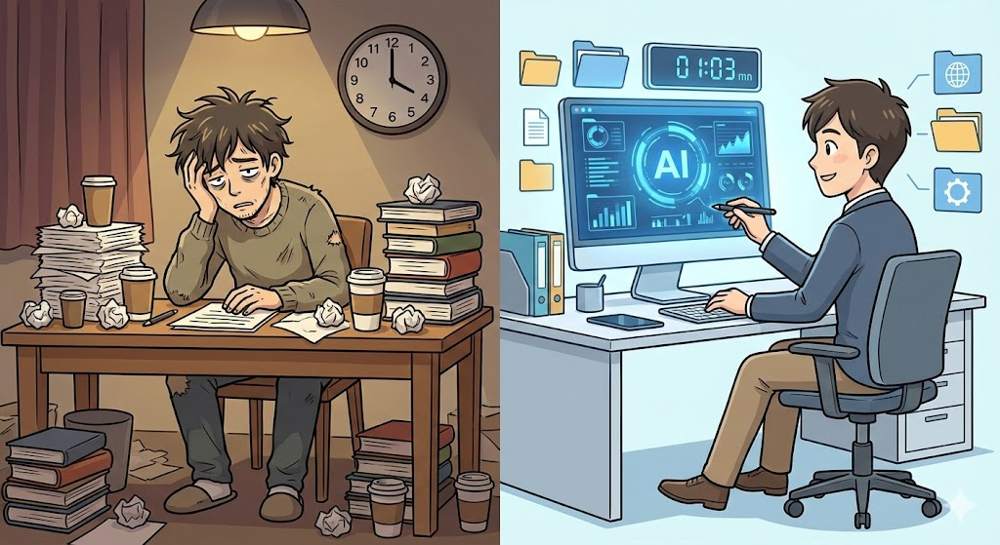
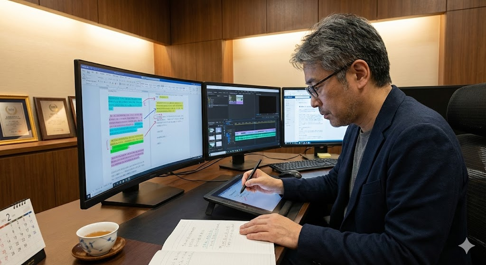

## 「伝わる構成がつくれる」のに、その力を収入に変えられていない問題

たとえば、58歳で放送作家として27年間走り続けてきた方がいるとします。その方が抱える最大の悩みは、意外とシンプルです。**「何をどの順番で伝えれば人が動くか」を知り尽くしているのに、その力をお金に変える方法がわからない**ということです。

*たとえば、58歳で放送作家として27年間走り続けてきた方がいるとします。*

テレビやラジオの現場で培った構成力は、本来ものすごく価値のあるスキルです。視聴者を15秒で引きつけ、CMまたぎでも離脱させず、最後にしっかり行動させる。この一連の設計ができる人は、実はそう多くありません。

しかし、放送業界以外でこの力をどう売ればいいのか、見当がつかない方は少なくありません。「台本を書けます」と言っても、企業の担当者には放送作家がどんな価値を提供できるのかが伝わりにくいのが現実です。

さらに問題を複雑にしているのが、**昨今のコンテンツ制作はスピード勝負になっている**点です。YouTube動画の台本、企業のプレゼン資料、ポッドキャストの構成。どれもクライアントは「早く、安く、でも質は高く」を求めています。手作業だけでは単価が合わず、案件を受けにくい状況に陥りがちです。

この「構成力はあるけれど、スピードと収益化の壁がある」という課題を、AIとの組み合わせで突破する方法を具体的にお伝えしていきます。

## ゼロから台本を手書きする従来型アプローチの限界

### 手作業中心の制作フローが抱える3つの壁

*この工程をすべて手作業で行うと、1本の台本に8から15時間かかることも珍しくありません。*

これまでの台本作成は、基本的に以下の流れで進められてきました。

1. クライアントからのヒアリング(相手の要望や条件を聞き取る作業)
2. テーマのリサーチと情報収集
3. 構成案の作成
4. 下書きの執筆
5. 推敲と修正
6. 納品

この工程をすべて手作業で行うと、**1本の台本に8から15時間**かかることも珍しくありません。仮に1本あたり2万円で受注したとしても、時給換算すると1,300から2,500円程度。副業として月3から5万円を目指すなら、月に2から3本は納品しなければならず、本業や生活との両立が厳しくなります。

### 「安く書ける人」との価格競争

クラウドソーシング(インターネット上で仕事の発注や受注ができるサービス)の世界では、動画台本1本3,000から5,000円という案件が大量に存在します。経験の浅いライターがこうした案件をこなしているため、放送作家としての構成力を適正価格で売ろうとすると、「高い」と判断されてしまうことがあります。

| 項目 | 一般ライター | 放送作家(手作業) |
|------|-------------|------------------|
| 台本1本の制作時間 | 3から5時間 | 8から15時間 |
| 想定単価 | 3,000から5,000円 | 15,000から30,000円 |
| 時給換算 | 600から1,600円 | 1,300から2,500円 |
| 構成の質 | ばらつきあり | 安定して高い |

この表からわかるのは、一般ライターと放送作家の間にある本質的な違いです。構成の質では放送作家が圧倒的に優れている一方、制作にかかる時間の差が価格面での不利につながっています。つまり、**制作時間を短縮できれば、構成力の優位性がそのまま収益に直結する**のです。ここにAIを導入する意味があります。

## 27年の構成力がAIの「弱点」を補い、AIが「時間の壁」を壊す

### なぜ放送作家の経験がAI活用で最強の武器になるのか

*ステップ4: 人間による構成監修と仕上げ(60から90分)*

AIが得意なことと苦手なことを整理すると、放送作家の強みとの相性の良さが見えてきます。

**AIが得意なこと:**

- 大量の情報を短時間で整理する
- 指定されたトーンやフォーマットで文章を生成する
- 複数パターンの案を瞬時に出す

**AIが苦手なこと:**

- 「この順番で伝えれば人が動く」という構成判断
- ターゲットの感情の機微に合わせた展開設計
- CMまたぎやフックポイント(視聴者が続きを見たくなる仕掛け)の最適配置

つまり、**AIは「素材づくりの速さ」を提供し、放送作家は「素材の並べ方と磨き方」を提供する**。この役割分担が成立すると、制作スピードは劇的に上がります。

### 具体的なAI活用ワークフロー

実際の制作フローを、AIツールと組み合わせた形でご紹介します。

**ステップ1: ヒアリング内容の構造化(15分)**

クライアントから受けた要望を、ChatGPTやClaudeといったAIチャットツールに入力して整理します。ChatGPTもClaudeも、ブラウザ(インターネット閲覧ソフト)からアクセスして文章で質問や指示を送ると、AIが回答を返してくれるサービスです。

たとえば「新商品の紹介動画を5分で」という依頼なら、以下のようなプロンプト(AIへの指示文)を使います。

「以下の商品情報をもとに、5分間の紹介動画に必要な要素を箇条書きで整理してください。ターゲットは30代女性、購入の後押しが目的です。」

<!-- paywall -->

**ステップ2: 構成案の叩き台生成(20分)**

AIに複数の構成パターンを出させます。ここが放送作家の腕の見せどころです。AIが出した3から4パターンの構成案を見て、**長年の経験に基づいて「この流れなら視聴者が離脱しない」と判断できるものを選ぶ**のです。

プロンプト例:「上記の要素をもとに、5分動画の台本構成を3パターン提案してください。パターンAは問題提起型、パターンBは共感導入型、パターンCはストーリー型でお願いします。」

**ステップ3: 下書きの自動生成(30分)**

選んだ構成案に沿って、AIに下書きを生成させます。このとき重要なのは、**セクションごとに分けて生成する**ことです。一気に全体を書かせると、中盤でトーンがぶれたり、構成が崩れたりします。

たとえば、5分の動画台本なら「冒頭30秒のつかみ」「問題提起パート(1分)」「解決策の提示(2分)」「まとめと行動喚起(1分30秒)」のように区切り、それぞれ別のプロンプトで生成すると品質が安定します。

**ステップ4: 人間による構成監修と仕上げ(60から90分)**

ここが最も価値を生むパートです。AIの下書きに対して、以下の観点で手を入れます。

- 冒頭15秒で視聴者の関心をつかめているか
- 情報の提示順序は最適か
- フックポイント(続きが気になるポイント)は適切に配置されているか
- 結末でしっかり行動を促せているか
- クライアントのブランドトーンに合っているか

この監修作業こそが、放送作家の27年分の経験が直接的に価値を発揮する工程です。AIが生成した文章の中から「ここは順番を入れ替えたほうが伝わる」「この表現では視聴者が離れる」と判断できるのは、長年にわたって視聴者の反応を見てきた方ならではの力です。

### 使用ツールの組み合わせ

低スペックPCや低速回線でも問題なく使えるツール構成を紹介します。すべてブラウザ上で動作するため、ソフトのインストールは基本的に不要です。

| 用途 | ツール | 費用 |
|------|--------|------|
| 下書き生成 | ChatGPT(無料プラン)+ Claude(無料枠) | 0円 |
| テキスト編集 | Visual Studio Code(無料のテキスト編集ソフト) | 0円 |
| 情報整理・分析 | Google Sheets(無料の表計算ツール) | 0円 |
| 資料ビジュアル化 | Canva(無料のデザインツール) | 0円 |
| ファイル管理 | Google Drive(無料のクラウド保存サービス) | 0円 |

**月額コストは基本的に0円で始められます。** 案件が増えてきたタイミングでChatGPT Plus(月額約3,000円)に移行すれば、生成速度と品質がさらに向上します。

### AIへの指示(プロンプト)を磨く3つのコツ

放送作家ならではの経験を活かした、効果的なプロンプトの書き方があります。

**1. ターゲットを具体的に指定する**

「30代女性」ではなく「育児中の32歳、時短勤務、SNSでの情報収集が中心」と書きます。放送の現場で「F2層(35から49歳の女性)向け」のような大まかなターゲット設定をさらに掘り下げてきた経験が、ここで活きます。

**2. 感情の動線を指示する**

「最初に不安を感じさせ、中盤で共感を生み、最後に安心感を持たせてください」のように、視聴者の感情がどう変化するかをAIに伝えます。テレビ番組の構成で「笑い、驚き、感動」の順番を設計してきた感覚と同じです。

**3. 放送のフォーマットで型を伝える**

「テレビの情報番組のVTR構成のように、ナレーション部分とテロップ候補を分けて出力してください」と指示します。AIは具体的なフォーマットを指定されると、出力の精度が上がります。

この3つを意識するだけで、**AIの出力品質が格段に上がり、監修にかける時間を大幅に削減できます。**

## AI併用で制作時間が半分以下に｜月3から5万円を実現する具体的な収益設計

### Before/After: 制作効率の変化

放送作家がAIを導入した場合の効率変化を、具体的な数字で見てみましょう。以下は一般的な相場と作業時間から算出した想定値です。

| 項目 | AI導入前 | AI導入後 |
|------|---------|---------|
| 1本あたりの制作時間 | 8から15時間 | 3から5時間 |
| 月間で対応できる本数 | 2から3本 | 6から10本 |
| 想定単価(動画台本) | 15,000から30,000円 | 8,000から20,000円 |
| 月間想定収入 | 30,000から60,000円 | 48,000から100,000円 |

**注目すべきは、単価を少し下げても対応本数が増えるため、トータルの収入が上がる**という点です。クライアントにとっても「質が高いのに比較的リーズナブル」という印象になるため、リピートにつながりやすくなります。

### 狙うべき3つの案件カテゴリ

放送作家の構成力とAIの組み合わせが特に活きる案件を3つ紹介します。

**1. 企業のYouTube動画台本**

企業のYouTubeチャンネル運営は年々増加しています。しかし、多くの企業は「何を話すか」は決まっていても、「どの順番で話せば伝わるか」がわかりません。ここに放送作家の構成力が刺さります。相場は1本あたり8,000から20,000円で、定期契約になれば安定収入になります。

**2. プレゼン資料の構成・スクリプト作成**

経営者や営業担当者が使うプレゼン資料のストーリー設計です。スライドの流れと話す内容のスクリプト(台本)をセットで提供します。1件あたり15,000から30,000円が相場で、決算期や新商品発表の時期に需要が集中します。

**3. ポッドキャスト台本**

音声コンテンツ市場は拡大を続けており、企業がブランディング目的でポッドキャスト(インターネット上で配信される音声番組)を始めるケースが増えています。30分番組の台本で5,000から15,000円程度。ラジオ番組の構成経験がそのまま活きるジャンルです。

### 案件獲得の具体的なステップ

**1. ポートフォリオ(作品見本)を3本つくる**

AIと組んで、動画台本、プレゼン資料、ポッドキャスト台本のサンプルを各1本作成します。架空のクライアントを想定して作成するだけでも、実力を示す材料になります。

**2. クラウドソーシングに登録する**

ランサーズ、クラウドワークス、ココナラの3つに同時登録します。それぞれのサービスで利用者層が異なるため、複数に登録しておくと案件に出会う確率が上がります。

**3. プロフィールに放送作家歴を明記する**

「放送作家歴27年」は強力な差別化要素です。構成力を前面に押し出し、「視聴者が離脱しない台本設計」のような具体的な強みを記載します。

**4. 最初の3件は実績づくりと割り切る**

相場より少し低めの価格で受注し、高評価レビューを獲得します。クラウドソーシングでは実績と評価が次の案件獲得に直結するため、この初期投資は重要です。

**5. リピーターを増やして単価を上げる**

実績がたまったら徐々に単価を適正水準に戻します。継続的な関係を築いたクライアントは、多少の値上げにも理解を示してくれることが多いです。

## FAQ

### Q1: AIが生成した台本をそのまま納品しても問題ないですか?

そのまま納品することはおすすめしません。**AIの出力はあくまで「素材」であり、プロの構成力で整えて初めて「商品」になります。** クライアントが求めているのは、AIが書いた文章ではなく、ターゲットに刺さる構成で仕上がった台本です。AIの出力をベースにしつつ、構成の並べ替え、フックポイントの追加、トーンの調整を必ず行ってください。

### Q2: ChatGPTとClaude、どちらを使うべきですか?

両方を使い分けるのがベストです。**ChatGPTは情報整理やリスト化が得意**で、ヒアリング内容の構造化に向いています。**Claudeは長文の生成品質が高く**、台本の下書き作成に適しています。どちらも無料枠で十分に始められるので、まずは両方試して、自分の作業スタイルに合うほうをメインにしてください。なお、AIツールの性能は頻繁にアップデートされるため、定期的に両方を試して比較するのがよいでしょう。

### Q3: 放送業界の経験がなくても、同じ方法で稼げますか?

構成力があれば可能です。ただし、**放送作家としての長年の経験は、他のライターには真似できない大きな差別化ポイント**です。テレビやラジオで「人を動かす構成」を実践してきた実績があるからこそ、単価を高く設定できます。放送業界未経験の方は、まず構成の基本(PREP法、ストーリーアーク、三幕構成など)を学ぶところから始めることをおすすめします。PREP法とは「結論、理由、具体例、結論」の順に話を組み立てる手法で、プレゼンや文章構成の基礎として広く使われています。

### Q4: 著作権やAI利用に関するトラブルは心配ないですか?

2025年現在の一般的な解釈では、**AIを「ツール」として使い、人間が最終的な編集と判断を行っている限り、著作権は制作者に帰属する**とされています。ただし、この分野の法整備はまだ進行中であり、今後ルールが変わる可能性もあります。また、クライアントによってはAI利用に関するポリシーがある場合もあります。契約前に「AIを下書き生成に活用し、構成・編集は人間が行います」と明示しておくと安心です。

### Q5: パソコンのスペックが低くても大丈夫ですか?

はい、問題ありません。今回紹介したツールはすべてブラウザ上で動作するため、**インターネットに接続できれば古いパソコンでも作業可能です。** ChatGPT、Claude、Google Sheets、Canvaのいずれもソフトのインストールは不要です。テキスト編集にVisual Studio Codeを使う場合も、動作が非常に軽いので心配いりません。

## 「伝え方のプロ」がAIと組めば、構成力はそのまま収入になる

放送作家として長年磨いてきた「何をどの順番で伝えれば人が動くか」という力は、AIの時代だからこそ、むしろ価値が上がっています。AIが大量のコンテンツを生成できるようになった今、**「正しく構成できる人間の目」は希少資源**です。

ポイントを改めて整理します。

- AIに下書きを任せることで、制作時間を半分以下に短縮できる
- 放送作家の構成力は、AIにはできない「並べ替え」と「磨き」を担う
- 動画台本、プレゼン資料、ポッドキャスト台本の3つが狙い目
- 無料ツールだけで月3から5万円の副収入は十分に現実的
- まずはサンプル台本を3本つくり、クラウドソーシングに登録する

**今日からできる最初の一歩は、ChatGPTかClaudeの無料アカウントを作成し、自分が過去に手がけた番組のテーマで試しに台本を1本生成してみること**です。AIの出力を読んで「ここはこう並べ替えたほうが伝わる」と感じた瞬間、あなたの構成力がAI時代の武器に変わったことを実感できるはずです。