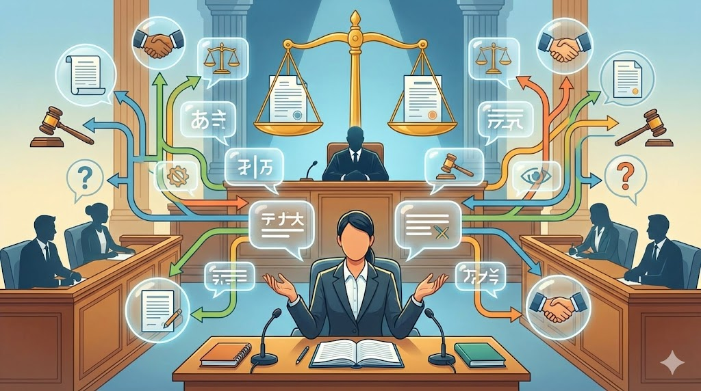
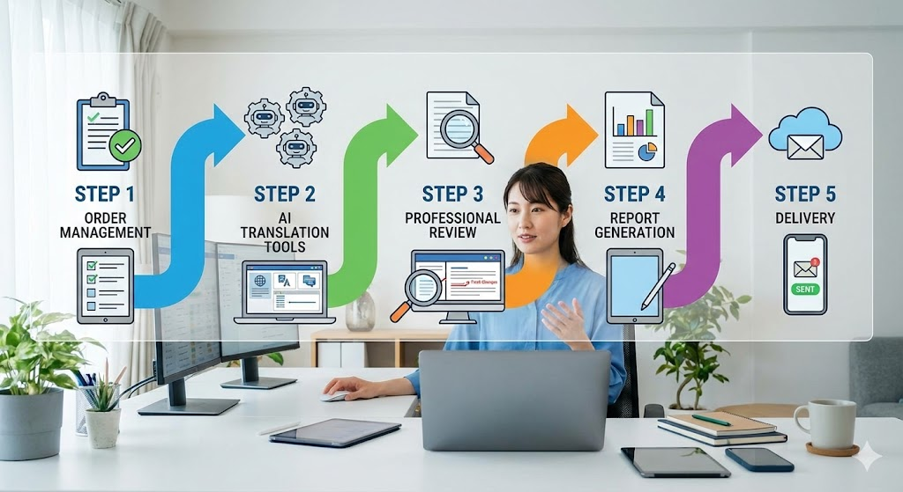

## AI翻訳が法律文書の「ニュアンス」を訳しきれない現実

AI翻訳の精度は年々向上しています。DeepLやChatGPTを使えば、日常会話レベルの翻訳はほぼ問題なくこなせる時代になりました。しかし、**法律文書の翻訳となると話は全く違います**。

*AI翻訳の精度は年々向上しています。DeepLやChatGPTを使えば、日常会話レベルの翻訳はほぼ問題なくこなせる時代になりました。しかし、法律文書の翻訳となると話は全く違います。*

たとえば「authentication」という単語。一般的な文脈では「認証」と訳されますが、法律文書では「公証」「認証」「証明」のどれが適切かは、文書の種類と使われる場面によって変わります。ある翻訳者がChatGPTで外国公文書の翻訳を試みたところ、本来「公証」とすべき箇所が「証明」と出力されたため、依頼主から差し戻しを受けたという話もあります。

もう一つ、架空の例で考えてみましょう。ある国際契約書に「The party shall be discharged from liability」という一文があったとします。AI翻訳はこれを「当事者は責任から解放されるものとする」と訳すかもしれません。しかし日本法の文脈では「免責される」という定型表現のほうが適切です。さらに「discharge」は破産手続きでは「免責」、債務関係では「弁済による消滅」を意味することもあります。一つの単語でもこれだけ訳語が分かれるのです。

法廷通訳を20年にわたって経験された方であれば、こうした**法律用語の微妙なニュアンスの違い**を瞬時に判断できるはずです。「契約の解除」と「契約の取消し」の法的効果の違い、「善意」が日常語と法律用語で全く意味が異なること。これらはAIがまだ正確に処理しきれない領域です。

もっとも、AIの言語処理能力は今後も進化していくでしょう。それでも、法律文書で求められるのは単なる言語変換ではなく、法的な意味の正確な伝達です。この判断には法体系や実務慣行への深い理解が必要であり、**専門家の介在が不要になる時代はまだ当分先**と考えてよいでしょう。

つまり、AI翻訳の弱点を補完できる専門知識こそが、そのまま収益化できるスキルになります。この記事では、**法廷通訳20年の専門力とAIを組み合わせて、月3〜5万円の副収入を実現する具体的な方法**をお伝えします。

## AI翻訳ツールだけに頼る翻訳サービスの落とし穴

### 機械翻訳の進化が生んだ「品質の谷間」

多くの人がまず試みるのは、DeepLやGoogle翻訳の出力をそのまま納品する翻訳サービスです。確かにこれらのツールは便利ですが、**専門分野の翻訳では致命的なミスを生む可能性があります**。

たとえば、架空の特許ライセンス契約書を想像してください。「royalty」という語がAI翻訳で「王族」と出力されたら明らかに問題ですが、実際にはもっと微妙なミスが起きます。「royalty」を「ロイヤリティ」とカタカナ表記するか「実施料」と訳すかで、契約の解釈が変わり得るのです。法律文書ではこうした問題が頻繁に発生します。

よくあるAI翻訳の問題パターンを整理すると、以下のようになります。

- 同じ英単語が法律文脈では全く異なる意味を持つケースの誤訳
- 契約書における条件節の係り受けの誤解釈
- 裁判文書特有の定型表現の不自然な訳出
- 数値条項や期限設定の曖昧な表現

### 「安くて速い」だけでは差別化できない

AI翻訳の普及により、単純な翻訳作業の単価は下がり続けています。クラウドソーシングサイトでは1文字1円以下の案件も珍しくありません。この市場で価格競争に巻き込まれると、労力に見合わない収入しか得られません。

**求められているのは、AI翻訳の出力を専門家の目で検証し、品質を保証するサービス**です。翻訳そのものではなく、翻訳の「品質チェックとリライト」に特化することで、高単価かつ継続的な受注が可能になります。

## 法廷通訳20年の「判断力」がAI翻訳の弱点を補う理由

### 人間の経験でしか判断できない領域

*AI翻訳の品質チェックを行うための実務ステップ*

法廷通訳を20年続けてきた方の強みは、単に法律用語を知っていることではありません。**用語が使われる文脈全体を把握し、最も適切な訳語を瞬時に選択できる判断力**にあります。

この判断力をAIと組み合わせることで、以下のような独自のワークフローが成立します。

1. **Claude無料枠で論理構成を確認**：文書全体の流れと論点の整合性をチェック
2. **ChatGPTで個別用語を検証**：法律用語の訳語候補を複数生成し、最適解を選択
3. **複数データソースでクロス検証**：判例データベースや法令用語集と照合して正確性を担保

この3段階の検証プロセスは、複数の情報源を突き合わせて正確性を高めるという考え方に基づいています。**AIで初期作業を効率化し、20年の経験による最終検証で精度を担保する**。これが、おとな世代ならではの強みを最大限に活かした作業設計です。

### 「伝わる翻訳」を作る感覚は経験からしか生まれない

翻訳は文法的に正しいだけでは不十分です。読み手に正確に伝わらなければ意味がありません。

海外生活の経験がある方なら実感されているかもしれませんが、同じ英語でも地域や文化的背景によって表現方法は大きく異なります。ビジネス環境では、相手の文化圏によって好まれる表現が違います。こうした**多様性への理解は、読み手の背景を考慮した翻訳品質の判断**において大きな差別化要因になります。

たとえば、ある企業の法務担当者が海外パートナーとの契約書翻訳をAIに任せたところ、相手側から「この表現は我々の法体系では別の意味に解釈される」と指摘を受けた、という架空のケースを考えてみてください。法廷通訳の経験者であれば、こうしたリスクを翻訳段階で事前に察知し、注釈を付けるといった対応が可能です。

<!-- paywall -->

AI翻訳の機械的な出力を、人間らしい自然な表現に修正する能力。これは言語データだけでは学習できない、**実体験に基づくスキル**です。

## 月3〜5万円を実現するAI翻訳品質チェックサービスの全体像

### サービスの基本設計

月3〜5万円の収益目標を達成するには、**1件5,000〜10,000円のサービスを月4〜8件受注する体制**を構築します。以下がサービス提供の基本フローです。

| ステップ | 作業内容 | 使用ツール | 所要時間目安 |
|---------|---------|-----------|------------|
| 1. 受注管理 | 依頼受付と案件登録 | Google Forms + Sheets | 10分 |
| 2. AI翻訳処理 | 複数ツールで翻訳結果を比較 | DeepL無料枠 + ChatGPT + Claude | 30分 |
| 3. 専門チェック | 用語統一と品質検証 | テキストエディタ + 用語集 | 60〜90分 |
| 4. レポート作成 | 品質保証レポートの自動生成 | Google Docsテンプレート | 20分 |
| 5. 納品 | 完了通知とレポート送信 | Gmail | 5分 |

1件あたりの作業時間は約2〜3時間。時給換算で約2,000〜5,000円となり、十分に収益性のある水準です。

### 無料ツールで構築する翻訳品質チェック環境

初期投資を最小限に抑えるため、**各サービスの無料枠を最大限活用**します。月額料金は実質0円で開始可能です。

**翻訳品質チェック用ツール（すべて無料枠で運用）**

- Google翻訳（無料）：基本翻訳の一次処理。ブラウザ上で文章を貼り付けるだけで使えます
- DeepL無料版：高品質な翻訳結果との比較用。月間の利用文字数に上限がありますが、品質チェック用途なら十分です
- ChatGPT無料枠：法律用語の訳語候補生成と文脈確認。「この用語の法律的な意味を教えて」と日本語で質問するだけで回答が得られます
- Gemini（無料）：第三の翻訳結果として比較検証に活用
- Claude無料枠：論理構成の確認と改善提案の生成

**業務管理ツール（Google無料枠中心）**

- Google Sheets：案件管理表（進捗状況、品質チェック項目、料金計算）
- Google Docs：品質保証レポートのテンプレート
- Google Slides：サービス紹介資料の作成
- Google Forms：翻訳依頼の受付フォーム

**応用段階：ローカル処理環境（慣れてきたら導入を検討）**

最初から必須ではありませんが、業務に慣れてきたら以下のツール導入を検討してください。

- VS Code（無料）：プログラムを書くための編集ソフトです。用語の一括チェックなど、繰り返し作業を自動化する簡単なプログラム（Pythonスクリプト）を作成できます
- Ollama（無料）：自分のパソコン上でAIを動かせるツールです。インターネットに接続しなくてもAIによる品質チェックが可能になります

特にOllamaは、**機密性の高い法律文書を外部サーバーに送信せずに処理できる**という点で、クライアントへの大きなアピールポイントになります。導入手順は公式サイトにガイドがあり、パソコンにインストールして起動するだけで使い始められます。

### 営業と集客の具体的な方法

**オンラインでの集客チャネル**

- LinkedIn：法律事務所や企業の法務担当者とつながる最も効果的な手段
- Canva無料枠：サービス紹介資料やポートフォリオをプロ品質で作成
- Google Forms：サービス申込フォームの設置

**営業メッセージの方向性**

法律事務所や翻訳会社に営業する際は、以下の3点を明確に伝えます。

1. **法廷通訳20年の実績**：法律文書の専門用語とニュアンスを熟知している
2. **AI翻訳との併用**：作業スピードと品質の両立が可能
3. **品質保証レポート付き**：修正箇所と理由を可視化し、透明性を担保

**架空の成功シナリオ**

イメージをつかみやすくするために、一つの架空事例を紹介します。法廷通訳歴18年のAさん（仮名）がこのモデルを始めた場合を想定してみましょう。Aさんはまず、知人の弁護士に「AI翻訳の出力をチェックするサービスを試験的にやらせてほしい」と依頼。最初の2件は無料で対応し、品質保証レポートのサンプルを作成しました。そのレポートの精度が評価され、月に2〜3件の定期依頼につながったとします。3カ月目にはLinkedInで別の法律事務所からも問い合わせが入り、月4〜5件、約4万円の安定収入に到達。このように、最初の実績づくりが継続受注の土台になるのです。

### ビフォーアフター：AI導入前後の比較

| 項目 | AI導入前 | AI導入後 |
|------|---------|---------|
| 1件あたりの作業時間 | 5〜8時間 | 2〜3時間 |
| 月間処理可能件数 | 2〜3件 | 6〜10件 |
| 月間売上の目安 | 1〜2万円 | 3〜5万円 |
| 品質保証レポート | 手作業で1時間 | テンプレート活用で20分 |
| 用語統一チェック | 目視で確認 | AI補助で効率化 |
| 初期コスト | 翻訳ソフト購入で数万円 | 実質0円（無料枠活用） |

**AIを導入することで作業効率が約2〜3倍に向上し、同じ労働時間でも売上を大幅に伸ばすことが可能です。**

### 品質保証レポートが付加価値を生む

他の翻訳チェックサービスとの最大の差別化ポイントは、**修正箇所と修正理由を明記した品質保証レポートの提供**です。

レポートに含める項目は以下の通りです。

- 修正箇所の一覧（原文、AI翻訳結果、修正後の訳文）
- 修正理由の解説（なぜその訳語を選んだのか）
- 法的リスクの指摘（誤訳が引き起こす可能性のある問題）
- 用語統一リスト（文書内で使用した専門用語の訳語対応表）

このレポートがあることで、クライアントは翻訳品質に対する**安心感と信頼感**を得られます。結果としてリピート受注や紹介につながりやすくなります。

### 貿易文書や契約書への展開

法廷通訳の経験は、法律文書だけでなく**貿易文書や国際契約書の翻訳チェック**にも直接応用できます。

貿易条件（FOB、CIFなど）の正確な訳出、支払い条件の明確化、数値条項と実データの照合。これらは海外取引の実務経験がなければ正確に判断できない領域です。契約書では収益分配率や期限設定の曖昧な表現が後々トラブルの原因になるケースが多く、**こうしたリスクポイントを事前に指摘できることが、大きな競争優位性**となります。

たとえば、架空の輸出契約書に「payment shall be made within a reasonable time」と記載されていた場合、AI翻訳は「合理的な期間内に支払いが行われるものとする」と訳すでしょう。しかし法務の観点からは「合理的な期間」が具体的に何日を指すのか不明確であり、紛争の火種になります。こうした曖昧表現を検出し、クライアントに注意喚起できることが、専門家によるチェックの真価です。

貿易文書特有の専門用語辞書とチェックテンプレートを事前に設計しておくことで、案件の幅を広げつつ効率的に対応できます。

## FAQ

### Q1. AI翻訳の品質チェックに特別なITスキルは必要ですか？

基本的なパソコン操作ができれば始められます。Google翻訳やDeepLの操作は直感的ですし、ChatGPTやClaudeも日本語で指示を出すだけで使えます。本文中で触れたVS CodeやPythonスクリプトは、業務に慣れてから効率化のために検討する応用ツールです。Pythonとはプログラミング言語の一つで、「この文書内で同じ英単語に異なる訳語が使われていないか自動で調べる」といった作業を自動化できます。**最初はAIツールの比較検証と手動チェックだけでサービスを開始**し、慣れてきたら導入する流れで問題ありません。

### Q2. 法律文書の翻訳チェックの需要は本当にありますか？

グローバル化の進展に伴い、法律文書の翻訳需要は増加し続けています。特に**国際契約書、特許文書、訴訟関連資料**の翻訳チェックは常に需要があります。AI翻訳の普及により「とりあえず機械翻訳したが品質が不安」というクライアントが増えており、専門家による品質チェックサービスの需要はむしろ高まっています。

### Q3. クライアントはどうやって見つければいいですか？

最も効果的なのは**LinkedInでの営業活動**です。法律事務所の国際部門、企業の法務部、翻訳会社をターゲットにします。法廷通訳20年の経歴をプロフィールに明記し、品質保証レポートのサンプルを添えてアプローチすれば、信頼性の高い営業が可能です。また、翻訳者コミュニティや法律系の勉強会への参加も有効な集客チャネルです。

### Q4. 機密性の高い文書を扱う場合のセキュリティ対策は？

本文でも触れたOllamaを使ったローカル環境でのAI処理がおすすめです。Ollamaとは、自分のパソコン上でAIモデルを動かせる無料ツールです。**文書データを外部サーバーに送信せずにAIチェックを実行できる**ため、機密保持の観点で大きなメリットがあります。クライアントにこの対策を説明できることは、受注獲得において強力なアピールポイントになります。秘密保持契約（NDA）のテンプレートも事前に用意しておくとよいでしょう。

### Q5. 月3〜5万円の収益に到達するまでの期間はどのくらいですか？

環境構築に1〜2週間、初期の営業活動に2〜4週間、最初の受注から安定稼働まで1〜2カ月が目安です。**開始から約2〜3カ月で月3万円の水準に到達する**ことを現実的な目標として設定してください。最初の数件は実績作りを兼ねて割引価格で提供し、品質保証レポートのサンプルを蓄積していく戦略が効果的です。

### Q6. AI翻訳がさらに進化したら、このサービスは不要になりませんか？

AI翻訳の精度は今後も向上していくでしょう。しかし、法律文書の翻訳で求められるのは、単なる言語変換ではなく**法的な意味の正確な伝達と責任の所在の明確化**です。契約書の一語が数千万円規模のトラブルにつながり得る世界では、「AIが訳しました」だけでは品質保証になりません。専門家が検証し、その根拠をレポートとして示す。この「人間による品質保証」の価値は、AIが進化しても当面は残り続けると考えてよいでしょう。むしろAIの進化により翻訳量自体が増えるため、チェック需要はさらに高まる可能性もあります。

## 20年の専門力は「AIでは代替できない価値」になる

法廷通訳20年の経験は、AIがどれだけ進化しても簡単には代替できない固有の価値です。法律用語のニュアンス判断、文脈全体を見渡した訳語選択、読み手の背景を考慮した表現の調整。これらはすべて、**長年の実務で培われた判断力があってこそ可能な仕事**です。

AIは作業を効率化するツールとして活用し、最終的な品質判断は人間の経験が担う。この役割分担こそが、月3〜5万円の安定した副収入を生み出す仕組みの核心です。

**今日からできる最初の一歩**は、手元にある法律文書をChatGPTとDeepLで翻訳させ、その出力結果をご自身の専門知識でチェックしてみることです。AIの出力にどんな問題があるかを具体的に把握できれば、それがそのまま**あなたのサービスの価値提案**になります。