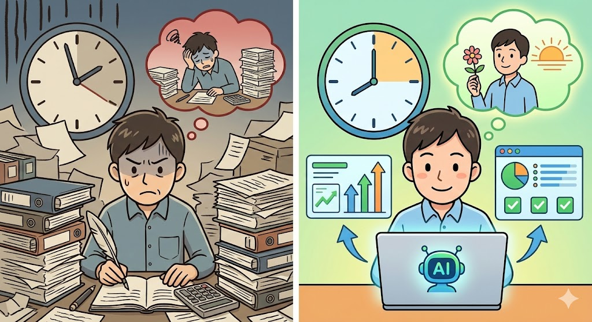

## AI生成マニュアルは「正しいけど伝わらない」という深刻な問題

ChatGPTやClaudeに「操作マニュアルを作って」と指示すれば、それらしい技術文書が数分で出来上がる時代になりました。しかし、その文書をそのまま現場に渡して本当に使えるかというと、答えはほぼ「NO」です。

*たとえばSEO事業で「検索エンジンのクローラー」を説明する場面を考えてみてください。*

AIが生成する技術文書には共通の弱点があります。情報として正しいのですが、読み手の立場が完全に抜け落ちているのです。手順の順番は論理的に正しくても、実際の作業者がどこでつまずくか、どの画面で迷うかという「現場感覚」がありません。

たとえば「管理者権限で実行してください」とAIは平気で書きます。管理者権限とは、パソコンやシステムの設定を変更できる特別な操作権限のことです。企業の実務では、この権限の申請に数日かかることも珍しくありません。「最新版を使用」と記載されていても、既存システムとの互換性の問題で古いバージョンに固定しなければならないケースは日常茶飯事です。

ここに、テクニカルライター歴25年の「複雑なことをわかりやすく書く力」が活きる副業の可能性があります。AIが作った「正しいけど伝わらない文書」を、読み手目線で再構成する仕事は、むしろAI時代だからこそ需要が拡大しているのです。

## まずは王道のクラウドソーシングから始める一般的なアプローチ

マニュアルや手順書のリライト副業を始めるにあたり、多くの方がまず検討するのはクラウドソーシング経由の案件獲得です。クラウドソーシングとは、インターネット上で仕事の発注者と受注者をマッチングするサービスのことで、クラウドワークスやランサーズが代表的です。この方法自体は間違いではありませんが、いくつかの現実を知っておく必要があります。

*作業環境の構築手順*

### クラウドソーシングの案件相場

| 案件種別 | 一般的な相場 | 作業時間目安 |
|---|---|---|
| 既存マニュアルの修正・改善 | 3,000〜5,000円/件 | 2〜3時間 |
| 新規手順書の作成 | 8,000〜15,000円/件 | 4〜6時間 |
| 多言語対応の追加 | 5,000〜8,000円/件 | 3〜4時間 |
| FAQ・トラブルシューティング作成 | 4,000〜7,000円/件 | 2〜3時間 |

### 一般ライターが直面する壁

クラウドソーシングでテクニカルライティング案件に応募するライターの多くは、以下のような課題に直面します。

1. 技術的な内容を正確に理解できず、表面的な言い換えしかできない
2. 読み手のスキルレベルを想定した書き分けができない
3. 実際の作業環境や制約条件を考慮した記述ができない
4. 単価競争に巻き込まれ、1件あたり1,000〜2,000円の案件で消耗する

こうした状況が生まれる根本原因は、技術理解と文章力の両方を兼ね備えた人材が圧倒的に少ないからです。逆に言えば、この両方を持っている方にとっては、差別化が非常にしやすい市場でもあります。

## 25年の「読み手目線力」とAI多段階処理で圧倒的な品質差を生む方法

ここからが本題です。テクニカルライターとしての長年の経験は、AIと組み合わせることで単なる「便利さ」を超えた構造的な強みに変わります。

### なぜ人生経験がAI活用の質を変えるのか

AIが技術文書を生成する際、最も欠けているのは「実際の運用環境での制約条件」に対する判断力です。この判断力は、書籍やマニュアルを読んで身につくものではありません。

たとえばSEO事業で「検索エンジンのクローラー」を説明する場面を考えてみてください。SEOとは検索エンジン最適化のことで、Googleなどの検索結果で自社サイトを上位に表示させるための取り組みです。クローラーとは、インターネット上のウェブサイトを自動的に巡回して情報を収集するプログラムのことです。専門用語をそのまま使えば正確ですが、伝わりません。これを「図書館の司書が本を分類整理する作業」に例えると、顧客は一瞬で概念を理解できます。「ウチのサイトが司書さんに見つけてもらいやすいように整理すればいいんですね」と自ら応用まで考えられるようになるのです。

この「身近なものに置き換える力」は、25年間にわたり現場で磨かれた技術です。AIにはこの経験値がありません。ただし補足すると、AIの言語処理能力は日々向上しています。将来的にはAIが文脈に応じた比喩を生成する精度も上がっていくでしょう。それでも、特定の業界や現場の空気感を踏まえた「伝わる表現」を選ぶ力は、実務経験に裏打ちされた人間の判断がしばらくの間は優位であり続けると考えられます。

### AI多段階処理の具体的な設計

低スペック環境でも実践可能な、無料枠を活用した多段階処理システムを構築します。

**第1段階:ChatGPT無料枠で基本構造を作成**

元の技術文書や要件を入力し、マニュアルの骨格を生成します。この段階ではあえて「完璧」を求めず、構造の叩き台を作ることに集中します。

**第2段階:Claude無料枠で論理構成を確認**

「この文書の目的は明確か」「読者の知識レベルに適しているか」「情報の過不足はないか」をClaudeに確認させます。Claudeは全体を俯瞰した論理整合性チェックに優れています。

**第3段階:Gemini無料枠で読みやすさを調整**

文章のリズムや表現の自然さを最適化します。技術文書であっても、読みやすさは品質に直結します。

**第4段階:あなた自身の目で「読み手目線」の最終再構成**

ここが最も価値の高い工程です。AIが作った文書に対して、以下の観点で手を加えます。

- 実際の作業者がどこでつまずくかの予測と注意書きの追加
- 「なぜこの順序なのか」の理由説明の併記
- 複雑な処理フローを「料理のレシピ」や「組み立て家具の説明書」のような身近な作業への置き換え
- 企業環境特有の制約条件(権限申請の所要日数、バージョン固定の必要性など)の反映

<!-- paywall -->

### 作業環境の構築手順

高価なソフトウェアは不要です。以下の無料ツールで副業基盤を整えます。

1. **Google Workspace無料版**を開設し、Sheets/Docs/Slidesを案件管理と成果物作成に使用
2. **各生成AIの無料アカウント**を作成(ChatGPT、Claude、Gemini)
3. **Canva無料版**でマニュアル用の図解やフローチャートを作成
4. **Visual Studio Code**をインストールし、テンプレート管理とテキスト処理を効率化

Visual Studio Codeは、マイクロソフトが提供する無料のテキストエディタです。プログラミング向けのツールですが、テンプレートの管理やテキストの一括置換などにも非常に便利です。公式サイトからダウンロードしてインストールするだけで使い始められます。

余裕があれば、Ollamaで軽量ローカルモデル(2〜3GB程度)を導入すると、無料枠の回数制限を気にせず専門用語の統一チェックなどに活用できます。Ollamaとは、自分のパソコン上でAIモデルを動かすための無料ツールです。ただし、最初から全てを揃える必要はありません。まずはブラウザで使えるChatGPT、Claude、Geminiの3つだけで十分に始められます。

### プロンプトライブラリの構築が効率化の鍵

案件を重ねるごとに、再利用可能なプロンプトをライブラリとして蓄積していくことが重要です。プロンプトとは、AIに出す指示文のことです。同じ種類の案件に対して毎回ゼロから指示を考えるのではなく、過去にうまくいった指示文を保存しておき、必要に応じて微調整して再利用する仕組みを作ります。

具体的には以下のようなカテゴリで整理します。

- 操作手順書の構造化プロンプト
- FAQ生成プロンプト(「よくある失敗パターン」を冒頭に配置する構成)
- 専門用語を平易な表現に変換するプロンプト
- トラブルシューティングの4段階構成プロンプト(現状確認、原因の可能性、具体的改善案、期待効果と時期)

このライブラリが充実するほど、1件あたりの作業時間は短縮され、結果的に時給が上がっていきます。

## Before/Afterで見るリライト副業の具体的な収益シミュレーション

実際にこの方法を実践した場合、どのような変化が期待できるのかを具体的に示します。なお、以下の数値はクラウドソーシングの公開案件情報と一般的な作業効率から算出した想定であり、個人の経験やスキル、案件の難易度によって実際の結果は異なります。

*Before/Afterで見るリライト副業の具体的な収益シミュレーション*

### Before:AIなし・経験のみで受注した場合

| 項目 | 数値 |
|---|---|
| 1件あたり作業時間 | 4〜6時間 |
| 月間対応可能件数 | 6〜8件 |
| 平均単価 | 4,000円/件 |
| 月間収益 | 24,000〜32,000円 |
| 月間作業時間 | 24〜48時間 |

### After:AI多段階処理+経験を組み合わせた場合

| 項目 | 数値 |
|---|---|
| 1件あたり作業時間 | 2〜3時間 |
| 月間対応可能件数 | 12〜18件 |
| 平均単価 | 5,000円/件 |
| 月間収益 | 30,000〜50,000円 |
| 月間作業時間 | 24〜36時間(変わらず〜微減) |

ポイントは、作業時間を増やさずに対応件数を増やせる点です。AIがドラフト作成と一次チェックを担当することで、あなたは最も価値の高い「読み手目線での再構成」に集中できます。

### 月5万円達成の具体的な案件ミックス

月5万円を目指す場合の現実的な案件構成は以下のとおりです。

1. **既存マニュアル改善案件**:5,000円 x 6件 = 30,000円
2. **新規手順書作成案件**:8,000円 x 2件 = 16,000円
3. **FAQ・トラブルシューティング作成**:4,000円 x 1件 = 4,000円

合計:50,000円/月

1日あたりの作業時間は平均1.5〜2時間程度です。本業を続けながら、あるいは退職後の生活リズムの中でも無理なくこなせる分量と言えます。

### 単価を引き上げるための専門性アピール

最初は3,000〜5,000円の案件からスタートしますが、実績が積み上がった段階で単価交渉が可能になります。特に以下の要素は、クライアントにとって明確な価値として映ります。

- **機械メーカーでの実務経験25年**:製造業クライアントにとって、業界用語や現場の感覚を理解しているライターは貴重です
- **AI活用による納期短縮**:通常1週間かかる案件を3〜4日で納品できる点は大きなアドバンテージです
- **「よくある質問の事前回答」付き納品**:マニュアル本体に加えて、想定されるFAQを添付することで付加価値を提供できます

## FAQ

### Q1. AIの無料枠だけで本当に実用的な文書が作れますか?

はい、十分に実用的な文書を作成できます。重要なのは、1つのAIに全てを任せるのではなく、複数のAIの無料枠を使い分けることです。ChatGPTで骨格を作り、Claudeで論理チェック、Geminiで表現調整という多段階処理を行えば、有料プランに匹敵する品質を出せます。月の案件数が増えてきた段階で、必要に応じて有料プランへの移行を検討すれば問題ありません。

### Q2. テクニカルライティングの案件はどこで見つけられますか?

主に3つのルートがあります。第一にクラウドワークスやランサーズなどのクラウドソーシングサイトです。「マニュアル作成」「手順書リライト」などのキーワードで検索してみてください。第二に既存の業界ネットワークです。25年のキャリアで築いた人脈から、社内で手が回っていないマニュアル業務を紹介してもらえる可能性があります。第三に中小メーカーへの直接提案です。自社製品のマニュアルに課題を感じている中小企業は少なくありません。

### Q3. AI生成の文書をリライトするだけで、本当にクライアントは満足しますか?

AIが作った文書をそのまま納品するのではなく、読み手目線で再構成することが価値の本質です。具体的には、実際の作業者がつまずきやすいポイントに注意書きを追加したり、専門用語を身近な比喩に置き換えたり、企業環境特有の制約条件を反映したりします。この「最後の仕上げ」があるかないかで、マニュアルの実用性は大きく変わります。システム導入で要件定義が曖昧なまま進めると、完成後に「使えない」と判明するのと同じで、事前に対象読者のスキルレベルや実際の作業環境を具体的に定義し、サンプル段階でフィードバックを得ることが成功の秘訣です。

### Q4. 60歳からでも新しいAIツールを使いこなせますか?

テクニカルライターとして25年間さまざまなツールの変遷を経験してきた方であれば、AIツールの習得は決してハードルが高くありません。ChatGPTもClaudeも、基本的には「日本語で指示を出す」だけです。むしろ的確な指示を出す力(プロンプト設計)こそ、文章のプロであるテクニカルライターが最も得意とする分野です。最初の1〜2週間でサンプル文書を数本作ってみれば、自分なりの活用パターンが見えてきます。

### Q5. ChatGPTとClaudeの使い分けはどうすればいいですか?

技術文書の品質向上では、Claudeは「全体の構成と論理整合性のチェック」、ChatGPTは「具体的な手順やデータの正確性確認」に向いています。まずClaudeに「この文書の目的は明確か」「情報の過不足はないか」を確認させ、次にChatGPTで「手順通り実行して本当に動作するか」「エラー時の対処法は適切か」を検証するのが効率的です。この2段階チェックにより、論理的整合性と実用性を両立した文書に仕上がります。

### Q6. AIの進化が進めば、この副業自体が不要になりませんか?

AIの文章生成能力は確かに年々向上しています。しかし、マニュアルリライトの本質は「特定の現場環境と読者層に合わせた調整」です。同じ製品のマニュアルでも、IT部門向けと営業部門向けでは書き方がまったく異なります。こうした「誰に、どの文脈で伝えるか」という判断は、現場の事情を知る人間が介在することで精度が大きく上がります。将来的にAIがさらに進化した場合でも、AIへの指示精度を高める役割や、出力結果の品質を保証する役割として、テクニカルライターの経験は引き続き活かせると考えられます。

## 「複雑なことをわかりやすく書く力」は、AI時代にこそ価値が高まる

AIの登場により、文章を「生成する」コストは劇的に下がりました。しかし、生成された文章を「伝わる文書」に変換する力の価値は、むしろ上がっています。

25年間にわたって培ってきた「読み手目線での再構成力」は、AIが最も苦手とする領域です。複雑な技術的内容を、料理のレシピや組み立て家具の説明書のように身近な作業に置き換えて説明できるのは、長年の実務経験があるからこそです。

今日からできる最初のステップは、以下の3つです。

1. **ChatGPTまたはClaudeの無料アカウントを作成**し、試しに自分の業務で扱ったことのある技術文書をAIに生成させてみる
2. **生成された文書の「伝わらないポイント」を洗い出す**。ここで見つかる課題の数こそ、あなたのスキルの証明です
3. **リライト前後の比較サンプルを1本作成**する。これがそのまま案件獲得時のポートフォリオになります

月3〜5万円という収益目標は、週に10〜15時間の作業で十分に到達可能な現実的な数字です。まずはサンプル1本から始めてみてください。