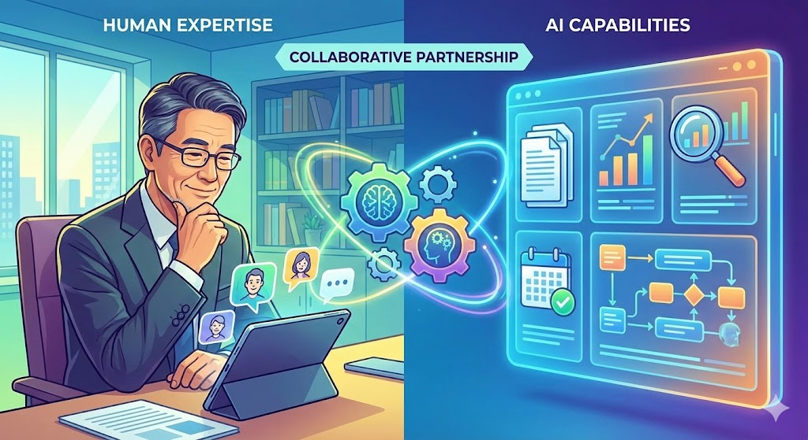

## 「言葉にされないリクエスト」を読み取れる人が、なぜ副業で苦戦するのか

56歳、高級ホテルのコンシェルジュとして28年のキャリア。お客様が口にしない要望を表情や声のトーンから察知し、期待を超えるサービスを提供してきた方。この「相手の本音を引き出す力」は、ビジネスの世界では極めて希少なスキルです。

*さらに、デジタルツールへの苦手意識が追い打ちをかけます。*

しかし、いざ副業を始めようとすると壁にぶつかります。自分のスキルをどうやってお金に変えるのかという問題です。接客の現場で磨き上げた感覚的な能力は、そのままでは商品として見えにくい。「私は相手の気持ちを読むのが得意です」と言っても、クライアントには伝わりません。

さらに、デジタルツールへの苦手意識が追い打ちをかけます。ホテルの現場では対面でのコミュニケーションが中心だったため、オンラインでの営業や納品のイメージが湧かないという方も多いでしょう。

ここで注目したいのが、カスタマー対応テンプレートやFAQ設計の受託という副業モデルです。企業が顧客対応に困っている場面は無数にあります。「問い合わせへの回答がバラバラ」「クレーム対応のマニュアルがない」「顧客満足度が上がらない」。こうした課題に対して、コンシェルジュの経験とAIの処理能力を組み合わせれば、質の高いソリューションを提供できます。

## 一般的なカスタマー対応テンプレート作成が「響かない」理由

副業としてカスタマー対応の仕事を始めようとすると、多くの方がまず試みるのがAIで一気にテンプレートを量産するという方法です。

### AIだけで作ったテンプレートの限界

ChatGPTに「飲食店向けのクレーム対応テンプレートを10個作って」と指示すれば、それらしいものは数分で出来上がります。しかし、この方法には致命的な問題があります。

表面的な定型文の羅列になり、顧客の感情に寄り添えていないケースがほとんどです。業界特有の微妙なニュアンスが抜け落ち、どの企業にも当てはまるがどの企業にもフィットしない汎用品になります。AIが生成した「正しいが冷たい」文面がかえって顧客の不満を増幅することも少なくありません。

### マニュアル本を参考にする方法の問題点

書店に並ぶカスタマーサービスの書籍を参考にするのも一つの手です。しかし、これらは一般論が中心で、特定の業種や企業文化に合わせたカスタマイズができません。

### クラウドソーシングでの価格競争

ランサーズやクラウドワークスでカスタマー対応関連の案件を探すと、単価の安い案件が目立ちます。「FAQ作成 1件500円」のような価格帯では、28年の経験を活かすどころか、時給換算で割に合わない状況に陥ります。

これらの一般的なアプローチに共通するのは、「人間が相手の本音を読み取る」というプロセスが欠落しているという点です。テンプレートの文面そのものよりも、「どんな場面で」「どんな感情の顧客に」「どんな順序で」伝えるかという設計こそが価値を生みます。

## コンシェルジュ28年の「察する力」とAIの処理速度が生む独自の価値

ここからが本題です。28年のコンシェルジュ経験で培った能力を、AIと明確に役割分担することで、他の誰にも真似できないサービスが生まれます。

*文章の下書きはAIが担当します。あなたの役割は「この回答で顧客は安心できるか」「この表現で感情を逆なでしないか」を判断することです。*

### 経験が活きる3つの核心スキル

**1. 「言葉にされない不満」を予測する力**

ホテルのフロントで「大丈夫です」と言いながら明らかに不満を抱えているお客様を、何千回と見てきたはずです。この経験は、企業の顧客対応設計で絶大な力を発揮します。

例えば、ECサイトのFAQを設計する際、顧客が「返品したい」と言葉にする前に感じている不安は何か。「商品が思っていたのと違った」という表面的な理由の裏にある「騙された感」「自分の選択ミスへの後悔」「面倒な手続きへの抵抗感」。こうした感情の層を読み取り、それぞれに対応する回答を設計できるのは、長年の接客経験者ならではの強みです。

**2. 異なる立場の人を調整する力**

高級ホテルのコンシェルジュは、お客様の要望と、レストラン、交通機関、観光施設など複数の関係者の事情を同時に調整します。この調整力は、企業内の部門間で統一された顧客対応方針を作る際に直結します。

営業部門は「柔軟な対応」を求め、技術部門は「正確性」を重視し、管理部門は「リスク回避」を優先する。こうした対立する視点を理解した上で、全員が納得できる共通基準を明文化する作業は、まさにコンシェルジュの調整力そのものです。

**3. 文化的背景への感受性**

国際的なホテルで働いてきた方であれば、宗教的配慮、文化的タブー、地域特有のコミュニケーションスタイルへの理解があります。グローバル展開する企業のカスタマー対応設計では、この感受性が大きな差別化要因になります。

### AIとの具体的な役割分担

コンシェルジュ経験で担う部分、つまり人間の感性が必要な領域としては、顧客の感情パターンの分析と予測、業界特有のニュアンス調整、部門間の利害調整と合意形成、文化的配慮ポイントの設定、そして最終的な品質チェックと微調整があります。

<!-- paywall -->

一方、AIに任せる部分、つまり処理速度と効率化が求められる領域としては、FAQ項目の網羅的な洗い出し、対応テンプレートの下書き生成、業界トレンドや競合事例のリサーチ、データの整理と構造化、提案資料のビジュアル作成が挙げられます。

### 低コストで始めるAIツール構成

初期投資をゼロに抑えながら、プロフェッショナルな成果物を出すためのツール構成を紹介します。

**文章生成・コンテンツ作成**

| ツール | 用途 | コスト |
|--------|------|--------|
| ChatGPT(無料枠) | 対応テンプレートの叩き台作成 | 0円 |
| Claude(無料枠) | FAQ項目の洗い出しと構成確認 | 0円 |
| Gemini(無料枠) | 別角度からの検証と補完 | 0円 |

**情報収集・分析**

| ツール | 用途 | コスト |
|--------|------|--------|
| Perplexity(無料枠) | 業界トレンドや競合対応事例のリサーチ | 0円 |
| Google検索 | 基本的な情報収集 | 0円 |

**資料作成・管理**

| ツール | 用途 | コスト |
|--------|------|--------|
| Canva(無料枠) | 提案資料のビジュアル作成 | 0円 |
| Gamma(無料枠) | プレゼン資料の自動生成 | 0円 |
| Googleドキュメント | テンプレート・マニュアル作成 | 0円 |
| Googleスプレッドシート | クライアント管理・進捗管理 | 0円 |

### AIの三段階チェック体制

品質を担保するために、以下の手順を確立します。

まず第一段階として、Claudeで顧客問い合わせの全体的な文脈と論理構成を確認し、対応の方向性を判断します。次に第二段階として、ChatGPTで個別の回答内容や表現の正確性を検証し、顧客の理解レベルに合わせた説明に調整します。そして第三段階として、28年の接客経験による最終チェックで、AI出力を既知の対応パターンと照合し、不適切な要素がないか確認します。

この三段階チェック体制により、AIの速度と経験に裏打ちされた判断力を両立した高品質な成果物が生まれます。

## カスタマー対応設計の受託で月2〜4万円を実現するロードマップ

具体的にどのような成果物を、どのような流れで提供し、収益につなげるのか。ビフォーアフターを含めて示します。

### 提供する成果物の例

**成果物1：業界特化型カスタマー対応テンプレート集**

クレーム対応では、怒り、失望、困惑といった感情別のテンプレートを用意します。問い合わせ対応では、情報収集、比較検討、購入後サポートなど目的別に整理します。さらにアップセルやクロスセル対応として、タイミング別のガイドも付属させます。

**成果物2：FAQ設計ドキュメント**

顧客の潜在的疑問を先回りした質問設計、部門横断で統一された回答基準書、そして文化的配慮チェックリストを含む包括的なドキュメントです。

**成果物3：顧客対応品質レビューレポート**

既存の対応内容の分析と改善提案、競合他社との対応品質比較、月次の満足度追跡フレームワークを盛り込んだレポートです。

### ビフォーアフター：あるECサイト向け提案の想定例

**Before(一般的なFAQ)**

「Q：返品はできますか？ A：商品到着後7日以内にご連絡ください。返品条件の詳細は返品ポリシーをご確認ください。」

**After(コンシェルジュ視点で再設計したFAQ)**

「Q：届いた商品がイメージと違ったのですが... A：ご期待に沿えず申し訳ございません。まずはお気持ちをお聞かせください。商品のどの部分がイメージと異なりましたか？ (1) 色味やサイズ感が写真と異なる場合 → 交換対応をご案内いたします (2) 使用感が期待と異なる場合 → ご用途に合わせた代替商品のご提案も可能です (3) その他ご不満な点 → 個別にベストな解決策をお探しします いずれの場合も、お客様のご負担が最小限になるよう対応いたします。」

**違いのポイント**

顧客の「感情」を受け止める導入文がある点が最も大きな違いです。不満の種類別に分岐を設けることで、顧客が自分の状況を見つけやすくなっています。さらに「返品」だけでなく「交換」「代替提案」と選択肢を広げ、最後に安心感を与える一文で締めています。

これが28年の「察する力」がもたらす設計品質の差です。

### 収益化のステップ

**月1(準備期間)：ポートフォリオ作成**

架空の3業種(飲食、EC、クリニック)向けにサンプルテンプレートを作成します。AIで下書きを生成し、コンシェルジュ視点で仕上げます。Canvaで提案資料のフォーマットも整備しておきましょう。

**月2〜3(営業開始)：最初の案件獲得**

ココナラやランサーズでサービスを出品します。知人の経営者や元同僚のネットワークにも声がけしましょう。初回は割引価格(1案件1〜2万円)で実績を作ることを優先します。

**月4以降(安定化)：月2〜4万円の定期収入**

継続クライアントとの月次レビュー契約を目指します。対応テンプレートの更新や改善サービスを組み合わせ、1クライアントあたり月1〜2万円で2〜3社と契約できれば目標達成です。

### 案件管理の仕組み

Googleスプレッドシートで以下を一元管理します。

クライアント情報と要件、各AIサービスの使用量記録、納品スケジュールと進捗、月末の使用状況確認と翌月の配分調整。これらを一つのシートにまとめておくことで、複数案件を同時に進める際も混乱を防げます。

週次で対応品質をセルフレビューし、月次でクライアントに改善レポートを提出する体制を作ることで、継続契約につながる信頼関係を築けます。

### 将来的な拡張の可能性

実績が積み上がれば、以下のような展開も視野に入ります。

対応品質レビューの単価アップ(1件3〜5万円)、企業研修の講師としてカスタマー対応の考え方をレクチャーする道、業界特化型テンプレートのパッケージ販売、さらにはチーム体制での受託で品質管理役として監修ポジションに就くことも可能です。

## FAQ

**Q1：接客経験はありますが、文章を書くのが苦手です。それでもできますか？**

はい、可能です。文章の下書きはAIが担当します。あなたの役割は「この回答で顧客は安心できるか」「この表現で感情を逆なでしないか」を判断することです。28年間お客様の反応を見てきた感覚で、AIが作った文章に赤入れをする作業が中心になります。文章力よりも「察する力」のほうが圧倒的に重要です。

**Q2：ホテル業界以外のカスタマー対応テンプレートも作れますか？**

作れます。むしろ異業種だからこそ価値が出ます。ホテルのコンシェルジュは「業界最高水準のホスピタリティ」を日常的に実践しています。その基準を他業界に持ち込むことで、「同業他社とは一線を画す顧客対応」が実現できます。AIで業界特有の知識を補完すれば、飲食、医療、EC、不動産など幅広い業種に対応可能です。

**Q3：AIツールを使いこなせるか不安です。最低限何から始めればいいですか？**

ChatGPTの無料版とGoogleドキュメントの2つだけで十分始められます。ChatGPTに「飲食店向けのクレーム対応テンプレートを作って」と入力し、出てきた文章をコンシェルジュの目線で修正する。この作業を繰り返すだけで、最初のサンプル成果物が完成します。他のツールは慣れてから順次追加すれば問題ありません。

**Q4：副業禁止の会社でも取り組めますか？**

まず就業規則を確認してください。その上で、個人の学習やスキル整理として始める方法もあります。ポートフォリオ(サンプル作品集)の作成は副業には該当しません。準備を整えておき、退職後やルールが変わったタイミングで即座にサービス提供を開始できる状態にしておくことも一つの戦略です。

**Q5：月2〜4万円という金額は現実的ですか？**

現実的な目標設定です。カスタマー対応テンプレート一式の相場は1〜3万円、FAQ設計は2〜5万円程度です。月に1〜2件の案件をこなせば達成可能な水準です。最初は実績作りのために低めの価格設定でも構いません。クライアントからの継続依頼が入り始めれば、月4万円以上も十分に見込めます。

## 28年の「察する力」は、AIにはない最強の武器になる

ホテルコンシェルジュとして28年間磨き上げた「言葉にされないリクエストを読み取る力」は、AI時代にこそ価値が高まるスキルです。AIは大量の情報処理と文章生成を高速でこなしますが、顧客の感情の機微を読み取り、最適な対応を設計する力は人間にしかありません。

今日からできる最初の一歩は、ChatGPTの無料版を開いて、自分がよく知っている業界のクレーム対応テンプレートを1つ作ってもらうことです。出てきた文章を見て「ここが足りない」「この表現では顧客は納得しない」と感じたら、それがあなたの28年の経験値です。その感覚をAIの出力に反映させる作業こそが、月2〜4万円の副収入につながるサービスの核になります。

AIの処理速度と、長年の経験から生まれる洞察力。この2つを掛け合わせることで、若い世代にも、AIだけにも真似できない独自のポジションを築いていきましょう。