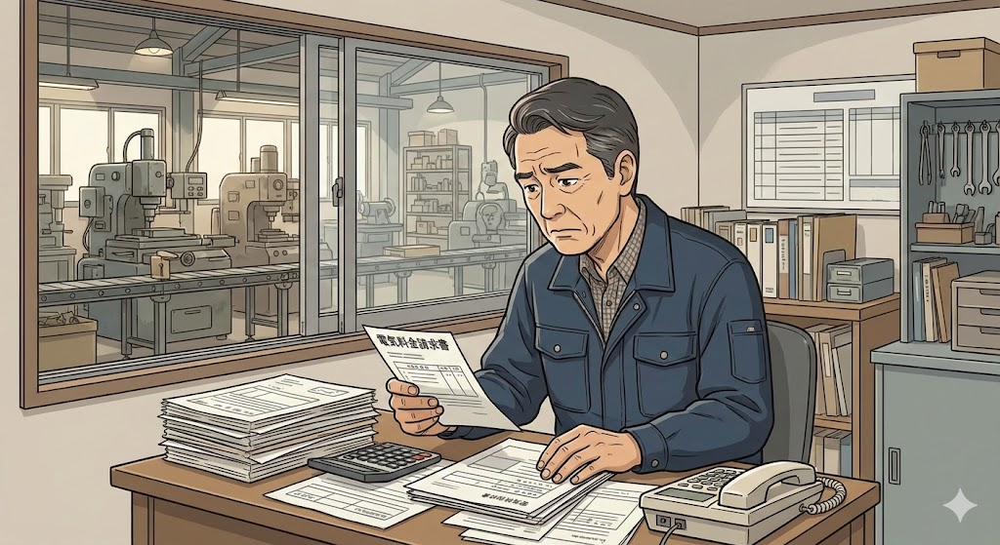
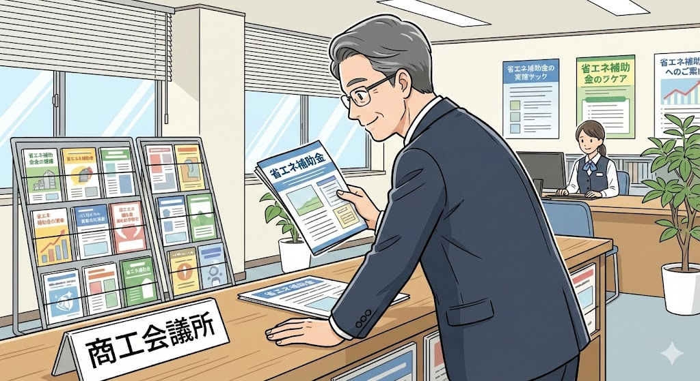
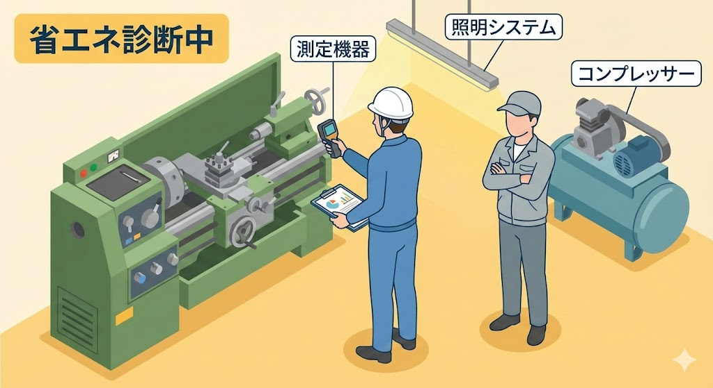

> **この記事は、以下の実在の補助金制度を題材にしたフィクション(物語)です。**
> 登場人物・企業名・具体的なエピソードはすべて架空です。
>
> | 項目 | 内容 |
> |------|------|
> | 補助金名 | [横浜市省エネ診断支援補助金](/subsidies/jg-CDXFPMA5) |
> | カテゴリ | general |
> | 対象地域 | national |
> | 上限額 | 5 man yen |
> | 難易度 | 簡単 |
> | 締切 | 2026-02-28 |
> | 管轄 | Check official page |
## 毎月届く電気代の請求書が、安藤さんの胃を締め付けていた

横浜市鶴見区の住宅街の一角に、小さな金属加工の工場があります。創業から38年、安藤誠一さん(62歳)が父から受け継いだ「安藤精工」は、従業員8名の町工場です。自動車部品の二次下請けとして、旋盤やフライス盤を回し続ける毎日でした。

*2024年の夏、安藤さんの表情は暗くなる一方でした。月々の電気代が前年比で約15%も上がっていたのです。工場では古い設備が24時間稼働することもあり、エアコンプレッサーの音が止まることはありません。*

2024年の夏、安藤さんの表情は暗くなる一方でした。**月々の電気代が前年比で約15%も上がっていた**のです。工場では古い設備が24時間稼働することもあり、エアコンプレッサーの音が止まることはありません。

「うちみたいな零細が、電気代だけで月に40万円近く払ってるんだよ」

安藤さんは、油まみれの作業着のまま事務所の椅子に腰を下ろし、請求書をテーブルに放り出しました。原材料費も上がり、取引先からは値下げの圧力がかかる。利益はどんどん薄くなっていきます。

従業員の渡辺さんが「社長、エアコンの温度、もう少し上げましょうか」と気を遣ってくれますが、真夏の工場で冷房を弱めれば、作業効率が落ちるどころか、熱中症のリスクすらあります。節約にも限界がありました。

「省エネしたいのは山々だけど、何をどうすれば効果があるのか、さっぱりわからない」

それが安藤さんの正直な気持ちでした。設備を新しくすれば電気代は下がるかもしれません。しかし、新しい工作機械は1台で数百万円。町工場にそんな余裕はありません。もやもやとした不安を抱えたまま、安藤さんはただ毎日を乗り越えるので精一杯でした。

## ある商工会議所のチラシが、安藤さんの目に飛び込んだ

転機は、2025年の5月に訪れました。横浜商工会議所の窓口に別の用件で立ち寄った安藤さんは、カウンター横のチラシ立てに並ぶ一枚のリーフレットに目を止めました。

*安藤さんは、思わずチラシを手に取りました。横浜市が、市内の中小企業が省エネルギー診断を受ける際の費用を補助してくれるという制度でした。補助率は対象経費の全額、上限は5万円。しかも申請の難易度は比較的やさしいとされている制度です。*

**「横浜市省エネ診断支援補助金 -- 省エネ診断の費用を全額補助します」**

安藤さんは、思わずチラシを手に取りました。横浜市が、市内の中小企業が省エネルギー診断を受ける際の費用を補助してくれるという制度でした。補助率は対象経費の全額、上限は5万円。しかも申請の難易度は比較的やさしいとされている制度です。

「省エネ診断ってのは、要するに専門家がうちの工場を見て、電気の無駄遣いを教えてくれるってことか」

チラシを読み進めるうちに、安藤さんの心に小さな火が灯りました。経済産業省が実施する省エネルギー診断には、ウォークスルー診断やIT診断など複数の種類があり、**工場の設備や使い方を専門家がチェックして、改善点を具体的に教えてくれる**というものです。

しかし、期待と同時に不安も押し寄せてきました。

「補助金なんて、うちみたいな小さい工場が申請して通るものなのか。書類だって面倒そうだし、どうせ大手ばっかり優遇されるんじゃないのか」

安藤さんは、これまで補助金というものに縁がありませんでした。ものづくり補助金の話を聞いたこともありますが、申請書類の山に圧倒されて、検討する前にあきらめてしまった過去があります。チラシをカバンにしまいこんだまま、その日は工場に戻りました。

数日後、チラシは事務所の机の引き出しの奥に押し込まれていました。「やっぱり、自分には無理だろう」。そう思いかけていた安藤さんの心を動かしたのは、意外な一言でした。

## 「それ、俺もやったよ」 -- 同業の田中さんとの再会

6月のある日曜日、安藤さんは地元の中小企業経営者が集まる異業種交流会に顔を出しました。ふだんは工場にこもりきりの安藤さんですが、年に数回、この会だけには参加するようにしていました。

*診断員は約3時間かけて、電力の使用パターン、設備の稼働状況、空調の効率、照明の種類まで細かくチェックしました。途中、安藤さんに質問をしながらメモを取っていきます。*

そこで偶然、隣の席に座ったのが、同じ横浜市内で樹脂成形の工場を営む田中浩二さん(58歳)でした。田中さんとは10年来の顔見知りです。ビールを片手に近況を話すうち、安藤さんは電気代の悩みをこぼしました。

「ああ、省エネ診断だろ。それ、俺もやったよ」

田中さんはあっけらかんと言いました。前年度に横浜市の同じ補助金を使い、省エネ診断を受けたというのです。

「**正直、目からウロコだったよ**。うちのコンプレッサー、圧力設定が高すぎたんだ。診断員の人に指摘されて、設定を少し下げただけで電気代が月に2万円以上減った。診断費用は補助金で全額戻ってきたから、実質タダだったよ」

安藤さんは驚きました。設定を変えるだけで、そんなに変わるものなのか。田中さんは続けて、申請の流れも教えてくれました。

「まず、横浜市の脱炭素取組宣言っていうのをやる必要がある。これはネットで簡単にできる。それから経済産業省の省エネ診断を申し込んで、診断を受けて、費用を払った後に補助金を申請する。**順番を間違えなければ、そんなに難しくない**」

さらに田中さんは、自分が相談に乗ってもらった税理士の山本先生を紹介してくれました。山本先生は横浜市内の中小企業支援に詳しく、補助金申請のサポート経験も豊富だという話でした。

その夜、安藤さんは事務所の引き出しからチラシを引っ張り出しました。折り目がついたリーフレットを広げ、もう一度じっくりと読みました。

「やってみるか」

小さくつぶやいた声は、誰にも聞こえませんでした。

## 「脱炭素取組宣言」の壁と、慣れない電子申請との格闘

翌週、安藤さんはさっそく動き始めました。まず田中さんに紹介された税理士の山本先生に連絡を取り、事務所を訪ねました。

山本先生は穏やかな口調で、申請の全体像を説明してくれました。

「安藤さん、この補助金は手順さえ押さえれば十分申請できます。ただし、いくつか事前に準備が必要です。**まず横浜市の脱炭素取組宣言を済ませてください**。それから、経済産業省の省エネ診断の申し込みです。診断を受けて費用を支払った後に、横浜市の電子申請システムで補助金を申請する流れになります」

安藤さんが最初につまずいたのは、「脱炭素取組宣言」でした。横浜市のウェブサイトにアクセスし、自社の省エネに向けた取り組み方針を登録する必要があります。パソコン操作が得意ではない安藤さんにとって、ウェブ上のフォームを埋めていく作業は、想像以上に骨が折れるものでした。

<!-- paywall -->

「こういうのは若い者にやらせたいけど、経営方針に関わることだからな......」

安藤さんは老眼鏡をかけ直しながら、一つひとつの項目を埋めていきました。山本先生が電話で「こう書けばわかりやすいですよ」とアドバイスをくれたおかげで、2日がかりで宣言の登録を完了しました。

次は省エネ診断の申し込みです。経済産業省が実施する診断プログラムの中から、安藤さんは工場の設備を専門家が実際に見て回る**「ウォークスルー診断」**を選びました。申し込みから診断実施までは約1カ月。その間に、工場の電力使用量や設備リスト、フロアの配置図など、診断に必要な資料を準備しなければなりません。

「うちの設備は古いから、型番なんてもう消えかかってるのもある」

安藤さんは従業員の渡辺さんと一緒に、工場内の設備を一台ずつ確認して回りました。旋盤3台、フライス盤2台、エアコンプレッサー1台、集塵機、照明設備。**ふだん何気なく使っている設備のスペックを改めて書き出す作業は、自分の工場を客観的に見つめ直す機会にもなりました**。

## 診断当日の緊張、そして結果を待つ長い日々

7月下旬、いよいよ診断の日がやってきました。診断員は、エネルギー管理士の資格を持つベテランの技術者でした。白いヘルメットをかぶり、測定器を手に工場の隅々を歩き回ります。

安藤さんは終始そわそわしていました。まるで健康診断で医師の前に立つような気分です。「うちの工場、ひどい点数をつけられるんじゃないか」。そんな不安が頭をよぎります。

診断員は約3時間かけて、電力の使用パターン、設備の稼働状況、空調の効率、照明の種類まで細かくチェックしました。途中、安藤さんに質問をしながらメモを取っていきます。

「このコンプレッサー、設定圧力はいくつですか。エア漏れの点検は定期的にされていますか」

安藤さんは言葉に詰まりました。正直なところ、コンプレッサーの設定は父の代から一度も変えたことがなく、エア漏れの点検もしたことがありませんでした。恥ずかしさと、もっと早く診断を受けていればという後悔が入り混じりました。

診断後、報告書が届くまでに約2週間かかると言われました。この2週間が、安藤さんにとっては長く感じられました。

「もし改善点がないって言われたら、もうお手上げだ。逆に改善点だらけだったら、それはそれで金がかかる話になるかもしれない」

結果がどう転んでも不安。安藤さんは夜、布団の中で天井を見つめながら、あれこれ考えを巡らせていました。

そしてもう一つ、気がかりなことがありました。診断費用は約4万8000円。補助金で全額戻ってくるとはいえ、**まずは自分で支払わなければなりません**。もし申請に不備があって補助金がもらえなかったら、その出費は丸ごと自腹です。山本先生には「要件を満たしていれば大丈夫ですよ」と言われていましたが、初めての補助金申請で心配は尽きませんでした。

## 報告書がもたらした驚きと、工場に訪れた小さな革命

8月中旬、診断報告書が届きました。安藤さんは事務所のデスクで、封筒を開ける手が少し震えていたと後になって打ち明けています。

報告書には、具体的な改善提案が5項目にわたって記載されていました。

**エアコンプレッサーの設定圧力が必要以上に高かった**こと。配管の接続部分から微量のエア漏れが3カ所あったこと。工場の蛍光灯をLEDに交換すれば大幅な節電になること。稼働していない時間帯の待機電力が無視できない量であること。そして、作業工程の順序を少し変えるだけで、ピーク電力を抑えられる可能性があること。

安藤さんは食い入るように報告書を読みました。どの指摘も、言われてみれば当たり前のことばかりです。しかし、**38年間ものづくりに集中してきた安藤さんには、エネルギーの使い方を専門的に分析するという発想そのものがなかった**のです。

「こんなに具体的に教えてもらえるとは思わなかった」

まず安藤さんは、すぐにできることから手をつけました。コンプレッサーの設定圧力を0.1メガパスカル下げ、エア漏れの3カ所を補修しました。工具と部品代で合計8000円ほど。これだけで、翌月の電気代は**前年同月比で約3万2000円の削減**になりました。

報告書を読み終えた安藤さんは、すぐに補助金の申請準備に取りかかりました。診断費用の領収書、診断報告書の写し、会社の登記簿謄本、市税の納税証明書。山本先生に確認してもらいながら、横浜市の電子申請システムで書類を提出しました。

約3週間後、安藤さんの事務所に一通の通知が届きました。**補助金交付決定**の知らせです。診断費用4万8000円が、そのまま補助金として支給されることになりました。

「実質ゼロ円で、これだけのことがわかったのか」

安藤さんは、報告書をファイルに綴じながら、静かに息を吐きました。

その後、安藤さんはさらに一歩を踏み出しました。報告書で提案されていたLED照明への切り替えを、別の補助金制度も活用しながら実施。**半年後には、工場全体の電力コストが月あたり約6万円の削減**を達成しました。年間に換算すると約72万円。町工場にとって、この金額は決して小さくありません。

変化は数字だけではありませんでした。「うちも省エネやってるんだよ」と胸を張れるようになった安藤さんの姿を見て、取引先の担当者が「環境への取り組みをしている会社は信頼できる」と評価してくれるようになりました。新しい取引の引き合いが1件増えたのも、この診断がきっかけだったと安藤さんは感じています。

従業員の渡辺さんも変わりました。「社長、あの設備の待機電力、切っておきましょうか」と自分から声をかけるようになったのです。**省エネという共通の目標ができたことで、工場全体の意識が変わっていきました**。

## 安藤さんの物語から学ぶ、今日からできる5つのこと

安藤さんの物語は、架空のストーリーではありますが、横浜市省エネ診断支援補助金の仕組みは実際に存在する制度です。この物語から、読者の皆さんが今日から活かせる教訓を5つお伝えします。

**1. まず「知ること」にお金を使う価値がある**
設備投資には数百万円かかりますが、省エネ診断は数万円です。しかもこの補助金を使えば実質ゼロ円になる可能性があります。改善の第一歩は、現状を正しく把握することから始まります。

**2. 補助金は「先に自分で支払い、後から受け取る」ものが多い**
横浜市省エネ診断支援補助金は、診断を受けて費用を支払った後に申請する後払い型の制度です。この流れを事前に理解しておくことで、資金繰りの計画が立てやすくなります。

**3. 事前要件を見落とさない**
この補助金では「脱炭素取組宣言」の登録が必要です。補助金には事前に満たすべき条件がある場合が多いので、公式サイトで要件をしっかり確認することが大切です。申請受付期間は**令和7年5月13日から令和8年2月28日まで**となっていますので、スケジュールにも注意してください。

**4. 一人で悩まず、経験者や専門家に相談する**
安藤さんの場合、同業の田中さんと税理士の山本先生という二人の助言者がいました。商工会議所の窓口や、地域の中小企業支援センターなど、無料で相談できる場所は意外と身近にあります。

**5. 小さな成功を次の挑戦につなげる**
5万円の補助金は、金額だけを見れば大きくないかもしれません。しかし安藤さんのように、診断結果をもとに次のアクションにつなげることで、年間数十万円単位のコスト削減につながる可能性があります。**最初の一歩は小さくても構いません**。

もし今、光熱費の高騰に頭を悩ませている横浜市内の事業者の方がいれば、まずは横浜市の公式ページで詳細を確認してみてください。安藤さんのように、一枚のチラシが経営を変えるきっかけになるかもしれません。

大切なのは、完璧な準備ができてから動くことではなく、不安を抱えたままでも最初の一歩を踏み出すことです。あなたの工場やお店にも、まだ眠っている「省エネの種」がきっとあるはずです。