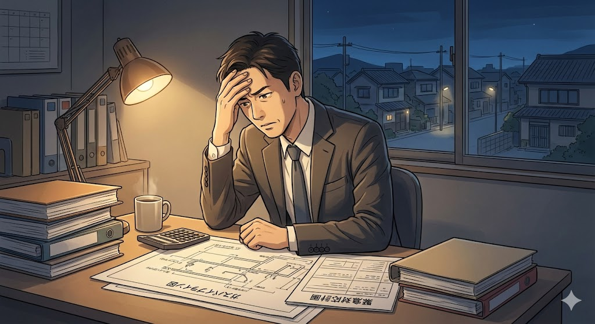
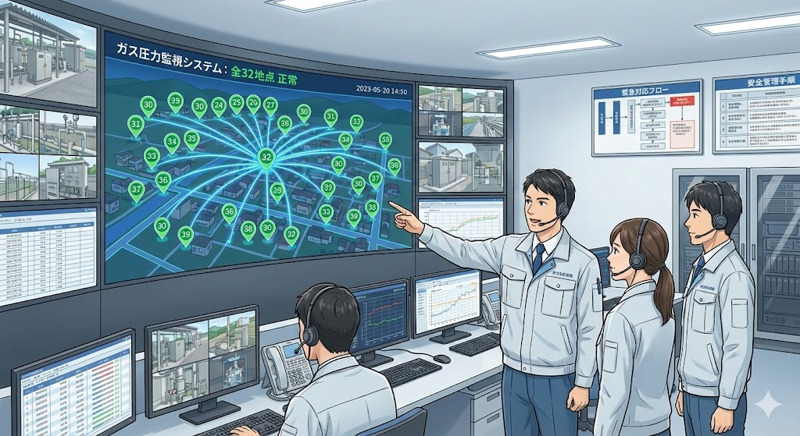

> **この記事は、以下の実在の補助金制度を題材にしたフィクション(物語)です。**
> 登場人物・企業名・具体的なエピソードはすべて架空です。
>
> | 項目 | 内容 |
> |------|------|
> | 補助金名 | [令和７年度都市ガス分野の災害対応・レジリエンス強化に係る支援事業費補助金](/subsidies/jg-CDMTlMAP) |
> | カテゴリ | 一般 |
> | 対象地域 | 全国 |
> | 上限額 | 1億円 |
> | 難易度 | 難しい |
> | 締切 | 2026-02-27 |
> | 管轄 | 公式ページを確認 |
## 祖父が築いた小さなガス会社を継いだ三代目の、眠れない夜

山陰地方の人口4万人ほどの町に、創業60年を超える小さな都市ガス会社があります。社名は「丸山ガス」。従業員は28名。この町のおよそ6,000世帯にガスを届ける、地域に根ざした一般ガス導管事業者です。

*「もし震度6クラスの地震が来たら、うちの体制で住民の安全を守りきれるのか」。翔太さんは何度もそう自問しました。*

三代目社長の丸山翔太さん（38歳）が祖父の代から続くこの会社を継いだのは、5年前のことでした。大学卒業後、東京の大手エネルギー企業で10年間の修業を積み、「いつかは地元に戻る」という約束を果たす形での事業承継でした。

しかし、翔太さんを待っていたのは想像以上に厳しい現実でした。**ガバナ（整圧器）の監視は、いまだに作業員が車で巡回して目視確認する方式**。バルブの開閉工具も規格がバラバラで、万が一の災害時に近隣事業者から応援が来ても、工具が合わずに作業ができない可能性がありました。

「もし震度6クラスの地震が来たら、うちの体制で住民の安全を守りきれるのか」。翔太さんは何度もそう自問しました。特に2024年の能登半島地震の報道を見たとき、その不安は恐怖に変わりました。被災地のガス会社が復旧に苦しむ姿は、明日の自分たちの姿かもしれなかったのです。

設備の近代化には莫大な費用がかかります。ガバナ遠隔監視システムだけでも**導入費用は約4,500万円**。バルブ開閉器一式の整備にも数百万円。年間売上高3億2,000万円、経常利益がようやく800万円という丸山ガスにとって、それは途方もない金額でした。

「設備投資をすれば資金が底をつく。しなければ、災害時に取り返しのつかないことになる」。翔太さんは毎晩、経営計画の数字とにらめっこしながら、眠れない夜を過ごしていました。

## ある業界紙の小さな記事が、すべてを変え始めた

転機は2025年4月の初旬に訪れました。

*翔太さんの心臓が大きく跳ねました。補助上限額は最大1億円。まさに自分たちのような規模の事業者を対象とした制度ではないか。*

翔太さんが何気なく開いた業界紙の電子版に、小さな記事が掲載されていたのです。「**令和７年度都市ガス分野の災害対応・レジリエンス強化に係る支援事業費補助金**、公募開始」。記事にはこう書かれていました。中小の一般ガス導管事業者が、災害時の復旧迅速化に資する機器や設備を導入する際の経費を補助する制度だと。

翔太さんの心臓が大きく跳ねました。**補助上限額は最大1億円**。まさに自分たちのような規模の事業者を対象とした制度ではないか。すぐに都市ガス振興センターのホームページにアクセスし、公募要領を読み込みました。

対象となる設備は2種類。一つは**バルブ開閉器**、つまり災害時に応援事業者が形式の違うバルブを開閉できるようにする工具一式。もう一つは**ガバナ遠隔監視システム**、つまりガバナを遠隔で監視し、災害時にガス供給範囲の特定や遠隔での供給停止を停電時にも行える設備です。

「これだ。まさにうちが必要としていたものだ」

しかし、興奮の直後に不安が押し寄せました。申請の難易度は決して低くないと聞きます。jGrantsという電子申請システムを使う必要があり、GビズIDの取得も必要。そもそも、28名の小さな会社に申請書類を作成するノウハウがあるのか。公募説明会は4月23日と24日にオンラインで開催されると書かれていましたが、その日まであと2週間。準備が間に合うのか。

「うちみたいな小さなところが手を挙げても、本当に採択されるんだろうか」。翔太さんは公募要領のPDFを閉じかけました。しかし、能登半島地震のニュース映像がふと頭をよぎったのです。あのとき感じた恐怖。あのとき誓った「うちの町だけは守る」という決意。

翔太さんはもう一度PDFを開き、今度はプリントアウトして赤ペンを手に取りました。

## 電話の向こうに現れた二人の師匠

翔太さんが最初にしたのは、東京時代の元上司である中村さんに電話をかけることでした。中村さんは大手エネルギー企業の経営企画部長を経て、現在は中小企業の経営コンサルタントとして独立しています。

*12月にはガバナ遠隔監視システムの設置工事が始まり、翌年2月には町内32カ所のガバナすべてが遠隔監視下に入りました。*

「翔太、いい補助金を見つけたな。ただし、この手の補助金は**事業計画の説得力がすべて**だ。なぜ御社がこの設備を必要としているのか、導入後にどう地域の安全が向上するのか、数字で語れるようにしろ」。中村さんの助言は明快でした。

もう一人の師匠は、意外な形で現れました。翔太さんが公募説明会に参加した際、質疑応答の時間に的確な質問をしていた人物がいたのです。隣県の中小ガス会社の社長、**高橋さん（62歳）**。実は高橋さんは過去にこの補助金の前身となる制度で採択された経験を持つ先輩経営者でした。

説明会後、思い切ってオンライン上で声をかけた翔太さんに、高橋さんは快く応じてくれました。「丸山さん、一番大事なのはね、**災害時連携計画との整合性**をしっかり示すことですよ。この補助金はガス事業法に定める災害時連携計画の効果を高めることが目的なんだから、そこがブレたら絶対に通らない」。

翔太さんは二人の助言を元に、申請準備に取りかかりました。まず**GビズIDプライムの取得**。これには数週間かかる場合もあると聞いていたので、真っ先に申請しました。次に、自社の災害時連携計画を改めて精査し、どの設備がどの計画上の課題を解決するのかを一覧表にまとめました。

申請書の作成は想像以上に骨の折れる作業でした。経理担当の山田さんと二人で夜遅くまでオフィスに残り、見積書の取得、設備仕様の確認、費用対効果の試算を繰り返しました。特に苦労したのが、**ガバナ遠隔監視システムの仕様を補助金の要件に合致させること**でした。停電時にも稼働できる仕様であること、遠隔での供給停止が可能であることなど、技術的な要件を一つひとつメーカーと確認していく必要がありました。

<!-- paywall -->

中村さんからは「申請書は審査員の立場で読み直せ。専門用語だらけの文章は、分野が違う審査員には伝わらない」とアドバイスを受けました。翔太さんは書き上げた申請書を3回書き直し、**地域の安全を守るという使命感**が文章のすみずみから伝わるよう心がけました。

高橋さんからは、jGrantsでの電子申請における注意点も教わりました。「ブラウザは必ずChromeかFirefoxの最新版を使うこと。Internet Explorerはもちろん、EdgeのIEモードも絶対にダメ。申請途中でエラーが出て、入力データが消えることがあるから」。この助言がなければ、翔太さんはEdgeのIEモードで作業を始めるところでした。

5月の連休返上で仕上げた申請書は、A4用紙にして42ページ。翔太さんの手は、最後の送信ボタンを押すとき、わずかに震えていました。

## 結果通知を待つ127日間の、長い長い沈黙

申請書を提出した翌日から、翔太さんの日常は一変しました。表面上はいつもどおりガス管の点検やお客様対応をこなしていましたが、頭の片隅には常に「採択されるだろうか」という問いがありました。

提出から3週間後、最初の試練がやってきました。**都市ガス振興センターから追加資料の提出要請**が届いたのです。ガバナ遠隔監視システムの停電時稼働に関する技術仕様書と、過去3年間の防災訓練実施記録の提出を求める内容でした。

翔太さんの顔から血の気が引きました。防災訓練の記録は、先代の父の時代には体系的に残されていなかったのです。「書類不備で不採択になるかもしれない」。その夜、翔太さんは過去の社内報やメールのアーカイブを片っ端から検索し、断片的な記録をかき集めました。

高橋さんに電話で相談すると、こう言われました。「追加資料の要請は、むしろ前向きな兆候だよ。門前払いするなら追加資料なんて求めない。**審査員が真剣に検討しているということだ**。丁寧に、誠実に応じなさい」。この言葉にどれほど救われたか、翔太さんは後に何度も思い返すことになります。

追加資料を提出してから、さらに長い沈黙が続きました。6月、7月、8月。猛暑の夏が過ぎ、秋の気配が漂い始めてもなお、結果は届きません。業界の集まりで他の事業者と情報交換しても、「まだ来ていない」という声ばかり。全員が同じ不安を抱えていました。

9月に入ると、翔太さんは最悪のシナリオを想定し始めました。不採択だった場合の代替計画。設備投資を5年に分割して自己資金で少しずつ進める案。しかし、それでは間に合わないかもしれない。**地震はこちらの都合を待ってくれない**のです。

山田さんが「社長、顔色が悪いですよ」と声をかけてくれた日の夕方。翔太さんはふと、祖父が会社を興したときの話を思い出しました。戦後間もない混乱期に、「この町の暮らしを温かくしたい」というただそれだけの想いで、ゼロからガス管を敷設していった祖父。あの頃の苦労に比べれば、結果を待つことくらい何だというのか。

翔太さんは深く息を吐き、目の前の仕事に集中することを自分に言い聞かせました。

## 10月のある朝、一通のメールがすべてを塗り替えた

その日は10月の第二週の火曜日でした。

朝8時、いつものようにパソコンを開いた翔太さんの目に、都市ガス振興センターからの件名が飛び込んできました。**「令和７年度都市ガス分野の災害対応・レジリエンス強化に係る支援事業費補助金 交付決定通知」**。

翔太さんはメールを開く前に、一度大きく深呼吸しました。そしてクリック。

「採択」の二文字が、画面に表示されていました。

**補助金額は約3,200万円**。ガバナ遠隔監視システムの導入費用約4,500万円のうち、補助対象経費の3分の2に相当する金額が補助されることになったのです。バルブ開閉器一式の導入費用約380万円についても、約250万円の補助が決まりました。合計で約3,450万円。自己負担は約1,430万円にまで圧縮されました。

翔太さんは椅子の背もたれに深く体を預け、天井を見上げました。目頭が熱くなるのを感じました。すぐに中村さんと高橋さんに報告の電話を入れ、次に28名の全社員を会議室に集めました。

「皆さんに報告があります。補助金が採択されました。これから丸山ガスは変わります」。

その後の変革は劇的でした。12月にはガバナ遠隔監視システムの設置工事が始まり、翌年2月には**町内32カ所のガバナすべてが遠隔監視下**に入りました。これまで1日がかりで車を走らせて巡回していた点検作業が、オフィスのモニター画面で即座に確認できるようになったのです。

異常値を検知すれば自動でアラートが鳴り、停電時にもバッテリーで48時間稼働し続ける仕様。**災害発生時のガス供給停止判断が、従来の推定3時間からわずか15分に短縮**されました。これは住民の安全にとって、文字通り命に関わる改善でした。

バルブ開閉器一式の整備も完了し、隣県3社との合同防災訓練では、応援事業者がスムーズにバルブ操作を行える体制が初めて実現しました。訓練に参加した高橋さんが「これで本当の連携ができるようになったね」と笑顔で言ってくれたとき、翔太さんはこの挑戦が間違いではなかったと心から実感しました。

さらに予想外の効果もありました。遠隔監視システムの導入により、ガバナの異常を早期発見できるようになったことで、**年間の緊急出動件数が前年比で42%減少**。巡回点検に費やしていた時間を顧客サービスの向上に振り向けられるようになり、顧客満足度調査のスコアも改善しました。採用面でも、最新のデジタル設備を備えた職場として地元の工業高校からの応募が増え、翌年度には3年ぶりの新卒採用に成功しています。

丸山ガスの年間経常利益は、設備投資の減価償却を差し引いても**前年比で約35%増の1,080万円**に達しました。数字以上に大きかったのは、「この町の安全は、うちが守っている」という全社員の誇りでした。

## 翔太さんの物語から学ぶ、補助金申請5つの教訓

翔太さんの物語はあくまでフィクションですが、ここから得られる教訓は実践的なものばかりです。補助金申請を検討している方に向けて、5つのポイントを整理します。

**1. 補助金は自社の課題とセットで考える**
翔太さんが成功した最大の理由は、補助金ありきではなく、「災害時に住民を守れない」という切実な課題が先にあったことです。自社の課題を明確にしてから、それに合致する補助金を探す順番が大切です。

**2. 先輩経営者のネットワークは最強の武器になる**
高橋さんとの出会いがなければ、翔太さんの申請はもっと苦戦していたでしょう。業界団体の集まりや公募説明会は、情報収集だけでなく人脈づくりの場でもあります。**公募説明会には必ず参加する**ことをおすすめします。この補助金の場合、オンライン（Zoom）で開催されるため、地方の事業者でも気軽に参加できます。

**3. GビズIDの取得は今すぐ始める**
jGrantsでの電子申請にはGビズIDプライムが必須です。取得には時間がかかる場合があるため、補助金申請を少しでも検討しているなら、**今日この瞬間にGビズIDの取得手続きを始める**のが最善の一歩です。

**4. 追加資料の要請は前向きに受け止める**
審査の過程で追加資料を求められることは珍しくありません。慌てず、誠実に対応することが採択の可能性を高めます。過去の記録や実績は日頃から体系的に保管しておくと、いざというときに慌てずに済みます。

**5. 申請書は審査員の目線で書き直す**
専門用語だらけの申請書は伝わりません。自社の取り組みがなぜ社会的に意義があるのか、導入後にどのような成果が期待できるのか、**わかりやすい言葉と具体的な数字**で示すことが重要です。

この補助金の申請期限は**2026年2月27日**まで設定されていますが、予算の執行状況によって早期に締め切られる可能性もあります。「いつかやろう」ではなく、「今日、公式ページを確認する」ことから始めてみてください。

翔太さんのように、たった一つの補助金との出会いが、事業の未来を、そして地域の安全を変えることがあるのです。あなたの会社にも、きっとそんな出会いが待っています。