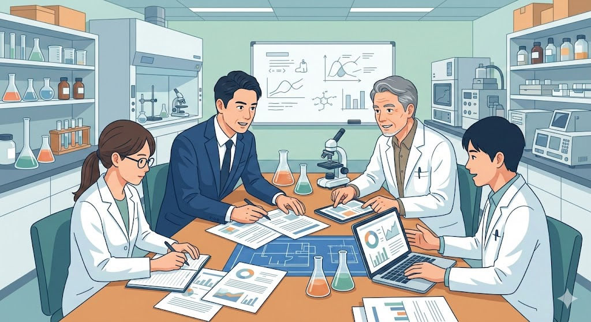
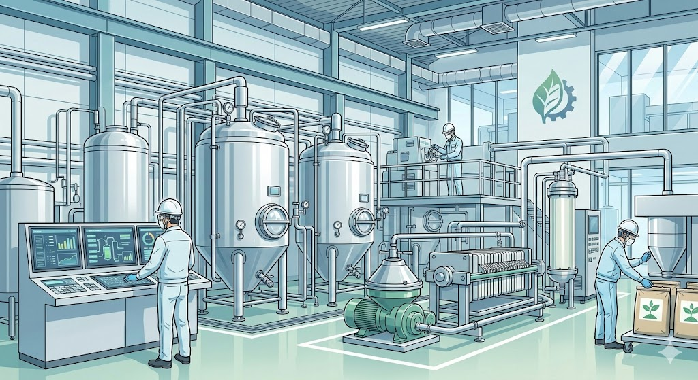

> **この記事は、以下の実在の補助金制度を題材にしたフィクション(物語)です。**
> 登場人物・企業名・具体的なエピソードはすべて架空です。
>
> | 項目 | 内容 |
> |------|------|
> | 補助金名 | [「バイオものづくり革命推進事業」の第4回公募](/subsidies/jg-CDWzZMAX) |
> | カテゴリ | 製造業 |
> | 対象地域 | 全国 |
> | 上限額 | プログラムにより異なる |
> | 難易度 | 普通 |
> | 締切 | 2026-03-19 |
> | 管轄 | 公式ページを確認 |
## 祖父が建てた工場が、静かに沈んでいく日々

埼玉県の工業団地の一角に、従業員28名の化学素材メーカーがあります。社名は「丸山化成株式会社」。プラスチック原料の中間素材を製造し、大手メーカーに納品することで60年以上の歴史を刻んできました。

*毎晩、工場の灯りが消えた後、拓也さんは事務所で一人、財務諸表とにらめっこしていました。祖父の写真が壁にかかっています。「どうすればいいんだ」。答えのない問いが、夜の工場に静かに響いていました。*

三代目社長の丸山拓也さん(38歳)は、大学で化学工学を学んだ後、大手化学メーカーで8年間の経験を積み、5年前に父から会社を引き継ぎました。継いだ当初は「祖父が建て、父が守った工場を、自分がさらに発展させる」という強い意志がありました。

しかし現実は、拓也さんの想像をはるかに超えて厳しいものでした。

**石油由来の原料価格は年々不安定さを増し**、利益率は10年前の半分以下にまで落ち込んでいます。さらに追い打ちをかけたのが、取引先からの「脱炭素」要求でした。主要取引先の大手自動車部品メーカーから、こう告げられたのです。

「丸山さん、2027年度までにサプライチェーン全体のCO2排出量を30%削減する方針が決まりました。御社の素材も、バイオ由来への切り替えを検討してもらえませんか」

それは事実上の最後通告でした。対応できなければ、**年間売上の約4割を占める取引を失う**ことになります。バイオ由来素材への転換が必要だと頭では理解していても、研究開発にかかる費用は最低でも数千万円。年間売上3億2000万円、経常利益がわずか800万円の中小企業にとって、自力での投資はあまりにも無謀でした。

毎晩、工場の灯りが消えた後、拓也さんは事務所で一人、財務諸表とにらめっこしていました。祖父の写真が壁にかかっています。「どうすればいいんだ」。答えのない問いが、夜の工場に静かに響いていました。

## ある展示会で知った「バイオものづくり革命推進事業」という光

転機は、東京ビッグサイトで開催されたバイオ素材の展示会でした。

取引先への説明材料を探すために半ば義務感で訪れた会場で、拓也さんはあるブースに足を止めました。国立研究開発法人新エネルギー・産業技術総合開発機構、通称**NEDO**のブースです。

そこで配布されていたパンフレットの一つに、**「バイオものづくり革命推進事業」** という文字がありました。説明員の話を聞くと、バイオ技術を活用したものづくりの革新を国が後押しするための大型事業で、研究開発から社会実装まで幅広いフェーズを支援対象としているとのことでした。

「中小企業でも応募できるんですか?」

拓也さんが恐る恐る尋ねると、説明員はうなずきました。「もちろんです。むしろ、実際の製造現場を持つ中小企業の参画が重要なんです」

その夜、拓也さんはNEDOの公式ページを何度も読み返しました。<!-- paywall -->公募は複数回にわたって実施されており、現在は**第4回公募**が進行中。応募締切は**2026年3月19日**。プログラムの内容によって支援の規模や条件は異なりますが、バイオ素材の製造プロセス開発という自社の課題にぴったり合致するテーマがありました。

しかし、期待と同時に強烈な不安も押し寄せてきます。

「NEDOの事業なんて、大学や大手企業が応募するものだろう。うちみたいな町工場が出しても、門前払いじゃないか」

公募要領を読めば読むほど、求められる技術水準の高さ、提案書の精密さに圧倒されました。拓也さんは何度もブラウザのタブを閉じかけました。**応募する勇気と、失敗への恐怖が、胸の中で激しくぶつかり合っていた**のです。

それでも、取引先からの期限は刻々と近づいています。「やらなければ、会社が終わる。やって駄目なら、それでもいい。でも、やらずに終わるのだけは嫌だ」。拓也さんは、震える指で応募書類のテンプレートをダウンロードしました。

## 大学教授との偶然の再会が、すべてを動かした

提案書の作成に着手したものの、壁はすぐに現れました。

*そこからの3か月は、まさに戦いの日々でした。毎週末、大学の研究室に通い詰め、教授と研究員たちと議論を重ねました。平日は通常の製造業務をこなしながら、夜は提案書の執筆に没頭します。*

NEDOの事業提案書は、一般的な補助金申請書とは比較にならないほど高度な内容を求められます。技術的な新規性、社会実装への道筋、知的財産戦略、そして事業化計画。拓也さんは化学工学の知識はあるものの、バイオテクノロジーの最先端研究については素人同然でした。

行き詰まりを感じていたある日、思いがけない再会がありました。大学時代の恩師である**藤原誠一教授**が、近隣の産業技術センターで講演を行うという情報を偶然目にしたのです。

藤原教授は微生物工学の専門家で、現在は地方大学でバイオプラスチックの研究を進めていました。講演後に声をかけると、教授は拓也さんのことをよく覚えていました。

「丸山くんか。化学メーカーを継いだと聞いていたよ。バイオものづくり革命推進事業に興味があるって? ちょうど私も、大学の研究成果を実用化できるパートナー企業を探していたんだ」

運命的なタイミングでした。藤原教授の研究室が開発した**微生物発酵による新しいバイオ素材の合成技術**は、実験室レベルでは成功していたものの、工業スケールでの製造プロセスが未確立でした。一方、丸山化成には60年にわたって培われた化学素材の製造ノウハウと、実際の生産設備があります。

「大学と企業の共同提案なら、技術の新規性と実用化の現実性を同時にアピールできる。これは勝算がある」

藤原教授の言葉に、拓也さんの目に光が宿りました。

そこからの3か月は、まさに戦いの日々でした。**毎週末、大学の研究室に通い詰め**、教授と研究員たちと議論を重ねました。平日は通常の製造業務をこなしながら、夜は提案書の執筆に没頭します。

さらに、藤原教授の紹介で知り合った**中小企業診断士の河野さん**が、事業計画書の組み立てを手伝ってくれることになりました。河野さんはNEDO事業の採択経験を持つ企業を複数支援した実績があり、提案書の「読まれ方」を熟知していました。

「拓也さん、NEDOの審査員は技術者です。技術的な正確さはもちろんですが、それ以上に大事なのは、この技術が社会にどんなインパクトを与えるかというストーリーです。**御社の60年の製造技術と、大学の最先端バイオ技術が融合する意義を、明確に伝えましょう**」

河野さんのアドバイスは的確でした。拓也さんは提案書を何度も書き直し、技術論文のような硬い文章から、審査員の心に届く説得力ある文章へと磨き上げていきました。

## 提出後の沈黙、そして予想もしなかった追加要求

提案書を提出したのは、締切の5日前でした。

何度も推敲を重ね、藤原教授と河野さんの最終チェックを経て、ようやく「これなら出せる」と思える水準に達しました。NEDOのオンラインシステムから提案書をアップロードしたとき、拓也さんの手はまだ微かに震えていました。

そして、待ちの期間が始まりました。

この期間が、拓也さんにとって**最も精神的に辛い時間**でした。結果がいつ届くのか、正確にはわかりません。来る日も来る日も、メールの受信ボックスを確認する日々。工場のラインが動く音を聞きながら、「もしこの提案が通らなかったら、この工場は3年後にはないかもしれない」という暗い想像が頭をよぎります。

提出から約1か月半が経った頃、NEDOから一通のメールが届きました。心臓が跳ね上がるような思いで開封すると、それは採択通知ではありませんでした。**追加資料の提出要求**です。

製造プロセスのスケールアップに関する技術的根拠について、より詳細なデータと説明を求める内容でした。要求された項目は12にも及び、回答期限はわずか2週間。

「これは落とすための質問なのか、それとも採択に前向きだから詳しく知りたいのか」。拓也さんには判断がつきませんでした。

河野さんに相談すると、意外な答えが返ってきました。「追加質問が来るということは、少なくとも審査の土俵には乗っているということです。**ここで手を抜いたら、すべてが水の泡になります**。全力で回答しましょう」

拓也さんは藤原教授に連絡を取り、研究室の実験データをかき集めました。さらに、自社工場で過去に蓄積してきた製造条件のデータベースを掘り起こし、「この製造技術と設備があるからこそ、スケールアップが可能である」という根拠を一つ一つ積み上げました。

追加資料の作成は、深夜3時に及ぶこともありました。妻の美咲さんが事務所にコーヒーを差し入れてくれながら、「あなたが本気でやりたいなら、私は最後まで応援する」と言ってくれたことが、拓也さんの心の支えでした。

12項目すべてに対して、**データと図表を添えた詳細な回答書**を期限内に提出しました。あとは、もう祈るしかありません。

## 採択通知、そして丸山化成に訪れた「第二の創業」

追加資料提出から約3週間後、1通のメールが届きました。

*まず、工場の一角にバイオ素材専用の発酵・精製ラインを新設しました。藤原教授の研究室で開発された微生物株を使い、植物由来の糖質から工業用バイオプラスチック原料を製造するプロセスを確立したのです。*

件名を見た瞬間、拓也さんは息が止まりました。「採択結果のお知らせ」。震える指でメールを開きます。

**採択。**

拓也さんは、事務所の椅子に深く沈み込みました。涙がこぼれました。祖父の写真に向かって、声にならない声で「じいちゃん、やったよ」とつぶやきました。

NEDOの**バイオものづくり革命推進事業**による支援を受け、丸山化成は劇的な変貌を遂げていきます。

まず、工場の一角に**バイオ素材専用の発酵・精製ライン**を新設しました。藤原教授の研究室で開発された微生物株を使い、植物由来の糖質から工業用バイオプラスチック原料を製造するプロセスを確立したのです。

大学との共同研究により、実験室レベルで1リットルだった発酵槽を、**工業用の500リットル規模**にまでスケールアップすることに成功しました。これは丸山化成が長年培ってきた温度管理や撹拌技術の知見なくしては実現できなかったものです。

具体的な成果を数字で見てみましょう。

事業開始前、丸山化成の売上は**年間3億2000万円**、経常利益は**800万円**でした。バイオ素材ラインが稼働を始めた初年度、新たなバイオ素材の売上が**約9000万円**加わり、年間売上は**4億1000万円**に成長しました。

さらに重要なのは利益率です。石油由来素材の利益率が約5%だったのに対し、バイオ素材の利益率は**約15%**。付加価値の高い製品への転換により、経常利益は**2400万円**にまで改善しました。

従業員にも変化が生まれています。バイオプロセスの専門技術者として**新たに3名を採用**。さらに、既存の従業員の中からも「バイオ技術を学びたい」と手を挙げる者が現れ、社内に新しい活気が生まれました。

そして何より、あの最後通告を突きつけてきた大手自動車部品メーカーからは、**バイオ素材の優先供給パートナー**としての長期契約を獲得することができました。取引を失うどころか、関係はかえって深まったのです。

拓也さんは、工場の新しいバイオ素材ラインの前に立ち、こう思いました。「祖父が石油化学で創業し、父がそれを守った。自分はバイオで、この会社に第二の創業をもたらすことができた」と。

## この物語から学べる5つの実践的な教訓

丸山拓也さんの物語は架空のものですが、ここに描かれた課題や転機は、多くの中小企業経営者に通じるものがあるはずです。この物語から得られる教訓を整理してみましょう。

**1. 危機をチャンスの入口と捉える**

取引先からの脱炭素要求は、拓也さんにとって最初は「脅威」でしかありませんでした。しかし、その危機感こそが新しい事業領域に踏み出す原動力になりました。今、自社が直面している課題は、実は変革の入口かもしれません。

**2. 自社だけで完結しようとしない**

拓也さんが成功した最大の要因は、大学や専門家との連携でした。NEDOの事業に限らず、多くの補助金制度は外部機関との連携を高く評価します。地域の大学、公設試験研究機関、産業技術センターなどに相談してみることが、突破口になることがあります。

**3. 提案書は「技術」と「ストーリー」の両輪で書く**

どれだけ優れた技術があっても、それが社会にどんな価値をもたらすのかが伝わらなければ、審査員の心には届きません。中小企業診断士の河野さんが助言したように、自社の強みと社会課題を結びつける物語を提案書の中に織り込むことが、**採択の可能性を高める**重要なポイントです。

**4. 追加質問や修正要求を恐れない**

審査プロセスで追加資料を求められることは珍しくありません。それは関心を持たれている証拠でもあります。慌てず、しかし全力で対応することが大切です。

**5. まずは情報収集の一歩を踏み出す**

拓也さんの物語は、展示会でNEDOのブースに立ち寄るという小さな行動から始まりました。今日からできる最初の一歩は、**NEDOの公式ページでバイオものづくり革命推進事業の公募情報を確認すること**です。第4回公募の締切は2026年3月19日ですが、公募要領を読み込み、自社の技術との接点を探すだけでも大きな前進です。

もし自社単独での応募が難しいと感じたら、まずは地域の産業支援センターやよろず支援拠点に相談してみてください。連携先や専門家を紹介してもらえる可能性があります。

丸山化成の物語が教えてくれるのは、変革は一人の力では成し遂げられないということ、そして同時に、最初の一歩を踏み出すのは自分自身でなければならないということです。あなたの会社にも、まだ見ぬ「第二の創業」の種が眠っているかもしれません。