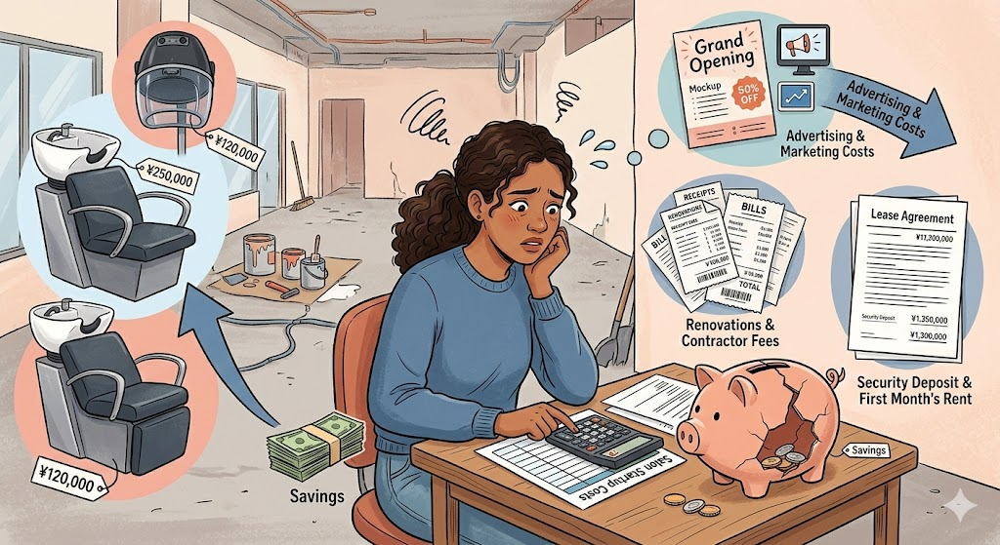
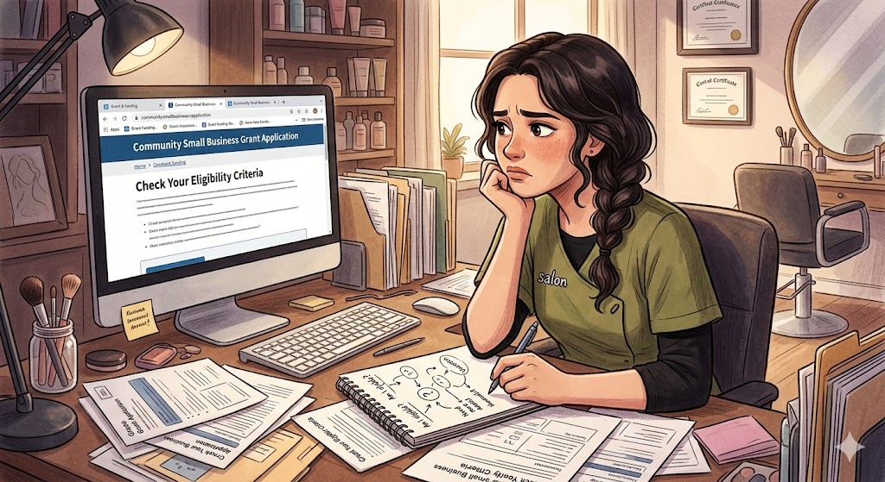
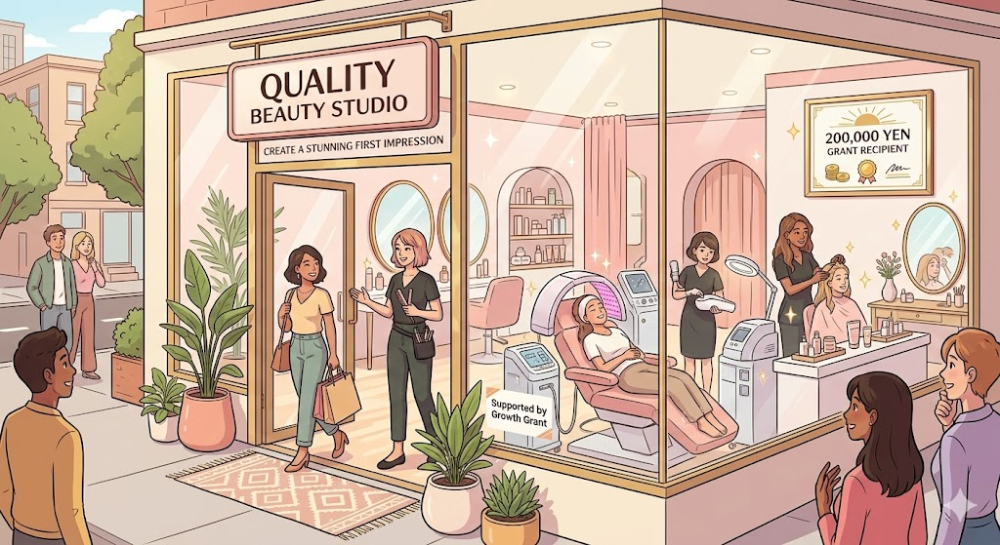

> **この記事は、以下の実在の補助金制度を題材にしたフィクション(物語)です。**
> 登場人物・企業名・具体的なエピソードはすべて架空です。
>
> | 項目 | 内容 |
> |------|------|
> | 補助金名 | [深谷市起業家支援事業補助金](/subsidies/jg-CDXR6MAP) |
> | カテゴリ | スタートアップ |
> | 対象地域 | 全国 |
> | 上限額 | 20万円 |
> | 難易度 | 簡単 |
> | 締切 | 2026-03-31 |
> | 管轄 | 公式ページを確認 |
## 毎日シャンプー台に立ちながら、いつか自分の店をと願い続けた日々

埼玉県深谷市で生まれ育った宮田彩香（32歳）は、市内の美容室で10年間働くベテランスタイリストでした。指名客は月に40人を超え、オーナーからの信頼も厚い存在です。

*問題は、お金でした。独立開業にはシャンプー台やセット椅子、ドライヤーなどの設備費だけでも100万円以上かかります。加えて、内装工事費、広告宣伝費、家賃の初期費用。貯金は80万円ほどありましたが、すべてを投じても足りるかどうか不安でした。*

けれど、彩香の心にはずっと小さな火が灯っていました。「いつか、自分の美容室を持ちたい」。高校時代から抱いてきたその夢は、年齢を重ねるごとに切実さを増していきます。

問題は、お金でした。独立開業にはシャンプー台やセット椅子、ドライヤーなどの設備費だけでも100万円以上かかります。加えて、内装工事費、広告宣伝費、家賃の初期費用。貯金は80万円ほどありましたが、すべてを投じても足りるかどうか不安でした。

勤務先では朝9時から夜8時まで立ちっぱなし。帰宅後にノートを開き、物件情報を調べ、開業資金の計算を繰り返す毎日。数字を見つめるたびにため息が漏れます。「あと20万円、いや30万円あれば、もう少し余裕を持ってスタートできるのに」。彩香はそうつぶやきながら、ノートをそっと閉じるのでした。

## ふとした会話から知った「深谷市起業家支援事業補助金」という希望の光

転機は、ある秋の午後に訪れました。常連客の中島さんとの何気ない会話がきっかけです。

*しかし、すぐに不安が押し寄せてきます。「本当に私みたいな個人の美容師が対象になるの？」「書類を書いたことなんてないのに、申請なんてできるのかな」。パソコンの画面を見つめながら、彩香の指はスクロールを止めたり動かしたりを繰り返しました。*

「彩香さん、独立するって前に言ってたわよね。深谷市に起業家向けの補助金があるの、知ってる？」

中島さんは市役所の広報誌で見かけたという情報を教えてくれました。帰宅後すぐにスマートフォンで検索すると、確かにありました。深谷市起業家支援事業補助金。深谷市内で新たに事業を始める起業家に対し、設備購入費や広告宣伝費の一部を補助してくれる制度です。

補助額は最大20万円。彩香にとって、その金額はまさに不足していた「あと少し」を埋めてくれる数字でした。

しかし、すぐに不安が押し寄せてきます。「本当に私みたいな個人の美容師が対象になるの？」「書類を書いたことなんてないのに、申請なんてできるのかな」。パソコンの画面を見つめながら、彩香の指はスクロールを止めたり動かしたりを繰り返しました。

それでも、心のどこかで声がしました。「ここで動かなかったら、また来年も同じことを言っている」。彩香は意を決して、翌日の休みに深谷商工会議所を訪ねることにしました。

## 商工会議所の相談員・田辺さんが教えてくれた申請の「地図」

深谷商工会議所の窓口で彩香を迎えたのは、経営指導員の田辺俊一さんでした。白髪交じりの穏やかな笑顔で、「起業の相談ですね。よく来てくださいました」と声をかけてくれます。

彩香が独立の夢と資金の不安を打ち明けると、田辺さんはうなずきながらメモを取り、こう言いました。「宮田さん、この補助金はまさにあなたのような方のために作られた制度ですよ」。

田辺さんの説明は丁寧でした。この補助金を申請するには、まず深谷商工会議所またはふかや市商工会の推薦が必要であること。そのためには事前に起業相談や経営指導を受ける必要があること。そして、深谷市内に住んでいて、市内に事業所を構えること、市税の滞納がないことなど、いくつかの要件をすべて満たす必要があること。

「難しそうに聞こえるかもしれませんが、一つずつ確認していけば大丈夫です。私が一緒にチェックしますから」。田辺さんのその言葉に、彩香の肩の力が少しだけ抜けました。

それから約1か月、彩香は仕事の合間を縫って田辺さんのもとに通いました。事業計画書の書き方、収支の見込み、ターゲットとする顧客層の設定。美容の技術には自信があっても、「経営」の言葉で自分の夢を語ることは初めての経験です。

特に苦労したのが、補助対象経費の整理でした。セット椅子やシャンプー台は設備費として認められますが、消費税は対象外です。チラシの制作費は広告宣伝費に該当しますが、その見積もりを事前に取っておく必要がありました。さらに、深谷市の地域通貨「ネギー」の取扱店として登録することも要件の一つです。

「ネギー？」と首をかしげた彩香に、田辺さんは笑いながら説明してくれました。「深谷市独自の地域通貨です。地域経済の活性化のために取扱店登録が求められているんですよ」。彩香は早速、登録の申し込みを済ませました。

田辺さんはさらに、先輩起業家として市内でカフェを経営している女性を紹介してくれました。その方も過去にこの補助金を利用して開業したそうです。「最初は不安だらけだったけど、商工会議所の方に助けてもらって乗り越えられたの」。先輩の実体験は、彩香に大きな勇気を与えてくれました。

<!-- paywall -->

## 申請書を提出してからの長い沈黙、そして届いた一通の封筒

すべての書類が整い、彩香は深谷市役所の商工振興課に申請書を提出しました。封筒を窓口に差し出した瞬間、指先が小さく震えていたのを覚えています。

ここからが、彩香にとって最も辛い時間でした。

結果が届くまでの日々は、驚くほど長く感じられました。仕事中はお客様のカットに集中できるのですが、帰宅するとどうしても考えてしまいます。「あの事業計画書、もっと具体的に書けばよかったのでは」「収支の見込みが甘すぎたかもしれない」。自分で提出した書類の一字一句が頭の中をぐるぐると回ります。

ある日、市役所から電話がありました。心臓が跳ねるほど驚きましたが、内容は補足資料の提出依頼でした。設備購入の見積書について、もう少し詳しい内訳が必要とのこと。彩香は慌てて業者に連絡し、翌日には追加の見積書を揃えて提出しました。

「やっぱりダメなのかも」。追加書類を求められたことで、不安は一層膨らみました。勤務先のオーナーには年末での退職を伝えてあります。もし補助金が不採択になったら、資金計画を一から見直さなければなりません。夜中に目が覚めて天井を見つめる日が何度かありました。

そんなある朝、ポストに深谷市役所からの封筒が届いていました。薄い茶色の事務的な封筒です。彩香は玄関先で立ったまま封を切りました。

「交付決定通知書」。

その文字を見た瞬間、彩香の目から涙がこぼれました。田辺さんに電話をかけると、「おめでとうございます。頑張りましたね」と温かい声が返ってきました。

## 補助金20万円が生んだ連鎖反応、小さな美容室の大きな一歩

翌年の春、深谷市の住宅街の一角に小さな美容室「hair salon AYA」がオープンしました。

*彩香はこう話します。「20万円という金額だけ見れば、大きくないと思う人もいるかもしれません。でも、あの20万円があったからこそ、設備に妥協せずに済みました。お客様に最初から良い印象を持っていただけたことが、今の結果につながっています」。*

彩香は補助金の最大20万円を活用し、中古で検討していたシャンプー台を新品で購入することができました。また、広告宣伝費としてチラシ500枚の制作費にも充てることができました。自己資金だけでは実現が難しかった「清潔感のある新しい設備」と「地域へのしっかりした告知」の両方を手にしたのです。

チラシは近隣の住宅にポスティングし、地域通貨「ネギー」が使えることも大きくアピールしました。これが予想以上の反響を呼びます。「ネギーが使えるなら行ってみよう」と来店する方が想像以上に多かったのです。

開業から3か月で月間の来客数は60人を超えました。前の職場での指名客が通ってくれたことに加え、チラシとネギーの効果で新規のお客様が毎週のように増えていきます。

開業から半年後の数字を整理してみると、変化は明らかでした。月の売上は開業初月の18万円から、半年後には42万円にまで成長。経費を差し引いても、勤務時代の手取りを上回る収入を得られるようになりました。

彩香はこう話します。「20万円という金額だけ見れば、大きくないと思う人もいるかもしれません。でも、あの20万円があったからこそ、設備に妥協せずに済みました。お客様に最初から良い印象を持っていただけたことが、今の結果につながっています」。

田辺さんも時折お店に顔を出してくれるそうです。経営のことで困ったら相談できる関係は、補助金の申請を通じて築かれたかけがえのない財産でした。

## 彩香の物語から学ぶ、補助金申請を成功に導く5つの教訓

彩香の物語は架空のものですが、深谷市起業家支援事業補助金は実在する制度です。この物語から、これから起業を考えている方が持ち帰れる教訓を整理してみましょう。

1. 「あと少し」を埋める補助金を探してみる

起業資金のすべてを補助金でまかなう必要はありません。彩香のように「あと20万円あれば余裕が出る」という場面で、最大20万円の補助は大きな力になります。自己資金だけで無理をする前に、自治体の支援制度がないか調べてみてください。

2. 商工会議所への相談は「最初の一歩」として最適

この補助金では、深谷商工会議所またはふかや市商工会の推薦が必須要件です。これは裏を返せば、申請の過程で必ずプロの経営相談を受けられるということです。一人で悩まず、まず相談の予約を入れてみましょう。

3. 要件を一つずつ丁寧に確認する

市内居住、市内での事業所設置、市税の滞納なし、許認可の取得、地域通貨「ネギー」取扱店への登録。要件は複数ありますが、一つずつ確認すれば難しいものではありません。チェックリストを作って潰していくのが確実です。

4. 消費税や対象外経費に注意する

補助対象経費に消費税は含まれません。見積書を取る段階で税抜き金額を把握しておくと、予算計画にズレが生じにくくなります。

5. 申請期限を意識して早めに動く

この補助金の申請期限は2026年3月31日までとされていますが、予算には上限があります。「まだ先だから」と先延ばしにせず、起業を考え始めた段階で情報収集を始めることが、採択の可能性を高める最善の方法です。

彩香が最初に踏み出した一歩は、商工会議所の窓口を訪ねることでした。あなたの一歩は、今日この記事を読み終えた後に、深谷市役所商工振興課（電話：048-577-3409）に問い合わせてみることかもしれません。小さな一歩が、大きな変革の始まりになることを、彩香の物語は教えてくれています。